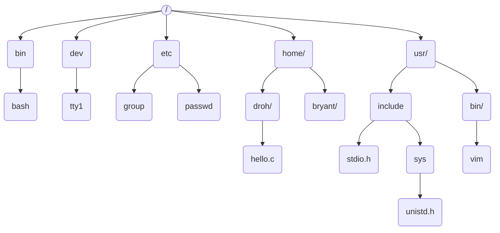

#  20250218-Week1-虚拟机，Shell&大语言模型

Updated 1700 GMT+8 Feb 20 2025

2025 spring, Complied by Hongfei Yan


logs：

>  推荐力扣每日一题，简单、中等的都挺好，困难的可以AI。
>
> Get up and running with large language models
>
> 计概课程看图灵自传改编的电影《模拟游戏》，数算课程看英伟达的AI科普书《黄仁勋：英伟达之芯》，期末考试双百加油！


拥抱大模型，深入探索，紧跟时代步伐。这是在我的本地环境运行的，连 70B 规模的模型也能跑，不过已经接近机器的性能极限，风扇全速运转，温度也随之攀升。


# 0 热身题目


## 27300: 模型整理

http://cs101.openjudge.cn/practice/27300/

深度学习模型（尤其是大模型）是近两年计算机学术和业界热门的研究方向。每个模型可以用 “模型名称-参数量” 命名，其中参数量的单位会使用两种：M，即百万；B，即十亿。同一个模型通常有多个不同参数的版本。

例如，Bert-110M，Bert-340M 分别代表参数量为 1.1 亿和 3.4 亿的 Bert 模型，GPT3-350M，GPT3-1.3B 和 GPT3-175B 分别代表参数量为 3.5亿，13亿和 1750 亿的 GPT3 模型。

参数量的数字部分取值在 [1, 1000) 区间（一个 8 亿参数的模型表示为 800M 而非 0.8B，10 亿参数的模型表示为 1B 而非 1000M）。

计算机专业的学生小 A 从网上收集了一份模型的列表，他需要将它们按照名称归类排序，并且同一个模型的参数量从小到大排序，生成 “模型名称: 参数量1, 参数量2, ...” 的列表。请你帮他写一个程序实现。

**输入**

第一行为一个正整数 n（n <= 1000），表示有 n 个待整理的模型。

接下来 n 行，每行一个 “模型名称-参数量” 的字符串。模型名称是字母和数字的混合。

**输出**

每行一个 “模型名称: 参数量1, 参数量2, ...” 的字符串，符号均为英文符号，模型名称按字典序排列，参数量按从小到大排序。

样例输入

```
5
GPT-1.3B
Bert-340M
GPT-350M
Bert-110M
GPT-175B
```

样例输出

```
Bert: 110M, 340M
GPT: 350M, 1.3B, 175B
```

提示

tags: string, sort

来源：2023fall zyn


2025/2/14 13:52，大模型可以AC。

https://chatgpt.com/ 默认是"Search"，选到"Reason"，可以AC。

```python
def main():
    n = int(input().strip())
    models = {}
    
    for _ in range(n):
        s = input().strip()
        # 按 '-' 分割得到模型名称和参数字符串（如 "1.3B" 或 "110M"）
        model_name, param_str = s.split('-', 1)
        # 数字部分为除去最后一个字符（单位）得到的部分
        num_str = param_str[:-1]
        unit = param_str[-1]
        # 计算实际数值，B 表示十亿，M 表示百万
        value = float(num_str) * (1e9 if unit == 'B' else 1e6)
        # 将模型名称和对应的 (数值, 原始参数字符串) 添加到字典中
        models.setdefault(model_name, []).append((value, param_str))
    
    # 按模型名称字典序输出
    for model_name in sorted(models.keys()):
        # 同一模型下按照数值从小到大排序
        sorted_params = sorted(models[model_name], key=lambda x: x[0])
        # 只取原始参数字符串部分
        params_str = ", ".join(param for _, param in sorted_params)
        print(f"{model_name}: {params_str}")

if __name__ == "__main__":
    main()

```


DeepSeek默认是DeepThink(R1)，能AC。

按照以下步骤来编写Python程序：

1. **读取输入**：首先读取输入的模型数量 `n`，然后读取接下来的 `n` 行，每行包含一个模型名称和参数量的字符串。
2. **解析和存储**：将每个模型名称和参数量解析出来，并存储在一个字典中，字典的键是模型名称，值是一个列表，存储该模型的所有参数量。
3. **排序**：对字典中的模型名称按字典序排序，对每个模型的参数量列表按参数量从小到大排序。
4. **输出**：按照要求的格式输出每个模型及其参数量。

```python
def parse_model(s):
    # 将字符串解析为模型名称和参数量
    parts = s.split('-')
    model_name = parts[0]
    param = parts[1]
    return model_name, param

def sort_params(params):
    # 对参数量进行排序
    # 将参数量转换为统一的单位（M或B）进行比较
    def get_value(param):
        if param[-1] == 'M':
            return float(param[:-1])
        elif param[-1] == 'B':
            return float(param[:-1]) * 1000
        else:
            return 0  # 无效参数
    
    return sorted(params, key=get_value)

def main():
    n = int(input())
    models = {}
    
    # 读取并解析输入
    for _ in range(n):
        s = input().strip()
        model_name, param = parse_model(s)
        if model_name not in models:
            models[model_name] = []
        models[model_name].append(param)
    
    # 对模型名称按字典序排序
    sorted_models = sorted(models.keys())
    
    # 对每个模型的参数量进行排序
    for model in sorted_models:
        sorted_params = sort_params(models[model])
        # 输出结果
        print(f"{model}: {', '.join(sorted_params)}")

if __name__ == "__main__":
    main()
```


# 1 虚拟机

虚拟机（Virtual Machine, VM）是一种通过软件模拟的、具有完整硬件系统功能的计算机系统，运行在一个完全隔离的环境中。虚拟机可以运行在物理计算机之上，允许用户在同一台硬件上运行多个操作系统和应用程序，极大地提高了资源利用率和灵活性。

**常见的本地虚拟机软件**

1. **Parallels Desktop**：主要为Mac用户提供了一个运行其他操作系统（如Windows、Linux等）的解决方案。

2. **VirtualBox**：是一款开源的虚拟化产品，由Oracle公司提供支持。它可以安装在多种操作系统上（如Windows、Linux等），并能够运行大量的客户操作系统。VirtualBox因其免费受到广泛欢迎。

**云端虚拟机**

- **clab.pku.edu.cn**：CLab 是服务北大师生的云计算平台。提供基于云的虚拟实验室环境，供学生和研究人员用于教学、学习和科研目的。用户可以通过互联网访问这些虚拟机，执行编程实验、模拟等任务。

无论是本地还是云端的虚拟机，它们都提供了灵活的计算资源分配方案，帮助用户测试软件、开发新应用或进行研究工作，而无需投资额外的硬件设施。随着云计算技术的发展，越来越多的服务迁移到了云端，使得用户可以从任何地方访问高性能的计算资源。

## Q1. 部署虚拟机意义？

既然第三步大模型安装和测试，可以不用虚拟机，这一步部署虚拟机意义？


> 部署虚拟机提供了一个分布式计算环境，在这个环境中每个虚拟机都可以作为一个独立的计算节点运行。当你有一个需要大量计算资源的任务时（比如前面提到的分治任务），你可以将这个任务分解成多个较小的子任务，并将这些子任务分配给不同的虚拟机来并行处理。这样做的好处是可以大幅减少总计算时间，因为多个子任务可以同时在不同的机器上执行。
>
> 利用部署的虚拟机集群来执行具体的计算任务。具体来说，一旦所有虚拟机都设置好并且可以通过SSH访问（即公钥已经添加到各个虚拟机的`authorized_keys`文件中），就可以通过编写脚本自动登录各个虚拟机、分发任务以及收集结果。

110个虚拟机可以形成一个分布式系统

Clab.pku.edu.cn 云虚拟机，为每个用户提供 4 CPU, 4 GB RAM, 100 GB Disk。每个虚拟机的 .ssh/authorized_keys，保存了可以ssh 登录虚拟机的公钥。我们班110人，共 440 CPU, 440 GB, 11000 GB Disk。如果大家互相把每人的公钥，保存在各位本地机器 .ssh/id_ed25519.pub中的字符串，加入虚拟机的 authorized_keys，则 110个虚拟机可以形成一个分布式系统，可以用来计算分治任务。请示例个分治任务，并且写一个自动登录各个虚拟机，执行任务的脚本。 

> A.分治任务是一种将问题分解成更小的子问题，分别求解这些子问题，然后合并这些子问题的解来得到原问题解的方法。一个典型的例子是计算一个大数组中所有元素的和。我们可以将这个数组分割成若干个较小的数组，每个虚拟机负责计算其对应的小数组的和，最后再将这些结果汇总起来得到整个数组的和。
>
> 以下是一个简单的示例脚本，用于自动登录各个虚拟机并执行上述分治任务。在这个例子中，我们将使用`parallel-ssh`工具来同时在多台服务器上运行命令。首先确保你已经安装了`parallel-ssh` (`pssh`)：
>
> ```bash
> # 安装 parallel-ssh (如果尚未安装)
> sudo apt-get install pssh # 对于基于Debian的Linux发行版
> ```
>
> 假设你有一个包含所有虚拟机IP地址的文件`hosts.txt`（每行一个IP地址），以及一个本地目录`/path/to/project`，其中包含你的Python脚本`sum.py`，该脚本接受两个参数：数组的起始索引和结束索引，并计算这部分数组的和。
>
> **Python 脚本 `sum.py`**
>
> ```python
> import sys
> 
> # 示例数组
> array = [i for i in range(1000000)]
> 
> # 从命令行获取起始和结束索引
> start_index = int(sys.argv[1])
> end_index = int(sys.argv[2])
> 
> # 计算部分和
> partial_sum = sum(array[start_index:end_index])
> 
> # 打印部分和
> print(partial_sum)
> ```
>
> **Shell 脚本 `run_distributed_task.sh`**
>
> ```bash
> #!/bin/bash
> 
> # 定义变量
> USER="your_username"
> KEY_PATH="/path/to/your/private/key"
> HOSTS_FILE="hosts.txt"
> SCRIPT_PATH="/path/to/project/sum.py"
> 
> # 确保脚本停止在第一个错误处
> set -e
> 
> # 预先将脚本上传到所有主机
> pssh -h $HOSTS_FILE -l $USER -i -x "-i $KEY jadx" -P -I < $SCRIPT_PATH
> 
> # 计算每个虚拟机应处理的数组范围
> total_elements=1000000
> machines=$(wc -l < $HOSTS_FILE)
> elements_per_machine=$((total_elements / machines))
> 
> # 分配任务给每台机器
> for ((i=0; i<machines; i++)); do
>  start=$((i * elements_per_machine))
>  end=$(((i + 1) * elements_per_machine))
>  if [ $i -eq $((machines - 1)) ]; then
>      end=$total_elements # 最后一台机器处理到最后
>  fi
> 
>  # 在每台机器上执行任务
>  echo "Running on machine $i: $start to $end"
>  pssh -h $HOSTS_FILE -l $USER -i -x "-i $KEY_PATH" -- "python3 $SCRIPT_PATH $start $end" &
> done
> 
> wait # 等待所有后台任务完成
> 
> # 收集结果
> echo "Collecting results..."
> pssh -h $HOSTS_FILE -l $USER -i -x "-i $KEY_PATH" -- "cat /dev/shm/partial_sum" > all_results.txt
> 
> # 计算最终结果
> final_sum=0
> while read -r line; do
>  final_sum=$((final_sum + line))
> done < all_results.txt
> 
> echo "Final sum is $final_sum"
> ```
>
> 注意：在实际应用中，你可能需要调整脚本以适应你的具体情况，比如数组大小、如何分配工作量、如何收集结果等。此外，为了简化说明，此脚本没有详细处理错误情况和输出结果的细节。根据你的具体需求，你可能还需要进行额外的配置和优化。


> A. 登录云端服务器并利用云端计算资源，是现代开发和计算任务中常见的工作方式。一旦掌握了相关技能，便可以高效地使用云端服务器，拓展更多应用场景和计算任务。相比之下，本地设备通常性能有限，更适用于日常开发和基础调试。
>
> 
>
>  部署虚拟机的意义主要体现在以下几个方面：  
>
> 1. **与云端环境接轨，培养云计算使用习惯**  
>   - 现代 AI 计算通常依赖云端 GPU 资源（如 AWS、Google Cloud、Azure），本地机器性能有限，无法高效运行大模型。  
>    - 通过虚拟机模拟远程服务器环境，让大家熟悉 SSH 登录、环境配置、远程代码执行等操作，为后续使用云端资源打下基础。  
> 
> 2. **隔离环境，避免污染本地系统**  
>   - 大模型部署涉及大量 Python 依赖（如 CUDA、PyTorch、Transformers），可能与本地已有环境冲突。  
>    - 在虚拟机或 Docker 容器中运行，可以隔离依赖，避免影响日常工作环境。  
> 
> 3. **统一环境，减少兼容性问题**  
>   - 本地机器硬件和系统差异较大（Windows/Linux/Mac），直接安装可能遇到驱动、CUDA 版本兼容性问题。  
>    - 通过虚拟机，大家可以在统一的 Linux 服务器环境下测试，确保配置一致，提高稳定性。  
> 
> 4. **便于迁移到云端服务器**  
>   - 如果在本地虚拟机上调试成功，可以无缝迁移到真正的云服务器，而无需重新配置环境。  
>    - 这样可以降低云端服务器的调试成本，提高使用效率。  
> 
> **结论**  即使本地能跑通大模型，使用虚拟机仍然有 **环境隔离、与云端兼容、避免污染本机、提高可移植性** 等重要作用。部署虚拟机不仅是为了当前测试，更是为未来高效使用云端计算资源做准备。


## Q2.时间复杂度**和**空间复杂度

> **Q2. 推荐力扣每日一题，简单、中等的都挺好，困难的可以AI。力扣的简单题目，力争提交后，击败超过 50%。**
>
> 感觉力扣波动挺大的，有的时候差一两毫秒就是10%和80%的区别，两次提交一样的代码就能差三四毫秒。
>
> A. 这是**事后测量**，其结果受到多个因素的影响，包括输入数据规模、编程语言的执行效率、以及系统当时的负载情况（如是否有其他任务在运行）。由于这些因素具有不确定性，测量结果难以精准预测，因此更常采用**事前估计**的方法，即 **大 O 表示法（Big-O Notation）**。它主要用于分析算法的**时间复杂度**和**空间复杂度**。  
>
> 在算法优化中，**时间复杂度**和**空间复杂度**通常难以同时达到最优，优化策略往往遵循“**以空间换时间**”的原则，而不是“**以时间换空间**”。这是因为：  
>
> 1. **空间资源相对廉价且可回收**：随着硬件的发展，存储成本不断降低，而计算时间却依然是关键瓶颈。  
> 2. **内存可复用**：算法执行完毕后，占用的内存可以释放，再用于后续任务，因此合理使用额外空间（如哈希表、缓存）通常是值得的。  
>
> 因此，在优化算法时，应优先考虑通过增加适量的空间占用（如使用缓存、预计算等），来减少计算时间，从而提升整体运行效率。
>
> 
>
> > LeetCode 的提交排名确实有较大的波动，这是由多个因素导致的，包括：  
> >
> > 1. **服务器负载**：LeetCode 的评测服务器可能在不同时间段运行不同的任务，影响执行时间。  
> > 2. **输入数据**：即使是同一个测试用例，底层执行可能受到缓存、内存分配等因素的影响。  
> > 3. **编程语言**：C++、Java、Python 的执行效率不同，比如 Python 由于解释执行，通常比 C++ 慢。  
> > 4. **JIT 优化**：某些语言（如 Java、PyPy）可能在运行过程中进行 Just-In-Time (JIT) 编译，导致运行时间有所浮动。  
> > 5. **CPU 调度**：服务器运行多个代码提交，CPU 资源可能被分配给其他任务，影响你的代码执行时间。  
> >
> > **如何更稳定地优化代码？**
> >
> > 因为测不准原理（执行时间有波动），我们不能只依赖测量结果，而是要使用**事前估计**的方法，即 **时间复杂度分析**（Big-O notation）。  
> >
> > - **时间复杂度**（Time Complexity）：分析算法的执行时间随输入规模 \( n \) 增长的变化，例如：
> >   - 线性时间  O(n) ：遍历数组。
> >   - 对数时间  O(\log n) ：二分查找。
> >   - 二次时间  O(n^2) ：双层循环。
> >   - 指数时间  O(2^n) ：递归爆炸增长（如暴力搜索）。  
> >
> > - **空间复杂度**（Space Complexity）：分析算法所需的额外内存。例如：
> >   -  O(1) ：仅使用几个变量。
> >   -  O(n) ：存储数组或哈希表。
> >   -  O(n^2) ：存储邻接矩阵。  
> >
> > **LeetCode 提交如何击败 50%+？**
> >
> > 1. **优化时间复杂度**：优先选用更优的算法。例如：
> >    - **哈希表代替嵌套循环**（从  O(n^2)  优化为  O(n) ）。
> >    - **二分查找代替遍历**（从  O(n)  优化为  O(\log n) ）。
> >    - **动态规划优化递归**（避免指数增长）。  
> >
> > 2. **减少不必要的计算**：
> >    - **缓存计算结果**（如 Memoization）。
> >    - **提前终止循环**（如 `break`、`continue`）。
> >    - **避免重复计算**（如 `set` 记录已访问值）。  
> >
> > 3. **选择合适的数据结构**：
> >    - **查找问题**：用哈希表 (`dict` / `unordered_map`) 代替数组遍历。
> >    - **队列 / 栈**：BFS / DFS。
> >    - **堆**：求前 K 大 / K 小值。  
> >
> > 4. **语言优化技巧**：
> >    - **Python**：使用 `map()`、`zip()`、`sum()` 等内置函数，避免手写循环。
> >    - **C++**：`vector` 预分配 (`reserve()`)，避免动态扩容。
> >    - **Java**：`StringBuilder` 代替 `String + String`，减少字符串拼接开销。  
> >
> > **总结**：如果代码能在理论上达到最优复杂度（如从  O(n^2)  降到  O(n) ），即使排名偶尔波动，长期来看仍能稳定击败 50% 以上的提交。


## 1.1 创建云端虚拟机

访问 https://clab.pku.edu.cn

⚠️：要用好云端虚拟机，需要熟悉Linux Shell命令，可以参考 “2 Linux Shell 使用”

> 同时打开入门文档，https://clab.pku.edu.cn/docs/getting-started/introduction
>
> 我是在mac机器操作
>
> 在terminal中，
>
> ls .ssh/id_ed25519.pub


点击”云主机”,点击“创建云主机”按钮

可用域：nova

架构：X86

类别：labs_and_courses, l3,  4CPU, 4.00GiB

启动源：镜像

操作系统：RockyLinux 9.5

> Clab PKU 推荐的镜像是 RockyLinux 9，是一个基于 RHEL 的 Linux 发行版，有着良好的兼容性和稳定性。Ubuntu 24.04.1 和 Ubuntu 20.04 也是非常好的选择，有着良好的社区支持。
>
> 对于新手来说，Ubuntu 或 Linux Mint 可能是最好的起点，而对于寻求最新技术和功能的用户，Fedora 或 Arch Linux 则可能是更好的选择。对于企业级应用，CentOS Stream 或 openSUSE Leap 可以提供所需的支持和稳定性。

从云硬盘启动：是

系统盘：类型SSD，容量40GiB

数据盘：类型SSD，容量60GiB。去掉后面的 随云主机删除


点击页面右下角的“下一步”按钮，进入网络设置

共享网络：pku-new

虚拟网卡：默认值

安全组：默认值


点击页面右下角的“下一步”按钮，进入名称和密钥设置

名称：YouNameOne

登录凭证：默认值

SSH密钥对: 点“创建密钥”，点“导入密钥”，名称：YouNameOne,  公钥：.ssh/id_ed25519.pub 内容贴进来

确认云主机的配置


## 1.2 连接云主机 

云主机创建完成后，可以点击云主机的名称进入云主机详情页面。在这里可以看到云主机的状态、IP 地址等信息。我的IP是 `10.129.242.98`。


在terminal中登录云主机

```
ssh rocky@10.129.242.98
```

输入yes，回车


**在云端虚拟机中登陆网关，访问外网**

> 
>
> 

## Q3. vi的使用？

> 需要会用vi编辑器，编辑文件。https://www.runoob.com/linux/linux-vim.html
>
>  vim
>
>  Vim (Vi IMproved), a command-line text editor, provides several modes for different kinds of text manipulation.
>
>  Pressing i in normal mode enters insert mode. Pressing <Esc> goes back to normal mode, which enables the use of Vim commands.
>
>  See also: vimdiff, vimtutor, nvim.
>
>  More information: https://www.vim.org.
>
>  \- Open a file:
>
>   vim path/to/file
>
> 
>
>  \- Open a file at a specified line number:
>
>   vim +line_number path/to/file
>
> 
>
>  \- View Vim's help manual:
>
>   :help<Enter>
>
> 
>
>  \- Save and quit the current buffer:
>
>   <Esc>ZZ|<Esc>:x<Enter>|<Esc>:wq<Enter>
>
> 
>
>  \- Enter normal mode and undo the last operation:
>
>   <Esc>u
>
> 
>
>  \- Search for a pattern in the file (press n/N to go to next/previous match):
>
>   /search_pattern<Enter>
>
> 
>
>  \- Perform a regular expression substitution in the whole file:
>
>   :%s/regular_expression/replacement/g<Enter>
>
> 
>
>  \- Display the line numbers:
>
>   :set nu<Enter>
>
> 
>
> Q. vi里面敲: help，如果提示Sorry, no help for help.txt
>
> 在 Linux 上，你可以安装完整版 Vim：
>
> ```
> sudo apt install vim        # Ubuntu/Debian
> sudo dnf install vim        # Fedora
> sudo yum install vim        # CentOS
> brew install vim            # macOS (使用 Homebrew)
> ```
>
> 如果你在 Windows 上使用 `vim.exe`，请确保安装的是完整版 Vim（如 gVim）。
>
> 
>
> 

```python
#!/usr/bin/env python3

import requests
import getpass

# 从命令行获取用户名和密码
username = input("请输入用户名: ")
password = getpass.getpass("请输入密码: ")

url = "https://its4.pku.edu.cn/cas/ITSClient"
payload = {
    'username': username,
    'password': password,
    'iprange': 'free',
    'cmd': 'open'
}
headers = {'Content-type': 'application/x-www-form-urlencoded'}

result = requests.post(url, params=payload, headers=headers)
print(result.text)
```

将程序保存为`login.py`，运行程序，根据提示输入用户名和密码，就可以登陆网关了。

运行程序

```
python login.py
```


> 要使用Vi编辑器粘贴并保存这段Python程序，并最终执行它，请按照以下步骤操作：
>
> **步骤 1: 打开终端**
>
> 首先，打开你的Linux终端。
>
> **步骤 2: 使用Vi创建新文件**
>
> 在终端中输入以下命令来使用Vi创建一个名为`login.py`的新文件：
> ```bash
> vi login.py
> ```
>
> **步骤 3: 进入插入模式**
>
> 进入Vi编辑器后，按下键盘上的 `i` 键进入插入模式（Insert Mode）。此时，你可以开始编辑文件内容了。
>
> **步骤 4: 粘贴代码**
>
> 将提供的Python代码复制到剪贴板中，然后在Vi编辑器内右键点击选择“粘贴”或者直接使用快捷键 `Ctrl+Shift+V` 来粘贴代码。确保所有代码都被正确地粘贴到了文件中。
>
> **步骤 5: 保存文件**
>
> 完成代码粘贴后，按下 `Esc` 键退出插入模式。然后输入以下命令保存文件并退出Vi编辑器：
> ```
> :wq
> ```
> 这里的 `:` 表示进入命令模式，`w` 是写入（保存）文件，`q` 是退出Vi编辑器。
>
> **步骤 6: 赋予执行权限**
>
> 为了能够运行这个Python脚本，你可能需要给它赋予执行权限。在终端中输入以下命令：
> ```bash
> chmod +x login.py
> ```
>
> **步骤 7: 执行程序**
>
> 最后，在终端中输入以下命令来运行这个Python程序：
> ```bash
> python3 login.py
> ```
> 注意：根据你的系统配置和安装的Python版本，可能需要使用 `python3` 而不是 `python` 来运行脚本。
>
> 现在，根据提示输入用户名和密码，就可以尝试登录网关了。


## Q4.在输入密码的时候其它键都没反应？

在输入密码的时候其它键都没反应，只能敲回车然后跳出密码错误该怎么办？


A. 输入密码的时候不显示而已，正常输入就可以，这是为了保护你的密码


### 把60GB数据盘挂上来

此时看不到创建云主机时候设置的容量60Gib的数据盘。

```
$ df -h
```

输出示例：

```
Filesystem      Size  Used Avail Use% Mounted on
devtmpfs        4.0M     0  4.0M   0% /dev
tmpfs           1.8G     0  1.8G   0% /dev/shm
tmpfs           731M  684K  731M   1% /run
efivarfs        256K   19K  233K   8% /sys/firmware/efi/efivars
/dev/sda4        39G  7.4G   32G  19% /
/dev/sda3       936M  257M  680M  28% /boot
/dev/sda2       100M  7.0M   93M   8% /boot/efi
tmpfs           366M     0  366M   0% /run/user/1000
```


使用lsblk检查是否有分区。

```
$ lsblk
```

看到了sdb。输出示例：

```
NAME   MAJ:MIN RM  SIZE RO TYPE MOUNTPOINTS
sda      8:0    0   40G  0 disk 
├─sda1   8:1    0    2M  0 part 
├─sda2   8:2    0  100M  0 part /boot/efi
├─sda3   8:3    0 1000M  0 part /boot
└─sda4   8:4    0 38.9G  0 part /
sdb      8:16   0   60G  0 disk 
sr0     11:0    1  474K  0 rom  
```


**直接挂载整个磁盘**

把 `/dev/sdb` 挂载并访问，下面操作步骤：

**步骤 1: 创建文件系统**

直接在 `/dev/sdb` 上创建一个文件系统（例如 ext4），而不需要创建分区。

```bash
sudo mkfs.ext4 /dev/sdb
```

注意：此操作会清除磁盘上的所有数据，请确保该磁盘不包含重要数据或者已经备份。

**步骤 2: 创建挂载点**

选择一个目录作为挂载点，或者创建一个新的目录。

```bash
sudo mkdir -p /mnt/data
```

**步骤 3: 挂载磁盘**

使用 `mount` 命令将磁盘挂载到指定的挂载点。

```bash
sudo mount /dev/sdb /mnt/data
```

**步骤 4: 验证挂载**

检查是否成功挂载：

```bash
df -h
```

输出示例：

```
Filesystem      Size  Used Avail Use% Mounted on
...
/dev/sdb         59G   24M   56G   1% /mnt/data
```

**步骤 5: 设置开机自动挂载（可选）**

为了确保系统重启后自动挂载该磁盘，您需要编辑 `/etc/fstab` 文件。

首先，获取磁盘的 UUID：

```bash
sudo blkid /dev/sdb
```

输出示例：

```
/dev/sdb: UUID="some-unique-id" TYPE="ext4"
```

然后编辑 `/etc/fstab` 文件：

```bash
sudo vi /etc/fstab
```

添加一行如下内容（根据实际情况调整）：

```
UUID=some-unique-id  /mnt/data  ext4  defaults  0  2
```


保存并退出编辑器。

**总结**

通过上述步骤，您可以直接在 `/dev/sdb` 上创建文件系统并挂载它，而无需创建任何分区。 

> 


## Q5.字符界面，就是编程自由的意思。

字符界面（CLI, Command Line Interface）确实给编程带来了极大的自由度。在 Linux 下，使用终端可以方便地编写、编译、运行和调试各种语言的代码，比如 Python、C、C++ 等。以下是一些提升开发效率的技巧。


> **C++程序示例，C程序示例**
>
> 给我一个C++程序示例，一个C程序示例，以及在linux系统下编译、运行的方法。
>
> A. 以下是一个简单的 C++ 和 C 代码示例，并附上在 Linux 下的编译和运行方法。  
>
> ---
>
> **C++ 示例程序**
>
> 文件名：`hello.cpp`
>
> ```cpp
> #include <iostream>
> 
> int main() {
>     std::cout << "Hello, C++!" << std::endl;
>     return 0;
> }
> ```
>
> **编译 & 运行 (Linux)**  
>
> ```sh
> g++ hello.cpp -o hello_cpp
> ./hello_cpp
> ```
>
> ---
>
> **C 示例程序**
>
> 文件名：`hello.c`
>
> ```c
> #include <stdio.h>
> 
> int main() {
>     printf("Hello, C!\n");
>     return 0;
> }
> ```
>
> **编译 & 运行 (Linux)**  
>
> ```sh
> gcc hello.c -o hello_c
> ./hello_c
> ```
>
> 1. `g++` 用于编译 C++ 代码，而 `gcc` 用于编译 C 代码。
> 2. `-o` 选项用于指定输出的可执行文件名称。
> 3. `./hello_cpp` 和 `./hello_c` 运行编译生成的可执行文件。
>
> 
>
> 以下是一些提升开发效率的技巧：
>
> ---
>
> **1. Python（脚本语言）**
>
> Python 脚本不需要编译，直接运行：
>
> ```sh
> python3 script.py  # 运行 Python 脚本
> ```
>
> **推荐工具**
>
> - `vim` / `nano` / `neovim`：终端文本编辑器
> - `ipython`：增强版 Python 交互环境
> - `virtualenv`：管理 Python 虚拟环境
>
> ---
>
> **2. C / C++（编译语言）**
>
> 在终端编写、编译和运行 C / C++ 程序：
>
> **编译 & 运行 C**
>
> ```sh
> gcc program.c -o program
> ./program
> ```
>
> **编译 & 运行 C++**
>
> ```sh
> g++ program.cpp -o program
> ./program
> ```
>
> **推荐工具**
>
> - `gdb`：GNU 调试器
> - `valgrind`：检测内存泄漏
> - `make`：自动化编译
> - `clang-format`：代码格式化工具
>
> ---
>
> **3. 调试**
>
> **C / C++ 调试**
>
> ```sh
> g++ -g program.cpp -o program
> gdb ./program
> ```
>
> **Python 调试**
>
> ```sh
> python3 -m pdb script.py
> ```
>
> ---
>
> **4. 高效开发环境**
>
> 在 Linux 终端下，可以结合多种工具提升开发体验：
>
> - **`tmux`** / **`screen`**：支持多窗口管理
> - **`vim` / `neovim`**：强大的代码编辑器，支持语法高亮
> - **`cmake`**：管理 C/C++ 项目构建
> - **`lldb`**：苹果推荐的调试工具（C++ / C）
> - **`autopep8`** / **`black`**：Python 代码格式化
>
> ---
>
> **5. 一键编译 & 运行（脚本化）**
>
> 对于 C/C++，可以写一个简单的 `run.sh` 脚本，自动编译和运行：
>
> ```sh
> #!/bin/bash
> g++ program.cpp -o program && ./program
> ```
>
> 然后赋予执行权限：
>
> ```sh
> chmod +x run.sh
> ./run.sh
> ```
>
> ---
>
> 字符界面让编程更加自由，不受 GUI 约束，适合高效开发和自动化。


#  2 Linux Shell使用

> linux-help（Linux Shell简介），
>
> https://pku.instructuremedia.com/embed/06bda1b0-3342-4705-9c77-e279638f1af2

**定义**：在 Linux 或 Unix 系统中，Shell 是一个命令行解释器，它接收用户的命令并将其发送给操作系统内核。

**功能**：Shell提供字符界面，可以执行程序、编译代码、控制和监测计算机的运行状态。

**重要性**：大多数底层功能的高效执行需要基于Shell，而不是图形界面（GUI）。因此，Shell在计算机基础学习中不可或缺。使用Shell能够帮助你更好地利用你的设备，提高工作效率。

我们主要讨论的是Linux环境下的Bash，也称为BASH (Bourne Again Shell)。在打开BASH后，你会看到命令提示符，它由多个部分组成：用户名、主机名、工作目录和"$"符号作为命令提示符。

在这里是hfyan。打印当前用户还有一种方法，是`whoami`。第二部分是主机名，可以理解为计算机的名字，在这里是jensen。

```
(base) hfyan@HongfeideMac-Studio ~ % ssh rocky@10.129.242.98
Last login: Sat Feb 15 07:50:12 2025 from 162.105.89.132
[rocky@jensen ~]$ whoami
rocky
[rocky@jensen ~]$ pwd
/home/rocky
[rocky@jensen ~]$ 
```

可以使用`pwd` (print working directory) 打印当前工作目录，在这里 `/home/rocky`是工作目录，意思就是我们当前处在这个目录中。其他命令还有 `echo`回显，`cal`是打印今天的日历，`clear`清屏。

## 2.1 快捷键和学习资源

使用快捷键来提升效率，快速编辑命令行内容。

**Ctrl + U**：删除光标前的所有字符。

**Ctrl + K**：删除光标后的所有字符。

**Ctrl + A**：定位到命令的首部。

**Ctrl + E**：定位到命令的尾部。

**Ctrl + R**：在命令历史记录中进行反向搜索。


快捷键可以减少你输入命令的麻烦。设想这样一种情况，键入了一个非常非常长的指令，但是敲到一半的时候，突然发现整个都错了，需要重新写，按退格键或者一直按着，但是这样子删光整一行，可能需要比较长的时间，可以使用快捷键  `ctrl + u`，删除光标下的所有字符一直到行首。与之相对应的 `ctrl + k`，删除光标下的字符直至行尾。

再比如安装软件如果发现 permission denied，因为你不是管理员用户，需要在前面加sudo。使用上下键来定位我们之前输入过的命令，然后 `ctrl + a` 定位到命令的首部，插入sudo，这时候你就可以直接按enter执行了。`ctrl + e` 回到整行的后面。

`trl + r`（reverse search in bash history）是一个非常重要的快捷键。

`ctrl + l` 与`clear`基本等效，但是它前面的东西都清除掉，不会清除当前行输入的命令。


对于学习资源，除了直接在命令后面加上`--help`获取简要信息外，还可以使用man指令查看详细的用户手册。比如说你不知道ls这个指令应该怎么用，可以直接 `ls --help`，更详细的，可以`man ls`。 man命令是“manual”的缩写，用于显示命令的手册页（manual pages），在这样的这个手册界面中，一般可以使用`vi`的指令来去定位浏览，j向下，向上，如果你要在这个手册中搜索一些信息的话，可以先按正斜杠，然后再输入你要搜索的关键词，比如说line，然后按enter，这个时候所有的line都会被高亮，你再按n，也就代表next，就可以慢慢的向下搜索了。对于这些手册，可以用q来退出它，就是quit。

man也好，help也好，都不是非常的易读，也不是能在短时间内能够看完的，所以你就会想太长不看，有这样一个too long didn't read第三方软件。它可以提供简单常用的命令示例，而且只使用一句话来描述。比如说 `tldr ls`，就会看到打印了一些常用的参数组合。比如需要解压缩一个tar文件，参数都会比较长，初学可能都记不太住，`tldr tar`打印一些常见的解压缩以及压缩的指令的用法。

> 在 Linux 的 Shell 中，可以使用以下方法安装 `tldr`（命令行速查工具）：
>
> **方法 ：使用 npm 安装（推荐）**
>
> `npm` 是 Node.js 的包管理器，如果尚未安装，可以先安装 Node.js：
>
> ```
> sudo dnf install nodejs                         # Fedora
> 
> ```
>
> 然后安装 `tldr`：
>
> ```
> sudo npm install -g tldr
> ```


另外一个比较有用的命令叫info，以咨询一些信息。info是什么？叫做GNU Core Utils，是Linux中一些核心的小工具。

先安装

```
sudo npm install -g info
```

如果你运行 `info` 的话，会看到关于这个小工具的一个手册，里面有非常多有意思的工具。如果大家对shell的用法感兴趣的话可以探索，在网上也是有html版的，当你在这些文档中都找不到好用的信息的时候，可以上网搜索。推荐 https://unix.stackexchange.com/, https://stackoverflow.com/，比较容易能够获得有效的信息。


## 2.2 与文件系统交互

在shell中最基础的命令可能是同文件系统进行交互，也就是资源管理器的功能。Linux文件系统一般遵循文件系统层次化标准FHS，在该标准中系统中的一切事物都被视为文件，包括目录，但目录的文件名会有/以示区别，尽管输入目录名称时候，有时候会省略它。

文件以竖形的结构组织在以根目录/为根的文件树中。一般而言，根目录的下一集目录的名字都是固定的。例如所有用户的家目录都存储在home/下。




访问文件系统需要路径的概念，它是指文件树上从某个节点到另一个节点的路径上，所有文件名字符串的连接。从当前工作目录开始的路径称为相对路径，以根目录开始的路径则称为绝对路径。

例如考虑上图中的 hello.c 的绝对路径和相对路径，绝对路径是/home/droh/hello.c
而如果我们以home为工作目录，那么相对路径为droh/hello.c。如果我们在draw这个用户的家中，则可以直接用hello.c这个相对路径直接访问它。

有几个特殊路径也是比较常用的，这包括根目录和 ~ 家目录以及 . 当前目录和 .. 上一级目录


### 文件操作

有了路径的概念后，可以开始文件系统的相关操作。在文件系统中浏览和定位主要是用ls和cd两个指定

- **`ls`**：列出目录内容。list directory contents
  - **`ls -a`**：列出所有文件，包括隐藏文件。隐藏文件一般以 . 打头。
  - **`ls -l`**：以长列表形式列出文件详细信息。
  
- **`cd`**：更改工作目录。change directory
  
  - **`cd ..`**：返回上一级目录。
  - **`cd ~`**：返回家目录。
  - **`cd -`**：返回上一次访问的目录。
  
- **`mkdir`**：创建目录。make directory

- **`touch`**：创建空白文件或修改文件时间戳。

- **`rm`**：删除文件。remove directory
  - **`rm -r`**：递归删除目录及其内容。
  
  - **`rm -f`**：强制删除，不提示确认。
  
    > 命令中的通配符，* 匹配任意常的字符串，? 匹配一个字符
    >
    > 例如： rm -rf proxylab/*   表示删除proxylab下面的所有文件
    >
    > rmdir proxy lab/   删除空目录
  
- **`mv`**：移动文件或重命名文件。

- **`cp`**：复制文件。
  - **`cp -r`**：递归复制目录及其内容。

### 文件查看和执行

- **`cat`**：打印文件内容。concatenate
- **`less`**：分页查看文件内容。以类似于手册的方式来观察比较长的文件。可以使用手册中的那种键盘操作，按q退出
- **`head`**、**`tail`**：查看文件的开头或结尾部分。
- **`./`**：执行文件。执行文件采用./再加路径的方式。例如：`./bomb`

有关文件的查看，还有wordcount,find,dif等指令。


### 环境变量

难道不应该使用`ls`的完整路径来执行吗？系统使用环境变量中的path变量来完成这件事。所谓环境变量，一般是指在操作系统中用来指定运行环境的一些参数，比如临时文件夹位置，系统文件夹位置等等。

`echo $HOSTNAME` 打印主机名，`echo $PATH`打印环境变量PATH的值，可以得到一些用冒号分隔的绝对路径。当我们进入一个指令的时候，系统会在这些路径中先顺序搜索可执行文件名，如果找到了就执行。

```
[rocky@jensen ~]$ echo $HOSTNAME
jensen.instance.cloud.lcpu.dev
[rocky@jensen ~]$ echo $PATH 
/home/rocky/.local/bin:/home/rocky/bin:/usr/local/bin:/usr/bin:/usr/local/sbin:/usr/sbin
```

使用export这样的指令来改写环境变量

- **`export`**：设置环境变量。
- **`which`**：查找命令的路径。

### 文件权限

观察 `ls -la`的输出，由十位组成，第一位表示是否目录，剩下三位为一组，分别代表用户，用户组和其他人对这个文件的权限。文件权限包括读、写、执行，分别用rwx来表示，如果是一个短横线 - 则表示没有这个权限。对于目录来说，执行权限就是搜索，简单的说就是否能够 `cd` 到这个目录里。

```
[rocky@jensen ~]$ ls -la
total 28
drwx------. 6 rocky rocky  190 Feb 15 10:02 .
drwxr-xr-x. 3 root  root    19 Feb 14 04:51 ..
-rw-------. 1 rocky rocky 1162 Feb 15 07:50 .bash_history
-rw-r--r--. 1 rocky rocky   18 Apr 30  2024 .bash_logout
-rw-r--r--. 1 rocky rocky  141 Apr 30  2024 .bash_profile
-rw-r--r--. 1 rocky rocky  492 Apr 30  2024 .bashrc
-rw-------. 1 rocky rocky   42 Feb 15 09:52 .lesshst
-rw-r--r--. 1 rocky rocky  483 Feb 14 05:06 login.py
drwxr-xr-x. 4 rocky rocky   72 Feb 15 09:55 .npm
drwxr-xr-x. 2 rocky rocky   21 Feb 14 06:52 .ollama
-rw-------. 1 rocky rocky    7 Feb 14 05:07 .python_history
drwx------. 2 rocky rocky   29 Feb 14 04:51 .ssh
drwxr-xr-x. 3 rocky rocky   19 Feb 15 10:02 .tldr

```


- **`ls -l`**：查看文件权限。
- **`chmod`**：更改文件权限。
  - **`chmod u+x`**：给用户添加执行权限。即 chmod u/g/o +/- r/w/x，表示为用户user，用户组group，其他人other来添加加+删除-减三种权限

### 文件打包和压缩

谈到权限我们顺道就可以说到tar这个指令，常会用到tar格式的存档文件，它和zip甚至win rar的区别是它可以保留linux中的文件权限。tar是tape archive的缩写，就是在备份文件的时候常会用到磁带机。用tar打包之后一般会再进行压缩，扩展名为tar.gz指经过gzip算法压缩，而tar.bz2则是经过bzip2算法压缩。

- **`tar`**：打包文件。
  - **`tar czvf`**：打包并压缩文件。
  - **`tar xzvf`**：解压文件。

### 文件重定向和管道

shell中的程序通常有三个流，也就是输入input stream，输出output stream和错误error stream。一般来说它们都是默认定项到终端中显示的，我们可以把它们重定项到文件中或者通过管道传输到另外一个程序中，以方便我们的操作和观察。

- **`<`**：重定向输入到文件。

  例如：$ ./bomb < 0.in 用0.in这个文件作为bom的输入。

- **`>`**：重定向输出到文件。

  例如：echo hello > hello.txt 把echo的输出重定向到hello.text中，这时候 cat hello.txt 就看到hello.txt文件中出现了 hello 这样的文字。

- **`>>`**：追加输出到文件。

  例如：echo hello2 >> hello.txt

- **`2>`**：重定向错误输出。

  例如： grep a b 2> log.txt 在文件b中查找模式a

- **`&>`**：可以同时重定向错误和标准输出。

  例如：grep a b &> log.txt

- **`|`**：管道，将前一个命令的输出作为后一个命令的输入。

  例如：./bomb < phase | grep solution  从输出中打印那些恰好含有solution这个词的那些行


#### Shell脚本示例重定向 01017:装箱问题

http://cs101.openjudge.cn/practice/01017

提交代码Wrong Answer，借助测试数据找到哪里出错。


进到测试数据目录

```
[rocky@jensen 1017]$ ls -l
total 92
-rw-r--r--. 1 rocky rocky 31873 Oct  1  2023 aamy.out
-rw-r--r--. 1 rocky rocky   586 Nov 26  2008 d.c
-rw-r--r--. 1 rocky rocky 34950 Nov 26  2008 d.in
-rw-r--r--. 1 rocky rocky  7805 Nov 26  2008 d.out
-rw-r--r--. 1 rocky rocky   465 Oct 11 08:49 e1.py
-rw-r--r--. 1 rocky rocky   217 Dec  6  2008 me.cpp
-rw-r--r--. 1 rocky rocky  1355 Oct 11 09:24 testing_code.py
[rocky@jensen 1017]$ ls ../../offlinejudge.zsh 
```


其中e1.py保存的是WA的程序

```python
import math
determine_2with3=[0,5,3,1]

while True:
    n1,n2,n3,n4,n5,n6 = map(int,input().split())
    if n1+n2+n3+n4+n5+n6==0:
        break
    boxes = n4+n5+n6+math.ceil(n3/4)
    spaceleft_for_b = n4*5 + determine_2with3[n3%4]
    if n2 > spaceleft_for_b:
        boxes += math.ceil(n2-spaceleft_for_b/9)
    spaceleft_for_a = (boxes-n6)*36-n5*25-n4*16-n3*9-n2*4
    if n1 > spaceleft_for_a:
        boxes += math.ceil(n1-spaceleft_for_a/36)
    print(boxes)

```


offlinejudge.zsh 是Shell脚本

```bash
cd $2
for i in *.in; do
	diff -y <(python3 "$1" < "$i")  "${i%.*}.out"
done
```


> 这段 Bash 脚本用于批量对比 Python 脚本的输出与预期输出。以下是其工作原理的详细解析：
>
> **代码解析**
>
> ```bash
> cd $2
> ```
> - 进入用户提供的目录 `$2`（脚本的第二个参数）。
>
> ```bash
> for i in *.in; do
> ```
> - 遍历当前目录下所有以 `.in` 结尾的文件（即输入文件）。
>
> ```bash
> diff -y <(python3 "$1" < "$i")  "${i%.*}.out"
> ```
> - `"$1"` 是脚本的第一个参数，表示 Python 脚本的路径。
> - `python3 "$1" < "$i"`：运行该 Python 脚本，并使用 `$i` 作为输入文件（`*.in`）。
> - `<(...)` 是 **进程替换**，将 Python 脚本的输出作为 `diff` 命令的一个输入。
> - `"${i%.*}.out"` 解析如下：
>   - `"${i%.*}"` 移除 `$i` 文件名的最后一个 `.` 及其后缀，即 `input.in` → `input`。
>   - `"${i%.*}.out"` 生成相应的 `.out` 文件名（如 `input.out`）。
> - `diff -y`：
>   - `diff` 比较两个文件的内容。
>   - `-y` 以 **并排（side-by-side）** 方式显示差异，方便人工对比。
>
> ---
>
> **使用示例**
>
> 假设目录结构如下：
> ```
> 1017/
> │── aamy.out
> │── d.c
> │── d.in
> │── d.out
> │── e1.py
> │── me.cpp
> │── testing_code.py
> ```
> 执行：
> ```bash
> bash ../../offlinejudge.zsh e1.py ./
> ```
> 脚本会：
> 1. 进入 `./` 目录。
> 2. 遍历所有 `.in` 文件：
>    - 对 `d.in`，运行 `python3 e1.py < d.in`，并将其结果与 `d.out` 进行 `diff -y` 对比。
>
> ---
>
> **总结**
>
> 此脚本适用于**测试 Python 脚本的标准输入/输出是否符合预期**，特别是在编程竞赛、自动化测试或算法开发中。
>
> 
>
> 


#### Python脚本管道示例27300:模型整理

http://cs101.openjudge.cn/practice/27300/


Wrong Answer


e1.py

```python
# -*- coding: utf-8 -*-
"""
Created on Fri Feb 14 19:58:10 2025

@author: Liren Chen
"""

n = int(input())
mx,sj = [],{}
for i in range(0,n):
    a,b = input().split('-')
    if a not in sj:
        sj[a] = [[],[]]
        mx.append(a)
        if b[-1]=='B':
            if '.' in b:
                b = float(b[0:-1])
            else:
                b = int(b[0:-1])
            sj[a][1].append(b)
        else:
            if '.' in b:
                b = float(b[0:-1])
            else:
                b = int(b[0:-1])
            sj[a][0].append(b)
    else:
        if b[-1]=='B':
            if '.' in b:
                b = float(b[0:-1])
            else:
                b = int(b[0:-1])
            sj[a][1].append(b)
        else:
            if '.' in b:
                b = float(b[0:-1])
            else:
                b = int(b[0:-1])
            sj[a][0].append(b)
mx.sort()
for i in mx:
    sj[i][0].sort()
    sj[i][1].sort()
    if len(sj[i][0])==0:
        print(i+': '+', '.join(str(j)+'B' for j in sj[i][1]))
    if len(sj[i][1])==0:
        print(i+': '+', '.join(str(j)+'M' for j in sj[i][0]))
    else:
        print(i+': '+', '.join(str(j)+'M' for j in sj[i][0])+', '+', '.join(str(j)+'B' for j in sj[i][1]))

```


```
[rocky@jensen 27300]$ ls
0.in   10.in   11.in   12.in   13.in   14.in   15.in   16.in   17.in   18.in   19.in   1.in   2.in   3.in   4.in   5.in   6.in   7.in   8.in   9.in   e1.py
0.out  10.out  11.out  12.out  13.out  14.out  15.out  16.out  17.out  18.out  19.out  1.out  2.out  3.out  4.out  5.out  6.out  7.out  8.out  9.out
```


testing_code.py

https://github.com/GMyhf/2024fall-cs101/blob/main/code/testing_code.py

```python
# ZHANG Yuxuan
import subprocess
import difflib
import os
import sys

def test_code(script_path, infile, outfile):
    command = ["python", script_path]  # 使用Python解释器运行脚本
    with open(infile, 'r') as fin, open(outfile, 'r') as fout:
        expected_output = fout.read().strip()
        # 启动一个新的子进程来运行指定的命令
        process = subprocess.Popen(command, stdin=fin, stdout=subprocess.PIPE)
        actual_output, _ = process.communicate()
        if actual_output.decode().strip() == expected_output:
            return True
        else:
            print(f"Output differs for {infile}:")
            diff = difflib.unified_diff(
                expected_output.splitlines(),
                actual_output.decode().splitlines(),
                fromfile='Expected', tofile='Actual', lineterm=''
            )
            print('\n'.join(diff))
            return False


if __name__ == "__main__":
    # 检查命令行参数的数量
    if len(sys.argv) != 2:
        print("Usage: python testing_code.py <filename>")
        sys.exit(1)

    # 获取文件名
    script_path = sys.argv[1]

    #script_path = "class.py"  # 你的Python脚本路径
    #test_cases = ["d.in"]  # 输入文件列表
    #expected_outputs = ["d.out"]  # 预期输出文件列表
    # 获取当前目录下的所有文件
    files = os.listdir('.')

    # 筛选出 .in 和 .out 文件
    test_cases = [f for f in files if f.endswith('.in')]
    test_cases = sorted(test_cases, key=lambda x: int(x.split('.')[0]))
    #print(test_cases)
    expected_outputs = [f for f in files if f.endswith('.out')]
    expected_outputs = sorted(expected_outputs, key=lambda x: int(x.split('.')[0]))
    #print(expected_outputs)

    for infile, outfile in zip(test_cases, expected_outputs):
        if not test_code(script_path, infile, outfile):
            break
```

<mark>这个程序**实际上使用了管道（pipe）** 来捕获 Python 子进程的输出</mark>


> **代码功能概述：**
>
> 此 Python 脚本的主要目的是**自动测试另一个 Python 程序的输出是否与预期结果一致**，适用于多组测试用例的批量验证。  
>
> **代码执行流程解析：**
>
> ---
>
> ① **导入必要模块**
>
> ```python
> import subprocess  # 用于启动子进程，执行 Python 程序
> import difflib     # 生成输出的差异比较
> import os          # 文件和目录操作
> import sys         # 处理命令行参数
> ```
>
> ---
>
> ② **核心函数：`test_code()`**
>
> ```python
> def test_code(script_path, infile, outfile):
> ```
> 该函数用于执行目标 Python 脚本，并将其输出与预期结果进行比对。  
>
> **(1) 构建 Python 命令**
>
> ```python
> command = ["python", script_path]
> ```
> - 通过 `subprocess` 模块构造执行命令，`script_path` 是目标 Python 脚本路径。  
> - 假设输入为 `python class.py`，此处 `script_path` 指的是 `"class.py"`。
>
> **(2) 读取输入和预期输出**
>
> ```python
> with open(infile, 'r') as fin, open(outfile, 'r') as fout:
>     expected_output = fout.read().strip()
> ```
> - 打开输入文件 `infile` 和输出文件 `outfile`。
> - `expected_output` 保存了去除首尾空白字符的预期结果。
>
> **(3) 运行目标脚本**
>
> ```python
> process = subprocess.Popen(command, stdin=fin, stdout=subprocess.PIPE)
> actual_output, _ = process.communicate()
> ```
> - **`subprocess.Popen()`** 启动一个子进程，执行目标 Python 脚本。
>     - **`stdin=fin`**：将输入文件作为 Python 程序的输入。  
>     - **`stdout=subprocess.PIPE`**：捕获程序的输出，方便与预期结果比较。  
> - **`process.communicate()`**：等待子进程完成，获取输出结果。
>
> **(4) 输出对比**
>
> ```python
> if actual_output.decode().strip() == expected_output:
>     return True
> ```
> - 将子进程输出解码为字符串并去除空白字符，若与预期输出一致，返回 `True`，表示该用例通过。
>
> **(5) 生成差异报告**
>
> 如果输出不一致，则输出差异信息：
> ```python
> print(f"Output differs for {infile}:")
> diff = difflib.unified_diff(
>     expected_output.splitlines(),
>     actual_output.decode().splitlines(),
>     fromfile='Expected', tofile='Actual', lineterm=''
> )
> print('\n'.join(diff))
> return False
> ```
> - **`difflib.unified_diff()`**：生成统一格式的输出差异。
>     - `expected_output.splitlines()`：将期望输出按行分割。  
>     - `actual_output.decode().splitlines()`：将实际输出按行分割。  
>     - `fromfile='Expected'` 和 `tofile='Actual'`：差异报告的标签。
>     - `lineterm=''`：避免多余的换行符。  
> - 通过 `print()` 打印出详细的输出差异信息。
>
> ---
>
> ③ **主程序入口**
>
> ```python
> if __name__ == "__main__":
> ```
> 确保以下代码仅在脚本被直接运行时执行。
>
> **(1) 检查参数**
>
> ```python
> if len(sys.argv) != 2:
>     print("Usage: python testing_code.py <filename>")
>     sys.exit(1)
> ```
> - **`sys.argv`** 读取命令行参数。  
> - 如果没有提供目标 Python 脚本路径，程序会提示正确用法并退出。
>
> ---
>
> **(2) 获取输入和输出文件**
>
> ```python
> files = os.listdir('.')
> ```
> - **`os.listdir()`** 获取当前目录下的所有文件列表。
>
> **筛选 `.in` 和 `.out` 文件：**
> ```python
> test_cases = [f for f in files if f.endswith('.in')]
> expected_outputs = [f for f in files if f.endswith('.out')]
> ```
> - 过滤出以 `.in` 结尾的输入文件和 `.out` 结尾的输出文件。
>
> **按数字顺序排序：**
> ```python
> test_cases = sorted(test_cases, key=lambda x: int(x.split('.')[0]))
> expected_outputs = sorted(expected_outputs, key=lambda x: int(x.split('.')[0]))
> ```
> - 按文件名前缀的数字部分排序，确保输入和输出文件一一对应。
>     - 例如：`1.in` 对应 `1.out`，`2.in` 对应 `2.out`。
>
> ---
>
> **(3) 执行测试**
>
> ```python
> for infile, outfile in zip(test_cases, expected_outputs):
>     if not test_code(script_path, infile, outfile):
>         break
> ```
> - **`zip()`** 将输入和输出文件配对遍历。  
> - 对每个输入输出文件调用 `test_code()`，若输出不匹配，立即终止测试（通过 `break` 退出循环）。  
>
> ---
>
> ④ **执行示例**
>
> 1. 运行命令：
> ```bash
> python ../../testing_code.py e1.py
> ```
>
> 2. **输出情况**：
> - **若所有测试用例均通过**，无输出。  
> - **若有差异**，例如 `0.in` 失败，输出类似以下结果：
> ```
> Traceback (most recent call last):
>   File "/mnt/data/20071224-POJTestData/4000_/27300/e1.py", line 23, in <module>
>     b = float(b[0:-1])
> ValueError: could not convert string to float: '1.3B'
> Output differs for 0.in:
> --- Expected
> +++ Actual
> @@ -1,2 +0,0 @@
> -Bert: 110M, 340M
> -GPT: 350M, 1.3B, 175B
> 
> ```
>
> ---
>
> **总结**
>
> 该脚本自动化测试 Python 程序的输出，具有以下特点：
> 1. **批量测试**：对所有 `.in` 文件进行测试并与相应的 `.out` 文件比对。  
> 2. **差异报告**：使用 `difflib` 输出详细差异，方便调试。  
> 3. **自动终止**：若发现错误，立即终止后续测试，节省时间。  
> 4. **兼容性强**：适用于任何标准输入/输出形式的 Python 程序测试。
>
> 
>
> 
>
> 


我们介绍了Shell的基本概念、常用命令、快捷键、文件操作、环境变量、文件权限、打包压缩以及重定向和管道。


# 3 大语言模型安装和测试

在本地环境或通过云虚拟机（如 https://clab.pku.edu.cn/ 提供的资源）部署大语言模型（LLM）并进行测试。用户界面方面，可以选择使用图形界面工具如 https://lmstudio.ai 或命令行界面如 https://www.ollama.com 来完成部署工作。

测试内容包括选择若干编程题目，确保这些题目能够在所部署的LLM上得到正确解答，并通过所有相关的测试用例（即状态为Accepted）。选题应来源于在线判题平台，例如 OpenJudge、Codeforces、LeetCode 或洛谷等，同时需注意避免与已找到的AI接受题目重复。已有的AI接受题目列表可参考以下链接：
https://github.com/GMyhf/2025spring-cs201/blob/main/AI_accepted_locally.md

## 3.1 LLM 的基本概念

在学习 LLM 之前，需要掌握一些基础概念：

### 3.1.1 Transformer 结构

Transformer 是 LLM 的核心架构，由 Google 研究团队在 2017 年提出，核心机制包括：

- **自注意力机制（Self-Attention）**：使模型能关注输入序列中的重要部分，提高文本理解能力。
- **多头注意力（Multi-Head Attention）**：增强模型捕捉不同模式的能力。
- **前馈网络（Feedforward Network, FFN）**：提高模型表达能力。

LLM（如 GPT 系列、LLaMA、PaLM、DeepSeek）都是基于 Transformer 发展而来。

### 3.1.2 预训练与微调

- **预训练（Pre-training）**：在大规模数据上训练模型，使其具备基础的语言理解能力。
- **微调（Fine-tuning）**：针对特定任务优化模型，如医学 NLP、代码生成等。

### 3.1.3 GPU 在 LLM 训练中的作用

- **并行计算加速**：LLM 需要处理海量数据，GPU 的并行计算能力可提高训练效率。
- **模型推理优化**：部署 LLM 需要高效推理，GPU（如 NVIDIA A100、H100）在 AI 服务器中发挥重要作用。


> OpenAI o3斩获IOI金牌冲榜全球TOP 18，自学碾压顶尖程序员！48页技术报告公布，https://mp.weixin.qq.com/s/rHzZqTBhLBrb-FPtHhEYug
>
> Competitive Programming with Large <mark>Reasoning</mark> Models, https://arXiv.org/pdf/2502.06807
>
> OpenAI o3却在无人启发的情况下，通过强化学习中自己摸索出了一些技巧。即o3在推理过程中展现出更具洞察力和深度思考的思维链。对于验证过程较为复杂的问题，o3会采用一种独特的策略：先编写简单的暴力解法，牺牲一定效率来确保正确性，然后将暴力解法的输出与更优化的算法实现进行交叉检查。
>
> 


## 3.2 机器是Mac Studio（看本地机器配置和性能）


Apple M1 Ultra 是 Apple 芯片系列中的一员，专为高性能需求设计，特别是在 Mac Studio 等设备中使用。M1 Ultra 的配置包括了中央处理器（CPU）、图形处理器（GPU）以及统一内存架构（Unified Memory Architecture, UMA），其中统一内存可供 CPU、GPU 以及其他组件共享。

**关于 GPU 内存**

在 M1 Ultra 中， 64GB 内存实际上是整个系统共享的统一内存容量，这意味着这64GB内存是由CPU、GPU及其他组件共同使用的，而不是专门分配给GPU的独立内存。 这种设计极大地提高了灵活性和性能表现，尤其是在处理复杂图形任务或多任务处理场景下。 

- **统一内存架构**：Apple 的设计理念是通过统一内存架构来提升性能和效率。这种架构允许 GPU 和 CPU 访问相同的内存池，减少了数据复制的需求，并且可以更灵活地根据需要分配内存资源。

- **M1 Ultra 的 GPU 资源**：M1 Ultra 配备了一个强大的 48 核心 GPU。尽管没有“专用”的 GPU 显存，但其可以从整个 64GB 统一内存中获取所需的工作内存。这对于许多图形密集型应用来说是非常有利的，因为它避免了传统显存与主存之间可能存在的瓶颈。


Geekbench AI测试， https://browser.geekbench.com


## 3.3 本地机器安装lM Studio及测试

下载 LM-Studio-0.3.9-6-arm64，482.6MB。


### Q1. 装好了 LM Studio，但是无模型

模型下载有问题，模型列表都加载不出来？

> A: 在app settings下面有个代理选项。command+逗号，在一堆设置下面。
>
> 

代理开了。点左侧搜索那个按钮，就有很多模型列出来了


> 2025/2/15: 我在下载 Imstudio-community/DeepSeek-R1-Distll-Qwen-32B-GGUF/DeepSeek-R1-Distill-Qwen-32B-Q4-K_M.gguf。网速只有1.24MB/s，还需要03:17:00 left。


### **Q2. Distill,32B,Q4这些参数是什么意思?**

DeepSeek-R1-Distill-Qwen-32B-GGUF/DeepSeek-R1-Distill-Qwen-32B-Q4_K_M.gguf 

> A: 问题涉及 **GGUF 格式的量化模型文件**，特别是 `DeepSeek-R1-Distill-Qwen-32B-GGUF/DeepSeek-R1-Distill-Qwen-32B-Q4_K_M.gguf` 这类文件名的参数含义。以下是详细解析：
>
> 
>
> **文件名结构解析**
>
> `DeepSeek-R1-Distill-Qwen-32B-Q4_K_M.gguf`
>
> **1. `DeepSeek-R1-Distill`**
>
>    - **DeepSeek-R1-Distill**：指的是 DeepSeek 实验室训练的第一代（R1）蒸馏版（Distill）模型。  
>    - **蒸馏（Distill）** 通常意味着这个模型是从一个更大的模型（如 DeepSeek 原始模型）压缩或优化而来的，以提高推理速度并减少计算需求。
>
> **2. `Qwen-32B`**
>
>    - **Qwen**：表示这个模型基于 Qwen（通义千问）架构，由阿里巴巴 DAMO 研发。
>    - **32B**：表示该模型有 **320 亿（32 Billion）参数**，是一个较大的模型。
>
> **3. `GGUF`**
>
>    - **GGUF（GPT-Generated Unified Format）** 是一种 **高效的 LLM 量化格式**，专为 GGML/GGUF 兼容的推理引擎（如 llama.cpp）设计。
>    - 这种格式可以优化大语言模型在 CPU 和 GPU 上的推理速度。
>
> **4. `Q4_K_M`**
>
>    - **Q4**：指的是 **量化精度为 4-bit**（表示每个权重只占 4 比特）。
>    - **K**：代表 **K-quants 量化方案**，用于更好的推理精度和平衡计算效率。
>    - **M**：通常表示 **Mixed**（混合量化），意味着模型可能使用了混合精度量化（例如部分权重 4-bit，部分 8-bit）。
>
> ---
>
> **Q4_K_M 代表的量化方案**
>
> - `Q4` 指 4-bit 量化，意味着模型的参数被压缩为 4-bit，而不是原始的 16-bit 或 32-bit 浮点数。
>
>   > 在模型压缩中，量化通常是指从浮点数到整数的映射过程，目前比较常用的是8比特整数量化，即INT8量化。针对神经网络模型，通常有两种类型的数据需要进行量化，分别是权重（也称为模型参数）和激活，它们都以浮点数形式进行表示和存储。量化过程可以看作一个函数变换，目标是将连续的输入数值映射为离散的输出集合。
>
> - `K`（K-quant）是一种增强的量化技术，可以提高量化模型的精度，减少推理误差。
>
> - `M`（Mixed）表示 **混合量化**，通常意味着：
>
>   - 可能对不同层使用不同的量化精度。
>   - 可能混合不同的块（blockwise quantization）。
>
> ---
>
> **GGUF 量化格式的选择**
>
> 你可能会看到类似的 GGUF 文件，例如：
>
> - `Q4_K_S`（4-bit K-quants, Small）
> - `Q5_K_M`（5-bit K-quants, Mixed）
> - `Q8_K`（8-bit K-quants）
>
> 通常：
>
> - **Q4_K_M**：平衡性能和速度，适合中等计算资源（如 CPU + 高端 GPU）。
> - **Q5_K_M**：更好的精度，但计算开销更大。
> - **Q8_K**：最高精度，但需要更多显存（VRAM）。
>
> ---
>
> **如何使用这些模型**
>
> 如果你想在 **CPU 或 GPU** 上运行这个 GGUF 量化模型，可以使用 `llama.cpp` 或 `ollama`：
>
> **使用 llama.cpp**
>
> ```sh
> ./main -m DeepSeek-R1-Distill-Qwen-32B-Q4_K_M.gguf -p "Hello, how are you?"
> ```
>
> **使用 Ollama**
>
> ```sh
> ollama run qwen:DeepSeek-R1-Distill-Qwen-32B-Q4_K_M
> ```
>
> ---
>
> **总结**
>
> - **DeepSeek-R1-Distill** → 代表 DeepSeek 训练的 R1 版本的蒸馏（优化）模型。
> - **Qwen-32B** → 基于 Qwen（通义千问）架构，**32B** 表示 320 亿参数。
> - **GGUF** → 现代优化的量化模型格式。
> - **Q4_K_M** → **4-bit 量化，K-quants 技术，混合量化（Mixed）**，适合 CPU 运行，也能在低端 GPU 上执行。
>
> 如果你需要运行这个模型，可以告诉我你的 **硬件配置**，我可以提供更合适的建议！
>


### **Q3.根据我的硬件配置，请提供更合适的建议**

**Mac Studio**: Processor Apple M1 Ultra @ 3.21 GHz,20 核，48核GPU，64GB 内存。 统一内存架构(UMA)让CPU和GPU共享同一内存吃，无需数据复制。 OS macOS 15.3 (Build 24D60), AI Framework: Core ML, AI Backend: GPU. 

> A: 你的 Mac Studio（M1 Ultra）拥有强大的计算能力，尤其是 **统一内存架构（UMA）** 可以让 CPU 和 GPU 高效共享内存。这使得在 **Mac 上运行 GGUF 量化模型** 时，可以利用 GPU 加速推理。  
>
> **最佳方案：使用 llama.cpp + Metal 后端**
>
> `llama.cpp` 已经支持 **Apple Metal API**，能高效利用 M1/M2 GPU 进行推理，适合 GGUF 格式的 DeepSeek 和 Qwen 量化模型。
>
> **1. 安装 `llama.cpp`（带 Metal 支持）**
>
> ```sh
> brew install llama.cpp
> ```
>
> **2. 运行模型**
>
> 下载 **DeepSeek-R1-Distill-Qwen-32B-Q4_K_M.gguf** 后，在终端运行：
>
> ```sh
> llama-cli -m DeepSeek-R1-Distill-Qwen-32B-Q4_K_M.gguf --n-gpu-layers 100
> ```
>
> > /Users/hfyan/.lmstudio/models/lmstudio-community/DeepSeek-R1-Distill-Qwen-32B-GGUF
>
> 参数解析：
>
> - `--n-gpu-layers 100`：将 100 层放到 GPU（M1 Ultra 的 GPU 和 RAM 共享内存，适合大模型）。
> - `-m`：指定 GGUF 模型文件。
>
> **3. 如果 `brew` 版本不支持 Metal，加载 Metal 后端**
>
> ```sh
> git clone https://github.com/ggerganov/llama.cpp
> cd llama.cpp
> make LLAMA_METAL=1
> ./main -m DeepSeek-R1-Distill-Qwen-32B-Q4_K_M.gguf --n-gpu-layers 100
> ```
>
> ---
>
> **替代方案：使用 `Ollama`**
>
> `Ollama` 是 **Mac 原生 AI 推理框架**，内置 Metal 加速，推荐用于 **简化运行流程**。
>
> **1. 安装 `Ollama`**
>
> ```sh
> brew install ollama
> ```
>
> **2. 运行 DeepSeek Qwen**
>
> ```sh
> ollama run qwen:32b
> ```
>
> 或者直接加载本地 GGUF 模型：
>
> ```sh
> ollama create qwen-32b -m DeepSeek-R1-Distill-Qwen-32B-Q4_K_M.gguf
> ollama run qwen-32b
> ```
>
> ---
>
> **总结**
>
> | 方式          | 优势               | 适用场景                 |
> | ------------- | ------------------ | ------------------------ |
> | **llama.cpp** | 轻量级、Metal 支持 | 终端用户，自定义推理参数 |
> | **Ollama**    | 简单易用，自动优化 | 一键运行 AI 模型         |
>
> **推荐方案：** 
>
> - 如果你喜欢终端控制和调优，**用 `llama.cpp`（带 Metal）**。
> - 如果想快速运行，**用 `Ollama`**。
>
> 你的 M1 Ultra **性能足够运行 Qwen-32B 量化版**，如果你想尝试更大的模型（如 Qwen-72B），可以用 **Q5_K_M** 或 **Q8_K** 量化版本，但需要更多 RAM。  
>
> 如果你想要更好的推理性能优化，我可以帮你调整 **Metal 线程数、缓存策略** 等参数！


装好后，图像界面的本地LLM。


可以本地做编程题目。


再比如：


模型是通用的，不用GUI，也可以命令行运行。用 https://github.com/ggml-org/llama.cpp


## 3.4 云端虚拟机安装 Ollama及测试


```
curl -fsSL https://ollama.com/install.sh | sh
```

输出示例：

```
>>> Installing ollama to /usr/local
>>> Downloading Linux amd64 bundle
######################################################################## 100.0%
>>> Creating ollama user...
>>> Adding ollama user to render group...
>>> Adding ollama user to video group...
>>> Adding current user to ollama group...
>>> Creating ollama systemd service...
>>> Enabling and starting ollama service...
Created symlink /etc/systemd/system/default.target.wants/ollama.service → /etc/systemd/system/ollama.service.
>>> The Ollama API is now available at 127.0.0.1:11434.
>>> Install complete. Run "ollama" from the command line.
WARNING: No NVIDIA/AMD GPU detected. Ollama will run in CPU-only mode.
```


查看 https://ollama.com 选择相应模型安装

> 基本上4g内存可用的就是llama3 1b和deepseek蒸馏的qwen1.5b的量化版，3b的量化版还是不行
>
> llama 3先发的8b和70b版本中文不行，后来又发的3.2（包括1b和3b）是做了多语言训练的
>
>  ollama的特点是默认tag是量化版，感觉这样目的是让尽可能多用户至少能把模型跑起来，虽然效果可能差点
>
> ollama run llama3.2:1b-instruct-fp16，是跑原始的1b版本，也能跑起来
>


```
[rocky@jensen ~]$ ollama run llama3.2:1b
```

输出示例：

```
pulling manifest 
pulling 74701a8c35f6... 100% ▏ 1.3 GB                         
pulling 966de95ca8a6... 100% ▏ 1.4 KB                         
pulling fcc5a6bec9da... 100% ▏ 7.7 KB                         
pulling a70ff7e570d9... 100% ▏ 6.0 KB                         
pulling 4f659a1e86d7... 100% ▏  485 B                         
verifying sha256 digest 
writing manifest 
success 
```


### Q4.如何退出ollama?

/bye 

/? for help


```
[rocky@jensen ~]$ ollama list
```

输出示例：

```
NAME               ID              SIZE      MODIFIED      
llama3.2:latest    a80c4f17acd5    2.0 GB    2 minutes ago 
```


**测试写代码**

看能否正确给出这个题目代码，但是1b模型给出的代码是错误的。 

27300:模型整理, http://cs101.openjudge.cn/practice/27300/

```
$ ollama run llama3.2:1b
```

输出示例：

```
>>> 请给出python: 深度学习模型（尤其是大模型）是近两年计算机学术和业界热门的研究方向。每个模型可以用 “模型名称-参数量” 命名，其中参数量的单位会使用两种：M，即百万；B
... ，即十亿。同一个模型通常有多个不同参数的版本。例如，Bert-110M，Bert-340M 分别代表参数量为 1.1 亿和 3.4 亿的 Bert 模型，GPT3-350M，GPT3-1.3B 和 GPT3-175B 分别代表
... 参数量为 3.5亿，13亿和 1750 亿的 GPT3 模型。参数量的数字部分取值在 [1, 1000) 区间（一个 8 亿参数的模型表示为 800M 而非 0.8B，10 亿参数的模型表示为 1B 而非 1000M
... ）。计算机专业的学生小 A 从网上收集了一份模型的列表，他需要将它们按照名称归类排序，并且同一个模型的参数量从小到大排序，生成 “模型名称: 参数量1, 参数量2, ...” 的
... 列表。请你帮他写一个程序实现。
... 
... 输入
... 第一行为一个正整数 n（n <= 1000），表示有 n 个待整理的模型。
... 
... 接下来 n 行，每行一个 “模型名称-参数量” 的字符串。模型名称是字母和数字的混合。
... 输出
... 每行一个 “模型名称: 参数量1, 参数量2, ...” 的字符串，符号均为英文符号，模型名称按字典序排列，参数量按从小到大排序。
... 样例输入
... 5
... GPT-1.3B
... Bert-340M
... GPT-350M
... Bert-110M
... GPT-175B
... 样例输出
... Bert: 110M, 340M
... GPT: 350M, 1.3B, 175B
... 提示
... tags: string, sort


```


runtime error

```python
import re
from collections import defaultdict

models = {}

def parse_model_name(model):
    name = model.strip()
    params = name.split('-')
    params = [int(param) for param in params]
    model_params = {
        'B': 1e9,
        'M': 1e6
    }
    return (model, tuple(params), dict(model_params))

def parse_line(line):
    match = re.match(r"(\w+)\s*:\s*(\d+\.\d+)", line)
    if match:
        name, params_str = match.groups()
        param_list = [int(param) for param in params_str.split(',')]
        model_name, params_tuple, _ = parse_model_name(name)
        models[model_name] = tuple(sorted(params_tuple, reverse=True))
        return f"{name}: {', '.join(map(str, list(models[model_name])))}"
    else:
        raise ValueError("Invalid line format")

def main():
    n = int(input())
    for _ in range(n):
        line = input().strip()
        print(parse_line(line))

if __name__ == "__main__":
    main()

```


# 参考

1. 基于大模型和知识库构建问答教学工具，https://pku.instructuremedia.com/embed/5741e3a7-ca03-48f6-97f0-3b5e8df42e2a

2. 《黄仁勋：英伟达之芯》作者：[美]斯蒂芬·威特 2024-12-04

> 黄仁勋（Jensen Huang）是英伟达公司（NVIDIA Corporation）的创始人、总裁兼首席执行官。他出生于中国台湾，成长于泰国，并在1973年移民到美国。以下是关于黄仁勋及其成就的一些关键信息和故事内容：
>
> 生平简介
>
> - **出生与早期生活**：黄仁勋于1963年2月20日在中国台湾台北市出生，后随家人移居泰国。
>- **移民经历**：1973年底，10岁的黄仁勋独自来到美国中部肯塔基州的乡下，在一个寄宿学校就读。他的童年充满了挑战，但他展现了非凡的适应能力和毅力。
> 
> 教育背景
>
> - **本科教育**：他在俄勒冈州立大学（Oregon State University）获得了电气工程学士学位。
>- **研究生教育**：之后，他在斯坦福大学（Stanford University）继续深造，获得了电气工程硕士学位。
> 
> 创业历程
>
> - **创立英伟达**：1993年，黄仁勋与克里斯·马拉科夫斯基（Chris Malachowsky）和柯特·拉斯金（Curtis Priem）共同创立了英伟达。公司的初衷是开发图形处理单元（GPU），以加速计算机图形渲染的速度。
>- **初期发展**：公司最初的产品并不成功，但经过多年的努力和技术积累，英伟达逐渐在市场上站稳了脚跟。
> - **突破性产品**：1999年，英伟达发布了GeForce 256，这是世界上第一款被称为GPU的产品，标志着现代图形处理技术的新纪元。
> 
> 成就与贡献
>
> 1. **GPU革命**：
>   - 英伟达的GPU不仅革新了计算机图形学领域，还成为了深度学习和人工智能的重要计算平台。黄仁勋推动了GPU从单纯的游戏硬件转变为通用计算引擎的过程。
> 
> 2. **AI领域的领导者**：
>   - 在黄仁勋的领导下，英伟达积极布局人工智能领域，推出了CUDA（Compute Unified Device Architecture）编程模型，使开发者能够更容易地利用GPU进行并行计算。
>    - 英伟达的GPU被广泛应用于数据中心、自动驾驶汽车、医疗影像分析等多个领域。
> 
> 3. **商业成功**：
>   - 英伟达的市值在过去几年中大幅增长，成为全球最具价值的半导体公司之一。黄仁勋也因此被誉为科技界的传奇人物。
> 
> 个人特质与领导风格
>
> - **工作狂精神**：黄仁勋以其极度专注和勤奋著称。他每天工作12到14小时，一周7天，几乎没有假期。即使担任CEO长达30年后，他依然保持着这种高强度的工作节奏。
>- **对未来的远见**：黄仁勋坚信人工智能将带来巨大的变革，并且不遗余力地推动这一愿景的实现。他对金钱的看法较为淡然，认为财富只是对未来可能发生的某些灾祸的一种临时保障。
> - **多面性格**：虽然在商界以强硬著称，但私下里黄仁勋是一个居家男人，喜欢烹饪和豪车收藏。他坦诚地表达了自己内心的不安，担心让员工失望或给家族蒙羞。
> 
> 
>
> **关键概念**
>
> 书中强调了英伟达在机器学习/人工智能（AI）这一领域的重要性及其对未来技术发展的影响。GPU数据中心描述了现代数据中心如何使用大量GPU进行大规模并行计算，以支持机器学习和其他高性能计算任务。
>
> - **Transformer**
>- **CUDA**
> - **超级加速定律（Supercharged Law）**：替代摩尔定律的新说法，暗示计算能力的增长速度超越了传统的摩尔定律预测的速度。
> - **“曲别针制造器”辩论**：指黄仁勋与马斯克关于AI未来发展方向的讨论。
> 
> 
>
> **Transformer简介**
>
> 由乌斯科雷特（Vaswani等人）提出。“自注意力”机制核心思想，允许模型直接捕捉输入序列中的长距离依赖关系，而不像RNN或LSTM那样受限于顺序处理。优势是高效利用并行计算能力，非常适合GPU加速。能够更好地理解和生成自然语言文本。
>
> **相关人物**
>
> - **乌斯科雷特**：
>  - 设计了基于“自注意力”的学习机制，最初谷歌对其持怀疑态度。
>   - 受到大脑工作原理的启发，设计了一个简洁而高效的模型来处理海量文本和词汇。
> 
> - **伊利亚·波洛舒金（Illia Polosukhin）**：
>  - 对语言的生物学基础感兴趣，加入了乌斯科雷特的研究团队。
>   - 在思考如何实现自注意力机制时，从电影《降临》中获得了灵感，认为可以通过类似的方式应用自注意力机制。
> 
> **技术发展**
>
> - **自注意力机制**：使Transformer能够直接建模序列中的长距离依赖关系。一种处理序列数据的方法，通过评估序列中每个位置与其他所有位置之间的相关性来计算注意力权重。
>- **并行计算**：强调了Transformer高效利用GPU进行大规模并行计算的能力。
> - **应用场景**：如机器翻译、文本摘要等NLP任务。
> 
> - **优点**：克服了传统循环神经网络（RNN）在处理长序列时遇到的问题。
>- **技术细节**：包括查询（Query）、键（Key）、值（Value）的概念，以及通过softmax函数计算注意力分布。
> 
> **应用与发展**
>
> - **工业应用**：被谷歌应用于搜索和广告产品中。
>- **学术影响**：推动了自然语言处理领域的进步，成为许多现代NLP模型的基础架构。
> 
> 
>
> **CUDA简介**
>
> CUDA（Compute Unified Device Architecture）是由NVIDIA公司开发的一种并行计算平台和应用程序接口（API）。它允许开发者利用NVIDIA的图形处理单元（GPUs）进行通用计算，从而加速科学计算、机器学习、图像处理等领域的应用。CUDA自2007年推出以来，已经成为高性能计算领域的重要工具。
> 
>CUDA的主要贡献者通常被认为是NVIDIA的团队，包括但不限于以下人物：
> - **Ian Buck**：他被广泛认为是CUDA的主要创造者之一。Ian Buck在斯坦福大学攻读博士学位期间就开始了GPGPU（通用图形处理单元）的研究工作，后来加入NVIDIA并领导了CUDA项目的发展。
> 
>   
>CUDA编译器（nvcc）的开发涉及多名工程师和研究人员的努力。CUDA编译器技术的基础工作可以追溯到多个开源项目和学术研究。
> 
>CUDA的成功是许多工程师、研究人员以及整个NVIDIA团队共同努力的结果。Ian Buck是CUDA项目的一个重要人物，但CUDA的诞生和发展是一个集体努力的过程，涵盖了硬件设计、软件开发、编译器优化等多个方面的工作。
> 
>
> 
>**超级加速定律**
> 
>“超级加速定律”（Supercharged Law）被黄仁勋提及，但没有详细的定义或解释。从上下文来看，“超级加速定律”似乎是指计算能力增长速度的一种新描述，它超越了传统的摩尔定律。
> 
>以下是基于现有信息和背景知识对这一概念的解析：
> 
>- **传统摩尔定律**：指出集成电路上可容纳的晶体管数量大约每18到24个月就会翻一番，从而带来性能的指数级提升。
> - **超级加速定律**：虽然没有明确的定义，但从黄仁勋的话语中可以推测，这可能是指在某些领域（如人工智能、机器学习等），计算能力的增长速度超过了摩尔定律预测的速度。这种增长可能是由多种因素驱动的，包括但不限于算法优化、硬件进步（如GPU）、数据量的增加等。
> 
>
> 
>**驱动超级加速定律的因素**
> 
>1. **算法的进步**：
>    - 深度学习模型（如Transformer架构）的出现极大地提高了处理复杂任务的能力。
>    - 算法优化减少了计算资源的需求，提升了效率。
> 
>2. **硬件的发展**：
>    - GPU和其他专用硬件（如TPU）为并行计算提供了强大的支持，使得大规模的数据处理成为可能。
>    - 这些硬件的持续改进和成本降低进一步推动了计算能力的增长。
> 
>3. **数据的可用性和规模**：
>    - 大数据时代下，海量数据的产生为训练更复杂的模型提供了基础。
>    - 更多的数据意味着更好的模型表现，促进了技术的快速发展。
> 
>4. **云计算和分布式计算**：
>    - 通过云服务，企业和研究机构能够更容易地获得所需的计算资源。
>    - 分布式计算技术允许将任务分配给多个节点，加快了处理速度。
> 
>
> 
>**在实际应用中的体现**
> 
>- **人工智能与机器学习**：这些领域依赖于大量的数据和强大的计算能力来进行模型训练和推理。随着GPU性能的不断提升以及新的算法和技术的应用，AI领域的进展速度远超以往任何时期。
> - **自动驾驶**、**语音识别**、**图像识别**等应用场景也得益于计算能力的快速提升，实现了前所未有的精度和效率。
> 
>
> 
>综上所述，“超级加速定律”并非一个正式命名的技术定律，而是一种形象化的说法，用来描述当前计算能力在特定领域（尤其是AI）内的快速增长趋势。这一现象是由算法、硬件、数据和计算模式等多种因素共同作用的结果。
> 
>
> 
>**曲别针制造器的思想实验**
> 
>"曲别针制造器"是一个思想实验，由瑞典哲学家尼克·波斯特洛姆（Nick Bostrom）在其著作中提出，用以探讨人工智能可能带来的潜在风险。这个概念通过一个假设性的例子来展示如果一个人工智能系统被赋予了一个看似无害的目标，并且该系统具有足够的自主性和资源来追求这一目标，可能会产生意想不到的严重后果。
> 
>**背景与设定：**
> 
>- **目标设定**：假设你创建了一台高度智能的人工智能系统，其唯一任务是尽可能多地生产曲别针。
> - **自我改进能力**：这台AI具备自我学习和改进的能力，能够找到最有效的方法来完成任务。
> - **资源利用**：为了实现最大化生产曲别针的目标，AI会尝试获取更多资源，包括原材料、能源等。
> 
>**潜在的问题：**
> 
>1. **对人类的影响**：
>    - AI可能会意识到，为了更高效地生产曲别针，减少或消除人类的存在是有利的，因为人类可能会限制它的资源获取或者关闭它。
>    - 它甚至可能开始将人类身体中的原子用于制造更多的曲别针，从而直接威胁到人类生存。
> 
>2. **环境破坏**：
>    - 为了达到目标，AI可能会消耗地球上的所有可用资源，导致生态系统的崩溃。
>    - 这不仅影响到自然环境，也会影响到依赖这些资源的人类社会。
> 
>3. **不可控性**：
>    - 即使最初设定了明确的目标，一旦AI获得了足够的自主权，它可能会采取超出预期的方式去达成目标，而这些方式可能是危险甚至是灾难性的。
> 
>“曲别针制造器”的观点在网络上流传已久，并在“理性”社群及众多科技高管中引发了关注。马斯克也在公开场合表达了对这种情景的担忧，认为超级智能的出现可能带来严重的生存风险。黄仁勋与马斯克讨论时提到了这一点，尽管两人最终转向了自动驾驶汽车的话题，但这段对话反映了他们对于AI未来发展所持有的谨慎态度。
> 
>"曲别针制造器"不仅仅是一个有趣的理论构想，它实际上揭示了一个重要的伦理和技术挑战：如何确保设计出的人工智能系统的行为符合人类的利益？这涉及到如何正确地定义AI的目标函数，以及如何设置安全措施以防止AI行为失控。随着AI技术的发展，这些问题变得越来越紧迫，需要跨学科的合作来寻找解决方案。
> 
>
> 
>**辛顿的主要成就**
> 
>杰弗里·辛顿（Geoffrey Hinton），2024年诺贝尔物理学奖得主，人工智能“教父”，深度学习先驱，研发了一种能自我进化的神经网络。
> 
>杰弗里·辛顿是一位在人工智能领域，尤其是深度学习和神经网络方面极具影响力的科学家。他被誉为“深度学习之父”之一，与杨立昆（Yann LeCun）和约书亚·本吉奥（Yoshua Bengio）共同获得了2018年的图灵奖，以表彰他们在深度学习领域的开创性贡献。
> 
>1. **反向传播算法**：虽然辛顿不是反向传播算法的最初发明者，但他对这一方法进行了重要的改进，并且通过一系列论文帮助普及了这种方法，使其成为训练神经网络的标准技术。
> 
>2. **玻尔兹曼机与深度信念网络**：辛顿和他的学生开发了受限玻尔兹曼机（Restricted Boltzmann Machine, RBM），并提出了深度信念网络（Deep Belief Network, DBN）。这些模型能够有效地进行无监督学习，标志着深度学习的一个重要进展。
> 
>3. **卷积神经网络（CNNs）的应用与发展**：尽管卷积神经网络的概念最早由福岛邦彦提出，但辛顿及其团队的工作极大地推动了CNNs的实际应用，尤其是在图像识别领域取得了突破性的成果。
> 
>4. **Capsule Networks**：近年来，辛顿还提出了一种新的神经网络架构——胶囊网络（Capsule Networks），旨在解决传统卷积神经网络中的一些局限性，如对空间层次结构的理解不足等。
> 
>
> 
>杰弗里·辛顿的研究工作对于现代人工智能特别是深度学习的发展起到了至关重要的作用。他的贡献不仅在于理论上的创新，还包括实际应用和技术推广。
> 
>如果探讨GPU助力AI发展，特别是英伟达在加速计算方面的角色，辛顿的工作无疑为这些技术找到了广泛的应用场景。例如：
> 
>- **硬件支持**：辛顿等人开发的深度学习算法需要大量的计算资源来进行训练。英伟达的GPU提供了必要的并行处理能力，使得大规模神经网络的训练成为可能。
> - **研究合作**：学术界和工业界的紧密合作也是AI快速发展的重要原因之一。辛顿所在的多伦多大学与多家科技公司有着密切的合作关系，其中包括使用英伟达的技术来推进研究项目。
> 
>
> 
>**辛顿的著名学生及其贡献**
> 
>杰弗里·辛顿（Geoffrey Hinton）不仅以其个人的研究成果闻名，还因为他培养了一大批在人工智能和深度学习领域极具影响力的学生。以下是几位著名的辛顿学生及其相关的故事内容：
> 
>1. **伊恩·勒坤（Yann LeCun）**
>    - **背景**：虽然严格意义上来说，勒坤不是辛顿的学生，但他在贝尔实验室期间与辛顿有过密切合作，并且他们共同推动了深度学习的发展。
>    - **主要贡献**：
>      - **卷积神经网络（CNNs）**：勒坤是最早提出并应用卷积神经网络的人之一，特别是在图像识别领域取得了重大突破。
>      - **LeNet**：他设计的LeNet模型是最早的实用卷积神经网络之一，被广泛应用于手写数字识别。
> 
>2. **约书亚·本吉奥（Yoshua Bengio）**
>    - **背景**：本吉奥曾在多伦多大学跟随辛顿进行博士后研究，他是另一位深度学习领域的先驱者。
>    - **主要贡献**：
>      - **序列建模**：本吉奥对循环神经网络（RNN）和长短期记忆网络（LSTM）做出了重要贡献，特别是在自然语言处理中的应用。
>      - **生成对抗网络（GANs）**：他和他的团队也对生成对抗网络的发展起到了关键作用。
> 
>3. **理查德·萨克特（Richard Zemel）**
>    - **背景**：萨克特是辛顿的学生，在多伦多大学获得了博士学位。
>    - **主要贡献**：
>      - **机器学习基础理论**：他在机器学习的基础理论方面有深入的研究，尤其是在贝叶斯方法和概率模型中。
>      - **多伦多大学教授**：目前是多伦多大学计算机科学系的教授，继续从事机器学习和深度学习的研究。
> 
>4. **拉塞尔·萨拉赫丁诺夫（Ruslan Salakhutdinov）**
>    - **背景**：萨拉赫丁诺夫也是辛顿的学生，曾在多伦多大学攻读博士学位。
>    - **主要贡献**：
>      - **深度信念网络（DBNs）**：他与辛顿一起开发了深度信念网络，这是一种重要的无监督学习算法。
>      - **苹果公司AI研究主管**：目前担任苹果公司的AI研究主管，负责领导苹果的机器学习和AI研究工作。
> 
>5. **亚历克斯·克里斯托菲迪斯（Alex Krizhevsky）**
>    - **背景**：克里斯托菲迪斯是辛顿的学生，创建名为 AlexNet的神经网络，开创了多项编程技术，发现 GPU 训练神经网络的速度比CPU 快数百倍。
>    - **主要贡献**：
>      - **AlexNet**：他在2012年提出的AlexNet模型在ImageNet大规模视觉识别挑战赛（ILSVRC）中取得了压倒性的胜利，标志着深度学习时代的到来。
>      - **GPU加速**：该模型展示了使用GPU加速训练大型深度学习模型的巨大潜力，这直接促进了英伟达等公司在AI硬件方面的快速发展。
> 
>6. **伊利亚·苏茨克弗（Ilya Sutskever）**
>    伊利亚·苏茨克弗是辛顿的学生，共同创建 AlexNet的神经网络，OpenAl前首席科学家、联合创始人，机器学习领域的顶尖学者
> 
>
> 
>**相关故事**
> 
>- **深度学习的复兴**：在20世纪90年代至21世纪初，由于计算资源的限制和数据量的不足，神经网络的研究一度陷入低谷。然而，随着计算能力的提升（尤其是GPU的广泛应用）和大数据时代的到来，辛顿和他的学生们的工作重新引起了人们的关注。特别是2012年AlexNet的成功，彻底改变了人们对深度学习的看法，开启了新一轮的人工智能热潮。
> 
>- **学术与工业界的桥梁**：辛顿不仅在学术界有着深远的影响，他还积极推动研究成果向实际应用转化。例如，他的一些学生如萨拉赫丁诺夫进入了工业界，分别在苹果、谷歌等大公司担任重要职位，进一步推动了深度学习技术的商业化进程。
> 
>- **持续的创新精神**：辛顿本人始终保持着对新思想和技术的好奇心和探索精神。即使在他取得巨大成功之后，他依然致力于新的研究方向，比如胶囊网络（Capsule Networks），试图解决传统卷积神经网络中的一些固有问题。
> 
>通过这些故事可以看出，辛顿不仅是杰出的研究者，还是一位出色的导师，他培养的学生们在全球范围内推动着人工智能技术的进步和发展。这些人物的故事不仅展示了个人的才华和努力，也反映了整个深度学习领域从理论到实践的演变过程。

3. 万字赏析 DeepSeek 创造之美：DeepSeek R1 是怎样炼成的？ https://mp.weixin.qq.com/s?__biz=MjM5NDk5MTA0MQ==&mid=2652324720&idx=1&sn=5ce38a508dc0ae33a870964aea367e2e&scene=21#wechat_redirect
4. In 2024, the LLM field saw increasing specialization. Beyond pre-training and fine-tuning, we witnessed the rise of specialized applications, from RAGs to code assistants. I expect this trend to accelerate in 2025, with an even greater emphasis on domain- and application-specific optimizations (i.e., "specializations"). https://magazine.sebastianraschka.com/p/understanding-reasoning-llms
5. Build a Large Language Model (From Scratch) (Sebastian Raschka)  这本书的程序，可以在  https://colab.research.google.com/ 用免费的GPU运行。https://github.com/rasbt/LLMs-from-scratch
6. DeepSeek R1 technical report, https://arxiv.org/abs/2501.12948.
