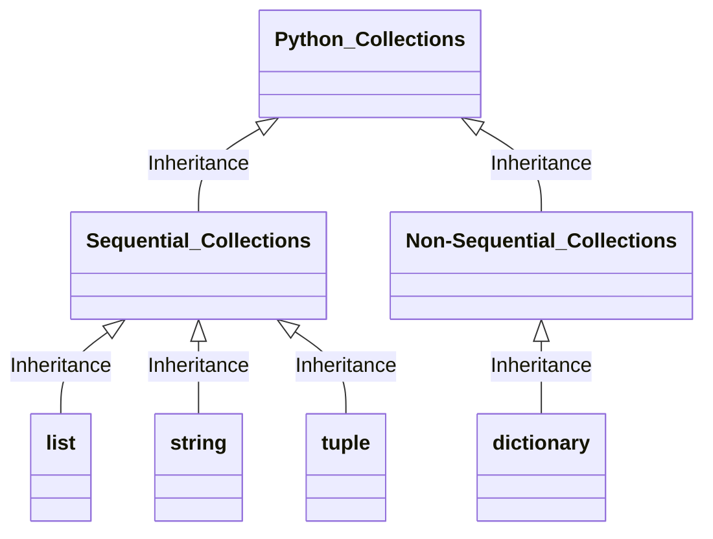

# Week3 DSA & OOP

Updated 1846 GMT+8 Mar 4, 2025

2025 spring, Complied by Hongfei Yan


Logs:

> cs201数算 2025spring每日选做
>
> https://github.com/GMyhf/2025spring-cs201/blob/main/problem_list_2025spring.md
>
> LeetCode 热题 100，https://leetcode.cn/studyplan/top-100-liked/
>
> ​	哈希，双指针，滑动窗口，子串，普通数组，回溯，二分查找，贪心算法，动态规划，技巧，图论（前2个）
>
> 


# 0 数据结构与算法

https://www.geeksforgeeks.org/learn-data-structures-and-algorithms-dsa-tutorial/?ref=outind

## What is DSA?

数据结构与算法（DSA）是两个独立却又紧密相连的领域相结合的产物。它被视为每位计算机科学学生必备的关键技能之一。实践中常常发现，那些对数据结构和算法有深刻理解的人往往比他人更具编程实力，也因此能够在众多求职者中脱颖而出，成功通过各大科技公司的面试。

> DSA is defined as a combination of two separate yet interrelated topics – Data Structure and Algorithms. DSA is one of the most important skills that every computer science student must have. It is often seen that people with good knowledge of these technologies are better programmers than others and thus, crack the interviews of almost every tech giant.


⚠️：算法是计概课程（Algo DS）的主要内容，四大类的算法贪心greedy、递归recursion/回溯backtracking、动态规划dp、搜索searching，我们在计概中覆盖到了。如果同学递归题目做的少，可以找相关题目多练习。

​	如果有题目没有思路，可以直接在这个课程群里面问。
​	1）递归是数算中必备的核心技能，建议优先掌握，可参看 https://github.com/GMyhf/2024fall-cs101/blob/main/20241029_recursion.md
​	2）队列在广度优先搜索（BFS）中有着广泛的应用。可参看 https://github.com/GMyhf/2024fall-cs101/blob/main/20241119_searching.md
​	3）其他的常用技巧，即使没学过也没关系，遇到相关题目时逐一掌握即可。如：双指针（链表里有个 快慢指针需要掌握）、单调栈、二分查找、并查集、滑动窗口、懒删除等。通过 1～2 道题即可理解基础原理，但要熟练掌握需要多加练习。
​	4） OOP 的写法属于语法范畴，可参看 https://www.runoob.com/python3/python3-class.html

> 


## What is Data Structure?

数据结构是指一种特定的存储和组织数据的方式，旨在我们的设备中高效且有效地管理和利用数据。采用数据结构的核心理念在于最小化时间和空间复杂度，即通过占用尽可能少的内存空间并以最短的时间来执行数据操作，从而实现高效的性能。

> A data structure is defined as a particular way of storing and organizing data in our devices to use the data efficiently and effectively. The main idea behind using data structures is to minimize the time and space complexities. An efficient data structure takes minimum memory space and requires minimum time to execute the data.

## What is Algorithm?

算法是指为了解决特定类型的问题或执行某种特定计算而设计的一系列明确定义的步骤。用更简单的话来说，算法就是一组按部就班的操作，通过这些操作来完成一项具体的任务。

> Algorithm is defined as a process or set of well-defined instructions that are typically used to solve a particular group of problems or perform a specific type of calculation. To explain in simpler terms, it is a set of operations performed in a step-by-step manner to execute a task.

## How to start learning DSA?

首先要做的是将整个学习过程分解为一系列需按顺序完成的小任务。从零开始系统地学习数据结构与算法（DSA）的过程可以分为以下四个阶段：

1. **理解时间和空间复杂度**：掌握评估算法效率的关键概念。
2. **学习各数据结构的基础**：熟悉不同数据结构的特点和使用场景。
3. **掌握算法的基础知识**：了解常用算法的工作原理及其应用。
4. **练习DSA相关的题目**：通过实践巩固所学知识，提高解决问题的能力。

> The first and foremost thing is dividing the total procedure into little pieces which need to be done sequentially. The complete process to learn DSA from scratch can be broken into 4 parts:
>
> 1. Learn about Time and Space complexities
> 2. Learn the basics of individual Data Structures
> 3. Learn the basics of Algorithms
> 4. Practice Problems on DSA


## 逻辑视图、物理视图和数据结构

计算机科学并不仅是研究计算机本身。尽管计算机在这一学科中是非常重要的工具，但也仅仅只是工具而已。计算机科学的研究对象是问题、解决问题的过程，以及通过该过程得到的解决方案。给定一个问题，计算机科学家的目标是开发一个能够逐步解决该问题的**算法**。算法是具有有限步骤的过程，依照这个过程便能解决问题。因此，算法就是解决方案。

可以认为计算机科学就是研究算法的学科。但是必须注意，某些问题并没有解决方案。可以将计算机科学更完善地定义为：研究问题及其解决方案，以及研究目前无解的问题的学科。

在研究问题解决过程的同时，计算机科学也研究**抽象**。抽象思维使得我们能分别从逻辑视角和物理视角来看待问题及其解决方案。举一个常见的例子。

试想你每天开车去上学或上班。作为车的使用者，你在驾驶时会与它有一系列的交互：坐进车里，插入钥匙，启动发动机，换挡，刹车，加速以及操作方向盘。从抽象的角度来看，这是从逻辑视角来看待这辆车，你在使用由汽车设计者提供的功能来将自己从某个地方运送到另一个地方。这些功能有时候也被称作**接口**。

另一方面，修车工看待车辆的角度与司机截然不同。他不仅需要知道如何驾驶，而且更需要知道实现汽车功能的所有细节：发动机如何工作，变速器如何换挡，如何控制温度，等等。这就是所谓的物理视角，即看到表面之下的实现细节。

使用计算机也是如此。大多数人用计算机来写文档、收发邮件、浏览网页、听音乐、存储图像以及打游戏，但他们并不需要了解这些功能的实现细节。大家都是从逻辑视角或者使用者的角度来看待计算机。计算机科学家、程序员、技术支持人员以及系统管理员则从另一个角度来看待计算机。他们必须知道操作系统的原理、网络协议的配置，以及如何编写各种脚本来控制计算机。他们必须能够控制用户不需要了解的底层细节。

上面两个例子的共同点在于，用户只需要知道接口是如何工作的，而并不需要知道实现细节。这些接口是用户用于与底层复杂的实现进行交互的方式。

### 1 为何学习数据结构及抽象数据类型

为了控制问题及其求解过程的复杂度，计算机科学家利用抽象来帮助自己专注于全局，从而避免迷失在众多细节中。通过对问题进行建模，可以更高效地解决问题。模型可以帮助计算机科学家更一致地描述算法要用到的数据。

如前所述，过程抽象将功能的实现细节隐藏起来，从而使用户能从更高的视角来看待功能。**数据抽象**的基本思想与此类似。**抽象数据类型**（简称为ADT）从逻辑上描述了如何看待数据及其对应运算而无须考虑具体实现。这意味着我们仅需要关心数据代表了什么，而可以忽略它们的构建方式。通过这样的抽象，我们对数据进行了一层封装，其基本思想是封装具体的实现细节，使它们对用户不可见，这被称为信息隐藏。

图1-1展示了抽象数据类型及其原理。用户通过抽象数据类型提供的操作来与接口交互。抽象数据类型是与用户交互的外壳。真正的实现则隐藏在内部。用户并不需要关心各种实现细节。


<center>图1-1 抽象数据类型</center>

抽象数据类型的实现，通常被称为**数据结构**。它是**物理视图**和**逻辑视图**之间的桥梁，因为数据结构既定义了数据的逻辑特性（如栈或队列的操作），也决定了这些特性的具体实现方式（如使用数组或链表）。逻辑视图和物理视图的分离使我们能够在不透露模型实际构建细节的情况下定义复杂的数据模型来解决相应的问题。这提供了与实现无关的逻辑视图。由于通常会有多种不同的方法来实现一个抽象数据类型，这种实现独立性允许程序员在不改变用户与数据交互方式的前提下切换实现的具体细节。因此，用户可以专注于问题解决的过程。The implementation of an abstract data type, often referred to as a **data structure**, will require that we provide a physical view of the data using some collection of programming constructs and primitive data types. As we discussed earlier, the separation of these two perspectives will allow us to define the complex data models for our problems without giving any indication as to the details of how the model will actually be built. This provides an **implementation-independent** view of the data. Since there will usually be many different ways to implement an abstract data type, this implementation independence allows the programmer to switch the details of the implementation without changing the way the user of the data interacts with it. The user can remain focused on the problem-solving process.

> 在计算机科学和软件工程中，“物理视图”、“数据视图”和“数据结构”是三个相关但含义不同的术语。
>
> **物理视图 (Physical View)**：
>
> - 物理视图指的是数据如何在计算机内存或存储设备上实际组织和表示的细节。它涉及到具体的数据布局、存储格式、访问方法等。例如，在实现一个数组时，物理视图会包括数组元素在内存中的连续存储方式，或者在一个链表中节点是如何通过指针相互链接的。
>
> **逻辑视图（也称为数据视图, Logical or Data View）**：
>
> - 逻辑视图（或数据视图）是指从用户或应用程序的角度看到的数据组织形式。它是抽象数据类型（ADT）的一部分，描述了数据应该具有的行为和操作，而不涉及这些操作是如何具体实现的。换句话说，逻辑视图定义了数据模型的功能特性，而不是其实现细节。例如，栈（stack）的逻辑视图只关心压入（push）和弹出（pop）操作，而不需要知道内部是用数组还是链表来实现。
>
> **数据结构 (Data Structure)**：
>
> - 数据结构是用来组织、管理和存储数据的方式，以便能够高效地访问和修改数据。它可以看作是物理视图和逻辑视图之间的桥梁，因为数据结构既定义了数据的逻辑特性（如栈或队列的操作），也决定了这些特性的具体实现方式（如使用数组或链表）。因此，数据结构的选择直接影响到程序的性能和复杂度。
>
> 原文中的 "physical view of the data" 更贴近于“数据的物理视图”，即关注的是数据在底层硬件上的表示和存储方式；而“implementation-independent view of the data” 则更倾向于描述“逻辑视图”或“数据视图”，强调的是与具体实现无关的数据抽象。
>


```
数据结构
├── 逻辑结构
│   ├── 集合结构
│   ├── 线性结构：线性表、栈、队列、串
│   ├── 非线性结构：数组、树、堆、图
│   └── 树形结构
└── 物理结构
    ├── 顺序存储
    ├── 链式存储
    ├── 索引存储 (Indexing)：B树、B+树等，适合有序数据和范围查询
    └── 散列存储 (Hashing)：在单一键值查找上表现优异
```


### 编程题目

#### 06640: 倒排索引

data structures, http://cs101.openjudge.cn/practice/06640/


#### 04093: 倒排索引查询

data structures, http://cs101.openjudge.cn/practice/04093/


> 在信息检索Infomation Retrieval领域，搜索引擎的工作原理是抓取网页，每个网页是一个doc，处理成token的序列。为了检索时候快速响应用户输入的查询token，所以要建token -> doc的倒排索引。
>
> document -> token，是正排。token -> doc_i, doc_j, ... 是倒排。名字就是这样来的。


**字典不设置上限，会耗尽内存**

https://github.com/GMyhf/2025spring-cs201/blob/main/code/2048/6_auto_2048_optimized.py

```python
#!/usr/bin/env python3
import random
import os
import sys
import time

BOARD_SIZE = 4
TARGET = 2048
SEARCH_DEPTH = 3  # 搜索深度

# 缓存 expectimax 计算结果
cache = {}

def board_to_key(board):
    return tuple(tuple(row) for row in board)

def init_board():
    board = [[0] * BOARD_SIZE for _ in range(BOARD_SIZE)]
    add_random_tile(board)
    add_random_tile(board)
    return board

def add_random_tile(board):
    empty = [(i, j) for i in range(BOARD_SIZE) for j in range(BOARD_SIZE) if board[i][j] == 0]
    if not empty:
        return
    i, j = random.choice(empty)
    board[i][j] = 4 if random.random() < 0.1 else 2
...
```


### 2 为何学习算法

计算机科学家通过经验来学习：<mark>观察他人如何解决问题，然后亲自解决问题</mark>。<mark>接触各种问题解决技巧并学习不同算法的设计方法，有助于解决新的问题</mark>。通过学习一系列不同的算法，可以举一反三，从而在遇到类似的问题时，能够快速加以解决。

各种算法之间往往差异巨大。例如求平方根的例子，完全可能有多种方法来实现计算平方根的函数。算法一可能使用了较少的资源，算法二返回结果所需的时间可能是算法一的10倍。我们需要某种方式来比较这两种算法。尽管这两种算法都能得到结果，但是其中一种可能比另一种“更好”——更高效、更快，或者使用的内存更少。随着对算法的进一步学习，你会掌握比较不同算法的分析技巧。这些技巧只依赖于算法本身的特性，而不依赖于程序或者实现算法的计算机的特性。

最坏的情况是遇到难以解决的问题，即没有算法能够在合理的时间内解决该问题。因此，至关重要的一点是，要能区分有解的问题、无解的问题，以及虽然有解但是需要过多的资源和时间来求解的问题。

在选择算法时，经常会有所权衡。除了有解决问题的能力之外，计算机科学家也需要知晓<mark>如何评估一个解决方案</mark>。总之，问题通常有很多解决方案，如何找到一个解决方案并且确定其为优秀的方案，是需要反复练习、熟能生巧的。


# 1 OOP及Python基础

本节为之前提到的思想提供更详细的例子。目标是复习Python并且强化一些会在后续各章中变得非常重要的概念。
Python是一门现代、易学、面向对象的编程语言。它拥有强大的內建数据类型以及简单易用的控制语句。由于Python是一门解释型语言，因此只需要查看和描述交互式会话就能进行学习。解释器会显示提示符>>>，然后计算你提供的Python语句。例如，以下代码显示了提示符、print函数、结果，以及下一个提示符。

```
>>> print("Algorithms and Data Structures")
>>> Algorithms and Data Structures
>>>
```




## 1.1 数据

Python支持面向对象编程范式。这意味着Python认为数据是问题解决过程中的关键点。在Python以及其他所有面向对象编程语言中，类都是对数据的构成（状态）以及数据能做什么（行为）的描述。由于类的使用者只能看到数据项的状态和行为，因此<mark>类与抽象数据类型</mark>是相似的。在面向对象编程范式中，数据项被称作对象。一个对象就是类的一个实例。

### 1 内建原子数据类型

我们首先看原子数据类型。Python有两大內建数据类实现了整数类型和浮点数类型，相应的Python类就是int和float。标准的数学运算符，即+、-、＊、/以及＊＊（幂），可以和能够改变运算优先级的括号一起使用。其他非常有用的运算符包括取模运算符%，以及整除运算符//。注意，当两个整数相除时，其结果是一个浮点数，而整除运算符截去小数部分，只返回商的整数部分。

Python通过bool类实现对表达真值非常有用的布尔数据类型。布尔对象可能的状态值是True或者False，布尔运算符有and、or以及not。

布尔对象也被用作相等（==）、大于（>）等比较运算符的计算结果。此外，结合使用关系运算符与逻辑运算符可以表达复杂的逻辑问题。表2-1展示了关系运算符和逻辑运算符。

表2-1 关系运算符和逻辑运算符

| **Operation Name**    | **Operator** | **Explanation**                                              |
| :-------------------- | :----------- | :----------------------------------------------------------- |
| less than             | <            | Less than operator                                           |
| greater than          | >            | Greater than operator                                        |
| less than or equal    | <=           | Less than or equal to operator                               |
| greater than or equal | >=           | Greater than or equal to operator                            |
| equal                 | ==           | Equality operator                                            |
| not equal             | !=           | Not equal operator                                           |
| logical and           | $and$        | Both operands True for result to be True                     |
| logical or            | $or$         | One or the other operand is True for the result to be True   |
| logical not           | $not$        | Negates the truth value, False becomes True, True becomes False |


标识符在编程语言中被用作名字。Python中的标识符以字母或者下划线（_）开头，区分大小写，可以是任意长度。采用能表达含义的名字是良好的编程习惯，这使程序代码更易阅读和理解。

当一个名字第一次出现在赋值语句的左边部分时，会创建对应的Python变量。赋值语句将名字与值关联起来。变量存的是指向数据的引用，而不是数据本身。

赋值语句改变了变量的引用，这体现了Python的动态特性。同样的变量可以指向许多不同类型的数据。

> 教学目标：深化对经典数据结构的理解与应用，提升算法设计与分析能力，培养工程化编程思维和代码质量意识。
>
> 教学方式：采用“案例教学+实践训练”的教学模式，通过101余道综合性编程题目进行实践训练，强化算法应用能力。
>
> 考核重点：算法效率（时间复杂度、空间复杂度），程序设计规范性，问题建模与解决能力。
>
> 代码要求：遵循PEP 8代码规范，鼓励采用面向对象编程（OOP）范式，强调代码的可测试性和可扩展性。


### 2 内建集合数据类型

除了数值类和布尔类，Python还有众多强大的內建集合类。列表、字符串以及元组是概念上非常相似的有序集合，但是只有理解它们的差别，才能正确运用。集合和字典是<mark>无序</mark>集合。

**列表**是零个或多个指向Python数据对象的引用的有序集合，通过在方括号内以逗号分隔的一系列值来表达。空列表就是[ ]。列表是异构的，这意味着其指向的数据对象不需要都是同一个类，并且这一集合可以被赋值给一个变量。

由于列表是有序的，因此它支持一系列可应用于任意Python序列的运算，如表2-2所示。

表2-2 可应用于任意Python序列的运算

| **Operation Name** | **Operator** | **Explanation**                         |
| :----------------- | :----------- | :-------------------------------------- |
| indexing           | [ ]          | Access an element of a sequence         |
| concatenation      | +            | Combine sequences together              |
| repetition         | *            | Concatenate a repeated number of times  |
| membership         | in           | Ask whether an item is in a sequence    |
| length             | len          | Ask the number of items in the sequence |
| slicing            | [ : ]        | Extract a part of a sequence            |


需要注意的是，列表和序列的下标从0开始。myList[1:3]会返回一个包含下标从1到2的元素列表（并没有包含下标为3的元素）。
如果需要快速初始化列表，可以通过重复运算来实现，如下所示。

```
>>> myList = [0] ＊ 6
>>> myList 
[0, 0, 0, 0, 0, 0]
```

非常重要的一点是，重复运算返回的结果是序列中指向数据对象的<mark>引用</mark>的重复。下面的例子可以很好地说明这一点。

```
>>> myList = [1,2,3,4]
>>> A = [myList]＊3
>>> A
[[1, 2, 3, 4], [1, 2, 3, 4], [1, 2, 3, 4]]
>>> myList[2] = 45
>>> A 
[[1, 2, 45, 4], [1, 2, 45, 4], [1, 2, 45, 4]]
```

变量A包含3个指向myList的引用。myList中的一个元素发生改变，A中的3处都随即改变。
列表支持一些用于构建数据结构的方法，如表2-3所示。后面的例子展示了用法。


表2-3 Python列表提供的方法

| **Method Name** | **Use**                | **Explanation**                                     |
| :-------------- | :--------------------- | :-------------------------------------------------- |
| `append`        | `alist.append(item)`   | Adds a new item to the end of a list                |
| `insert`        | `alist.insert(i,item)` | Inserts an item at the ith position in a list       |
| `pop`           | `alist.pop()`          | Removes and returns the last item in a list         |
| `pop`           | `alist.pop(i)`         | Removes and returns the ith item in a list          |
| `sort`          | `alist.sort()`         | Modifies a list to be sorted                        |
| `reverse`       | `alist.reverse()`      | Modifies a list to be in reverse order              |
| `del`           | `del alist[i]`         | Deletes the item in the ith position                |
| `index`         | `alist.index(item)`    | Returns the index of the first occurrence of `item` |
| `count`         | `alist.count(item)`    | Returns the number of occurrences of `item`         |
| `remove`        | `alist.remove(item)`   | Removes the first occurrence of `item`              |

你会发现，像pop这样的方法在返回值的同时也会修改列表的内容，<mark>reverse等方法则仅修改列表而不返回任何值</mark>。pop默认返回并删除列表的最后一个元素，但是也可以用来返回并删除特定的元素。这些方法默认下标从0开始。你也会注意到那个熟悉的句点符号，它被用来调用某个对象的方法。

range是一个常见的Python函数，我们常把它与列表放在一起讨论。range会生成一个代表值序列的范围对象。使用list函数，能够以列表形式看到范围对象的值。

范围对象表示整数序列。默认情况下，它从0开始。如果提供更多的参数，它可以在特定的点开始和结束，并且跳过中间的值。在第一个例子中，range(10) 从0开始并且一直到9为止（不包含10）；在第二个例子中，range(5,10) 从5开始并且到9为止（不包含10）; range(5,10,2) 的结果类似，但是元素的间隔变成了2（10还是没有包含在其中）。

> **Matrices 矩阵**
>
> 在学习编程的过程中，经常遇到输入的数据是矩阵的形式，所以我们首先来明确矩阵的概念。
>
> **知识点：矩阵**
>
> 这段矩阵知识点的讲解，借鉴自《数学要素》的1.4和1.5节，作者：姜伟生，2023-06-01出版。
>
> 
>
> 万物皆数。
> All is Number.
> 															——毕达哥拉斯(Pythagoras)｜古希腊哲学家、数学家｜570 B.C.—495 B.C.        
>
> ```mermaid
> flowchart TD
> 	linkStyle default interpolate basis
> 
> 
> AllIsNumber-->complex("复数")
> 	complex-->imaginary("虚数");complex-->real("实数");
> 	real-->irrational("无理数");real-->rational("有理数");
> 	rational-->non-integer("非整数");rational-->integers("整数");
> 	integers-->positive("正整数");integers-->zero("零");integers-->negative("负整数");
> AllIsNumber-->add-sub("加减")
> 	add-sub-->add("加");add-sub-->cumulative("累加");add-sub-->sub("减");
> AllIsNumber-->vector("向量")
> 	vector-->rowvec("行向量");vector-->colvec("列向量");vector-->transpose("向量转置");
> 
> AllIsNumber(万物皆数)--> matrix("矩阵");
> 
> 
> subgraph matrices
> 		matrix-->Numberofrows-columns("行数和列数"); 
> 		matrix-->element("元素");
> 		matrix-->chunk("分块");
> 			chunk-->YZLXL("一组列向量");chunk-->YZHXL("一组行向量");
> 		matrix-->transpose-diagonal("矩阵转置和主对角线");
> 		matrix-->TSJZXZ("特殊矩阵形状");
> 
> 		matrix-->JJF("加减法");
> 			JJF-->identicalshapes("形状相同");JJF-->correspondingpositions("对应位置");JJF-->Batchaddition-subtraction("批量加减");
> 
> end
> ```
>
> ​				图1 数的结构
>
> 
>
> **向量：数字排成行、列**
>
> 向量、矩阵等线性代数概念对于数据科学和机器学习至关重要。在机器学习中，数据几乎都以矩阵形式存储、运算。毫不夸张地说，没有线性代数就没有现代计算机运算。逐渐地，大家会发现算数、代数、解析几何、微积分、概率统计、优化方法并不是一个个孤岛，而线性代数正是连接它们的重要桥梁之一。
>
> **行向量、列向量**
>
> 若干数字排成一行或一列，并且用中括号括起来，得到的数组叫作向量(vector)。
> 排成一行的叫作行向量(row vector)，排成一列的叫作列向量(column vector)。
> 通俗地讲，行向量就是表格的一行数字，列向量就是表格的一列数字。以下两例分别展示了行向量和列向量，即
> $$
> \left[
> \matrix{
> 1 & 2 & 3 
> }
> \right]_{1\times 3},
> 
> \left[
> \matrix{
> 1 \\
> 2 \\
> 3 
> }
> \right]_{3\times 1}\tag{1}
> $$
>
>
> 式(1)中，下角标“1×3”代表“1行、3列”，“3×1”代表“3行、1列”。
>
> **转置**
>
> 转置符号为上标“T”。行向量转置(transpose)可得到列向量；同理，列向量转置可得到行向量。举例如下，有
> $$
> \left[
> \matrix{
> 1 & 2 & 3 
> }
> \right]^\mathrm T
> =
> \left[
> \matrix{
> 1 \\
> 2 \\
> 3 
> }
> \right],
> 
> 
> \left[
> \matrix{
> 1 \\
> 2 \\
> 3 
> }
> \right]^\mathrm T
> =
> \left[
> \matrix{
> 1 & 2 & 3
> }
> \right]
> 
> \tag{2}
> $$
>
> **矩阵：数字排列成长方形**
>
> 矩阵(matrix)将一系列数字以长方形方式排列，如
>
>
> $$
> \left[
> \matrix{
> 1 & 2 & 3 \\
> 4 & 5 & 6
> }
> \right]_{2\times 3},
> 
> \left[
> \matrix{
> 1 & 2 \\
> 3 & 4 \\
> 5 & 6 
> }
> \right]_{3\times 2},
> 
> \left[
> \matrix{
> 1 & 2 \\
> 3 & 4 
> }
> \right]_{2\times 2}
> 
> \tag{3}
> $$
>
> 通俗地讲，矩阵将数字排列成表格，有行、有列。式 (3) 给出了三个矩阵，形状分别是2行3列、3行2列和2行2列。
> 通常用大写字母代表矩阵，比如矩阵A和矩阵B。
> 图2所示为一个n×D矩阵X。n是矩阵的行数(number of rows in the matrix)，D是矩阵的列数(number of columns in the matrix)。X可以展开写成表格形式，即
> $$
> X_{n\times D}=
> \left[
> \matrix{
> x_{1,1} & x_{1,2} & ... & x_{1,D} \\
> x_{2,1} & x_{2,2} & ... & x_{2,D} \\
> \vdots & \vdots & \ddots & \vdots\\
> x_{n,1} & x_{n,2} & ... & x_{n,D} 
> }
> \right]
> 
> \tag{4}
> $$
>
>
> ​				
>
> 
>
> ​				图2　n×D矩阵X
>
> 
>
> 再次强调：先说行号，再说列号。数据矩阵一般采用大写X表达。
>
> 矩阵X中，元素(element) $x_{i,j}$ 被称作i,j元素（i j entry或i j element），也可以说$x_{i,j}$出现在i行j列(appears in row i and column j)。比如，$x_{n,1}$是矩阵X的第n行、第1列元素。
> 表1 总结了如何用英文读矩阵和矩阵元素。
>
> 表1　矩阵有关英文表达
>
> 
>
> 
>
> 
>
> **range中使用min、max**
>
> 
>
> **02659:Bomb Game**
>
> matrices, http://cs101.openjudge.cn/practice/02659/
>
> ```python
> ...
>     for (R, S, P, T) in bombs:
>         for i in range(max(0, R - (P - 1) // 2), min(A, R + (P + 1) // 2)):
>             for j in range(max(0, S - (P - 1) // 2), min(B, S + (P + 1) // 2)):
> ...
> ```
>
> **04133:垃圾炸弹**
>
> matrices, http://cs101.openjudge.cn/practice/04133/
>
> ```python
>     for i in range(max(x-d, 0), min(x+d+1, 1025)):
>         for j in range(max(y-d, 0), min(y+d+1, 1025)):
> ```
>
> 


**字符串**是零个或多个字母、数字和其他符号的有序集合。这些字母、数字和其他符号被称为字符。常量字符串值通过引号（单引号或者双引号均可）与标识符进行区分。

由于字符串是序列，因此之前提到的所有序列运算符都能用于字符串。此外，字符串还有一些特有的方法，表2-4列举了其中一些。

表2-4 Python字符串提供的方法

| **Method Name** | **Use**                | **Explanation**                                           |
| :-------------- | :--------------------- | :-------------------------------------------------------- |
| `center`        | `astring.center(w)`    | Returns a string centered in a field of size `w`          |
| `count`         | `astring.count(item)`  | Returns the number of occurrences of `item` in the string |
| `ljust`         | `astring.ljust(w)`     | Returns a string left-justified in a field of size `w`    |
| `lower`         | `astring.lower()`      | Returns a string in all lowercase                         |
| `rjust`         | `astring.rjust(w)`     | Returns a string right-justified in a field of size `w`   |
| `find`          | `astring.find(item)`   | Returns the index of the first occurrence of `item`       |
| `split`         | `astring.split(schar)` | Splits a string into substrings at `schar`                |

split在处理数据的时候非常有用。split接受一个字符串，并且返回一个由分隔字符作为分割点的字符串列表。


列表和字符串的主要区别在于，列表能够被修改，字符串则不能。列表的这一特性被称为可修改性。列表具有可修改性，字符串则不具有。

由于都是异构数据序列，因此元组与列表非常相似。它们的区别在于，元组和字符串一样是不可修改的。元组通常写成由括号包含并且以逗号分隔的一系列值。与序列一样，元组允许之前描述的任一操作。

集合（set）是由零个或多个不可修改的Python数据对象组成的无序集合。集不允许重复元素，并且写成由花括号包含、以逗号分隔的一系列值。空集由set()来表示。集是异构的。

尽管集是无序的，但它还是支持之前提到的一些运算，如表2-5所示。

表2-5 Python集合支持的运算

| **Operation Name** | **Operator**       | **Explanation**                                              |
| :----------------- | :----------------- | :----------------------------------------------------------- |
| membership         | in                 | Set membership                                               |
| length             | len                | Returns the cardinality of the set                           |
| `|`                | `aset | otherset`  | Returns a new set with all elements from both sets           |
| `&`                | `aset & otherset`  | Returns a new set with only those elements common to both sets |
| `-`                | `aset - otherset`  | Returns a new set with all items from the first set not in second |
| `<=`               | `aset <= otherset` | Asks whether all elements of the first set are in the second |

集支持一系列方法，如表2-6所示。在数学中运用过集合概念的人应该对它们非常熟悉。Note that `union`, `intersection`, `issubset`, and `difference` all have operators that can be used as well.

Note that `union`, `intersection`, `issubset`, and `difference` all have operators that can be used as well.


表2-6 Python集合提供的方法

| **Method Name** | **Use**                       | **Explanation**                                              |
| :-------------- | :---------------------------- | :----------------------------------------------------------- |
| `union`         | `aset.union(otherset)`        | Returns a new set with all elements from both sets           |
| `intersection`  | `aset.intersection(otherset)` | Returns a new set with only those elements common to both sets |
| `difference`    | `aset.difference(otherset)`   | Returns a new set with all items from first set not in second |
| `issubset`      | `aset.issubset(otherset)`     | Asks whether all elements of one set are in the other        |
| `add`           | `aset.add(item)`              | Adds item to the set                                         |
| `remove`        | `aset.remove(item)`           | Removes item from the set                                    |
| `pop`           | `aset.pop()`                  | Removes an arbitrary element from the set                    |
| `clear`         | `aset.clear()`                | Removes all elements from the set                            |


字典是无序结构，由相关的元素对构成，其中每对元素都由一个键和一个值组成。这种键-值对通常写成键：值的形式。字典由花括号包含的一系列以逗号分隔的键-值对表达，

可以通过键访问其对应的值，也可以向字典添加新的键-值对。访问字典的语法与访问序列的语法十分相似，只不过是使用键来访问，而不是下标。添加新值也类似。

需要谨记，字典并不是根据键来进行有序维护的。键的位置是由散列来决定的，后续章节会详细介绍散列。len函数对字典的功能与对其他集合的功能相同。

字典既有运算符，又有方法。表2-7和表2-8分别展示了它们。keys、values和items方法均会返回包含相应值的对象。可以使用list函数将字典转换成列表。在表2-8中可以看到，get方法有两种版本。如果键没有出现在字典中，get会返回None。然而，第二个可选参数可以返回特定值。

表2-7 Python字典支持的运算

| **Operator** | **Use**          | **Explanation**                                              |
| :----------- | :--------------- | :----------------------------------------------------------- |
| `[]`         | `myDict[k]`      | Returns the value associated with `k`, otherwise its an error |
| `in`         | `key in adict`   | Returns `True` if key is in the dictionary, `False` otherwise |
| `del`        | del `adict[key]` | Removes the entry from the dictionary                        |


表2-8 Python字典提供的方法

| **Method Name** | **Use**            | **Explanation**                                              |
| :-------------- | :----------------- | :----------------------------------------------------------- |
| `keys`          | `adict.keys()`     | Returns the keys of the dictionary in a dict_keys object     |
| `values`        | `adict.values()`   | Returns the values of the dictionary in a dict_values object |
| `items`         | `adict.items()`    | Returns the key-value pairs in a dict_items object           |
| `get`           | `adict.get(k)`     | Returns the value associated with `k`, `None` otherwise      |
| `get`           | `adict.get(k,alt)` | Returns the value associated with `k`, `alt` otherwise       |

<mark>defaultdict</mark>

> `defaultdict` 是 Python `collections` 模块中提供的一个类，它继承自内置的 `dict` 类。与普通字典相比，`defaultdict` 的主要特点是当你尝试访问一个不存在的键时，它不会抛出 `KeyError` 异常，而是会自动为这个键生成一个默认值。
>
> `defaultdict` 在初始化时需要指定一个“工厂函数”，用于在访问不存在的键时生成默认值。常用的工厂函数包括 `int`（返回0）、`list`（返回空列表）、`set`（返回空集合）等。
>
> 以下是一些使用 `defaultdict` 的示例：
>
> **创建一个 `defaultdict`**
>
> ```python
> from collections import defaultdict
> 
> # 使用 int 作为工厂函数，适用于计数
> count_dict = defaultdict(int)
> count_dict['apple'] += 1
> print(count_dict['apple'])  # 输出: 1
> print(count_dict['banana'])  # 输出: 0，注意这里'banana'之前未定义
> 
> # 使用 list 作为工厂函数，适用于存储分组信息
> group_dict = defaultdict(list)
> group_dict['fruits'].append('apple')
> group_dict['fruits'].append('banana')
> print(group_dict['fruits'])  # 输出: ['apple', 'banana']
> print(group_dict['vegetables'])  # 输出: []，空列表
> ```
>
> **应用场景**
>
> - **计数**：例如统计文档中每个单词出现的次数。
> - **分组**：例如将数据按某个属性分组。
>
> **示例：单词计数**
>
> 假设有一个包含多个字符串的列表，想要统计每个字符串出现的次数：
>
> ```python
> from collections import defaultdict
> 
> words = ["apple", "banana", "apple", "orange", "banana", "banana"]
> word_count = defaultdict(int)
> 
> for word in words:
>     word_count[word] += 1
> 
> print(dict(word_count))  # 输出: {'apple': 2, 'banana': 3, 'orange': 1}
> ```
>
> **示例：根据类别分组**
>
> 假设有如下数据结构，希望将其按类别分组：
>
> ```python
> from collections import defaultdict
> 
> items = [('水果', '苹果'), ('水果', '香蕉'), ('蔬菜', '白菜'), ('水果', '橙子'), ('蔬菜', '萝卜')]
> grouped_items = defaultdict(list)
> 
> for category, item in items:
>     grouped_items[category].append(item)
> 
> print(dict(grouped_items))
> # 输出: {'水果': ['苹果', '香蕉', '橙子'], '蔬菜': ['白菜', '萝卜']}
> ```
>
> `defaultdict` 提供了一种更加便捷的方式来处理需要默认值的情况，使得代码更加简洁易读。但是需要注意的是，在不需要默认行为的情况下，使用普通的 `dict` 可能更为合适，以避免不必要的性能开销或意外行为。


## 1.2基本语法

### 1 输入与输出

程序经常需要与用户进行交互，以获得数据或者提供某种结果。目前的大多数程序使用对话框作为要求用户提供某种输入的方式。尽管Python确实有方法来创建这样的对话框，但是可以利用更简单的函数。Python提供了一个函数，它使得我们可以要求用户输入数据并且返回一个字符串的引用。这个函数就是input。

input函数接受一个字符串作为参数。由于该字符串包含有用的文本来提示用户输入，因此它经常被称为提示字符串。

不论用户在提示字符串后面输入什么内容，都会被存储在aName变量中。使用input函数，可以非常简便地写出程序，让用户输入数据，然后再对这些数据进行进一步处理。

需要注意的是，input函数返回的值是一个字符串，它包含用户在提示字符串后面输入的所有字符。如果需要将这个字符串转换成其他类型，必须明确地提供类型转换。


> **04093: 倒排索引查询**
>
> data structures, http://cs101.openjudge.cn/practice/04093/
>
> ...
>
> 样例输入
>
> ```
> 3
> 3 1 2 3
> 1 2
> 1 3
> 3
> 1 1 1
> 1 -1 0
> 1 -1 -1
> ```
>
> ...
>
> ```python
> import sys
> input = sys.stdin.read
> data = input().split()
> 
> index = 0
> N = int(data[index])
> index += 1
> 
> word_documents = []
> 
> # 读取每个词的倒排索引
> for _ in range(N):
>     ci = int(data[index])
>     index += 1
>     documents = sorted(map(int, data[index:index + ci]))
>     index += ci
>     word_documents.append(documents)
> ....
> ```
>
> 
>
> **09201: Freda的越野跑**
>
> http://cs101.openjudge.cn/practice/09201/
>
> ...
>
> 样例输入
>
> ```
> 5
> 1 3 10 8 5
> ```
>
> ...
>
> ```python
> import sys
> ...
> n = int(sys.stdin.readline())
> a = list(map(int, sys.stdin.readline().split()))
> ```
>
> 


格式化字符串
print函数为输出Python程序的值提供了一种非常简便的方法。它接受零个或者多个参数，并且将单个空格作为默认分隔符来显示结果。通过设置sep这一实际参数可以改变分隔符。此外，每一次打印都默认以换行符结尾。这一行为可以通过设置实际参数end来更改。

更多地控制程序的输出格式经常十分有用。幸运的是，Python提供了另一种叫作格式化字符串的方式。格式化字符串是一个模板，其中包含保持不变的单词或空格，以及之后插入的变量的占位符。


> **04140: 方程求解**
>
> 牛顿迭代法，http://cs101.openjudge.cn/practice/04140/
>
> ```python
> ....
> print(f"{root2:.9f}")
> ```
>


### 2 控制结构

算法需要两个重要的控制结构：迭代和分支。Python通过多种方式支持这两种控制结构。程序员可以根据需要选择最有效的结构。

对于迭代，Python提供了标准的while语句以及非常强大的for语句。while语句会在给定条件为真时重复执行一段代码。


分支语句允许程序员进行询问，然后根据结果，采取不同的行动。绝大多数的编程语言都提供两种有用的分支结构：if else和if。

和其他所有控制结构一样，分支结构支持嵌套，一个问题的结果能帮助决定是否需要继续问下一个问题。

另一种表达嵌套分支的语法是使用elif关键字。将else和下一个if结合起来，可以减少额外的嵌套层次。注意，最后的else仍然是必需的，它用来在所有分支条件都不满足的情况下提供默认分支。


列表可以不通过迭代结构和分支结构来创建，这种方式被称为<mark>列表解析式</mark>。通过列表解析式，可以根据一些处理和分支标准轻松创建列表。

> Returning to lists, there is an alternative method for creating a list that uses iteration and selection constructs known as a **list comprehension**. A list comprehension allows you to easily create a list based on some processing or selection criteria. 
>
> 
>
> 只想包括偶数的平方，可以加上条件：
>
> ```python
> even_squares = [x*x for x in range(1, 11) if x % 2 == 0]
> ```
>
> 这种方式不仅使得代码更加简洁，而且在很多情况下也更易于阅读和理解。


### 3 异常处理

在编写程序时通常会遇到两种错误。第一种是语法错误，也就是说，程序员在编写语句或者表达式时出错。

第二种是逻辑错误，即程序能执行完成但返回了错误的结果。这可能是由于算法本身有错，或者程序员没有正确地实现算法。有时，逻辑错误会导致诸如除以0、越界访问列表等非常严重的情况。这些逻辑错误会导致运行时错误，进而导致程序终止运行。通常，这些运行时错误被称为异常。

许多初级程序员简单地把异常等同于引起程序终止的严重运行时错误。然而，大多数编程语言都提供了让程序员能够处理这些错误的方法。此外，程序员也可以在检测到程序执行有问题的情况下自己创建异常。
当异常发生时，我们称程序“抛出”异常。可以用try语句来“处理”被抛出的异常。


> **04015: 邮箱验证**
>
> strings, http://cs101.openjudge.cn/practice/04015
>
> 这题目输入没有明确结束，需要套在try ...  except里面。测试时候，需要模拟输入结束，看你是window还是mac。If the user hits EOF (*nix: Ctrl-D, Windows: Ctrl-Z+Return), raise EOFError.
>
> ```python
> while True:
>     try:
>         s = input()
>     except EOFError:
>         break
>     
> 		...
>     print('NO' if q==-1 else 'YES')
> ```
>
> 


### 4 定义函数

通常来说，可以通过定义函数来隐藏任何计算的细节。函数的定义需要一个函数名、一系列参数以及一个函数体。函数也可以显式地返回一个值。


## 1.3 面向对象编程

Python是一门面向对象的编程语言。到目前为止，我们已经使用了一些內建的类来展示数据和控制结构的例子。面向对象编程语言最强大的一项特性是允许程序员（问题求解者）创建全新的类来对求解问题所需的数据进行建模。

我们之前使用了抽象数据类型来对数据对象的状态及行为进行逻辑描述。通过构建能实现抽象数据类型的类，可以利用抽象过程，同时为真正在程序中运用抽象提供必要的细节。每当需要实现抽象数据类型时，就可以创建新类。

### 1 Fraction类

要展示如何实现用户定义的类，一个常用的例子是构建实现抽象数据类型Fraction的类。我们已经看到，Python提供了很多数值类。但是在有些时候，需要创建“看上去很像”分数的数据对象。

像 $\frac {3}{5}$​ 这样的分数由两部分组成。上面的值称作分子，可以是任意整数。下面的值称作分母，可以是任意大于0的整数（负的分数带有负的分子）。尽管可以用浮点数来近似表示分数，但我们在此希望能精确表示分数的值。

Fraction对象的表现应与其他数值类型一样。我们可以针对分数进行加、减、乘、除等运算，也能够使用标准的斜线形式来显示分数，比如3/5。此外，所有的分数方法都应该返回结果的最简形式。这样一来，不论进行何种运算，最后的结果都是最简分数。

在Python中<mark>定义新类的做法</mark>是，提供一个类名以及一整套与函数定义语法类似的方法定义。以下是一个方法定义框架。

> 在 Python 中，新创建的类默认继承自 `object` 类。`object` 是所有类的基类，也称为顶级基类或根类。这意味着在 Python 中，如果没有显式指定一个类的基类，它将自动成为 `object` 类的子类。
>
> 在类中定义的方法（包括 `__str__` 方法）的第一个参数应该是 <mark>self，它表示对当前对象的引用</mark>。这样，Python <mark>在调用方法时会自动将该对象作为第一个参数传递给方法</mark>。
>
> 当我们在多个类中定义了 `__str__` 方法时，通过 self 参数，Python 可以确定应该执行哪个类的 `__str__` 方法。

```python
class Fraction

		#the methods go here
```

所有类都应该首先提供构造方法。构造方法定义了数据对象的创建方式。要创建一个Fraction对象，需要提供分子和分母两部分数据。在Python中，构造方法总是命名为`__init__`（即在init的前后分别有两个下划线）。

代码 Fraction类及其构造方法

```python
def __init__(self, top, bottom):
    
    self.num = top
    self.den = bottom
```


注意，形式参数列表包含 3 项。<mark>self是一个总是指向对象本身的特殊参数，它必须是第一个形式参数</mark>。然而，在调用方法时，从来不需要提供相应的实际参数。如前所述，分数需要分子与分母两部分状态数据。构造方法中的`self.num`定义了`Fraction`对象有一个叫作`num`的内部数据对象作为其状态的一部分。同理，`self.den`定义了分母。这两个实际参数的值在初始时赋给了状态，使得新创建的`Fraction`对象能够知道其初始值。

要创建Fraction类的实例，必须调用构造方法。使用类名并且传入状态的实际值就能完成调用（注意，不要直接调用`__init__`）。


```python
myfraction = Fraction(3,5)
```

以上代码创建了一个对象，名为`myfraction`，值为`3/5`。图2-1展示了这个对象。


<center>图2-1 Fraction类的一个实例</center>

接下来实现这一抽象数据类型所需要的行为。考虑一下，如果试图打印Fraction对象，会发生什么呢？

```python
>>> myf = Fraction(3,5)
>>> print(myf)
<__main__.Fraction instance at 0x409b1acc>
```


`Fraction`对象`myf`并不知道如何响应打印请求。print函数要求对象将自己转换成一个可以被写到输出端的字符串。`myf`唯一能做的就是显示存储在变量中的实际引用（地址本身）。这不是我们想要的结果。

有两种办法可以解决这个问题。一种是定义一个show方法，使得Fraction对象能够将自己作为字符串来打印。代码show方法展示了该方法的实现细节。如果像之前那样创建一个Fraction对象，可以要求它显示自己（或者说，用合适的格式将自己打印出来）。不幸的是，这种方法并不通用。为了能正确打印，我们需要告诉Fraction类如何将自己转换成字符串。要完成任务，这是`print`函数所必需的。

代码 show方法

```python
def show(self):
     print(self.num,"/",self.den)
    
>>> myf = Fraction(3,5)
>>> myf.show()
3 / 5
>>> print(myf)
<__main__.Fraction instance at 0x40bce9ac>
>>>
```


Python的所有类都提供了一套标准方法，但是可能没有正常工作。其中之一就是将对象转换成字符串的方法`__str__`。这个方法的默认实现是像我们之前所见的那样返回实例的地址字符串。我们需要做的是为这个方法提供一个“更好”的实现，即重写默认实现，或者说重新定义该方法的行为。

为了达到这一目标，仅需定义一个名为`__str__`的方法，并且提供新的实现。除了特殊参数self之外，该方法定义不需要其他信息。新的方法通过将两部分内部状态数据转换成字符串并在它们之间插入字符/来将分数对象转换成字符串。一旦要求Fraction对象转换成字符串，就会返回结果。注意该方法的各种用法。

代码 `__str__`方法

```python
def __str__(self):
    return str(self.num)+"/"+str(self.den)
>>> myf = Fraction(3,5)
>>> print(myf)
3/5
>>> print("I ate", myf, "of the pizza")
I ate 3/5 of the pizza
>>> myf.__str__()
'3/5'
>>> str(myf)
'3/5'
>>>
```


可以重写Fraction类中的很多其他方法，其中最重要的一些是基本的数学运算。我们想创建两个Fraction对象，然后将它们相加。目前，如果试图将两个分数相加，会得到下面的结果。

```python
>>> f1 = Fraction(1,4)
>>> f2 = Fraction(1,2)
f1+f2

Traceback (most recent call last):
  File "<pyshell#173>", line 1, in -toplevel-
    f1+f2
TypeError: unsupported operand type(s) for +:
          'instance' and 'instance'
>>>
```


如果仔细研究这个错误，会发现加号`+`无法处理Fraction的操作数。
可以通过重写Fraction类的`__add__`方法来修正这个错误。该方法需要两个参数。第一个仍然是self，第二个代表了表达式中的另一个操作数。

```python
f1.__add__(f2)
```

以上代码会要求Fraction对象f1将Fraction对象f2加到自己的值上。可以将其写成标准表达式：f1 + f2。
两个分数需要有相同的分母才能相加。确保分母相同最简单的方法是使用两个分母的乘积作为分母。


$\frac {a}{b} + \frac {c}{d} = \frac {ad}{bd} + \frac {cb}{bd} = \frac{ad+cb}{bd}$


代码`__add__`方法返回一个包含分子和分母的新Fraction对象。可以利用这一方法来编写标准的分数数学表达式，将加法结果赋给变量，并且打印结果。值得注意的是，第3行中的\称作续行符。当一条Python语句被分成多行时，需要用到续行符。

代码 `__add__`方法

```python
def __add__(self,otherfraction):

     newnum = self.num*otherfraction.den + \
    						self.den*otherfraction.num
     newden = self.den * otherfraction.den

     return Fraction(newnum,newden)
>>> f1=Fraction(1,4)
>>> f2=Fraction(1,2)
>>> f3=f1+f2
>>> print(f3)
6/8
>>>
```

虽然这一方法能够与我们预想的一样执行加法运算，但是还有一处可以改进。1/4+1/2的确等于6/8，但它并不是最简分数。最好的表达应该是3/4。为了保证结果总是最简分数，需要一个知道如何化简分数的辅助方法。该方法需要寻找分子和分母的最大公因数（greatest common divisor, GCD），然后将分子和分母分别除以最大公因数，最后的结果就是最简分数。

要寻找最大公因数，最著名的方法就是欧几里得算法，第8章将详细讨论。欧几里得算法指出，对于整数m和n，如果m能被n整除，那么它们的最大公因数就是n。然而，如果m不能被n整除，那么结果是n与m除以n的余数的最大公因数。代码gcd函数提供了一个迭代实现。注意，这种实现只有在分母为正的时候才有效。对于Fraction类，这是可以接受的，因为之前已经定义过，负的分数带有负的分子，其分母为正。

代码 gcd函数

```python
def gcd(m,n):
    while m%n != 0:
        oldm = m
        oldn = n

        m = oldn
        n = oldm%oldn
    return n

print(gcd(20,10))
```

> import math
>
> print(math.gcd(16,12))

现在可以利用这个函数来化简分数。为了将一个分数转化成最简形式，需要将分子和分母都除以它们的最大公因数。对于分数6/8，最大公因数是2。因此，将分子和分母都除以2，便得到3/4。

代码 改良版`__add__`方法

```python
def __add__(self,otherfraction):
    newnum = self.num*otherfraction.den + self.den*otherfraction.num
    newden = self.den * otherfraction.den
    common = gcd(newnum,newden)
    return Fraction(newnum//common,newden//common)
  
>>> f1=Fraction(1,4)
>>> f2=Fraction(1,2)
>>> f3=f1+f2
>>> print(f3)
3/4
>>>
```

Fraction对象现在有两个非常有用的方法，如图2-2所示。为了允许两个分数互相比较，还需要添加一些方法。假设有两个Fraction对象，f1和f2。只有在它们是同一个对象的引用时，f1 == f2才为True。这被称为浅相等，如图2-3所示。在当前实现中，分子和分母相同的两个不同的对象是不相等的。


<center>图2-2 包含两个方法的Fraction实例</center>


<center>图2-3 浅相等与深相等</center>

通过重写`__eq__`方法，可以建立深相等——根据值来判断相等，而不是根据引用。`__eq__`是又一个在任意类中都有的标准方法。它比较两个对象，并且在它们的值相等时返回True，否则返回False。
在Fraction类中，可以通过统一两个分数的分母并比较分子来实现`__eq__`方法，如代码清单1所示。需要注意的是，其他的关系运算符也可以被重写。例如，`__le__`方法提供判断小于等于的功能。

代码 `__eq__`方法

```python
def __eq__(self, other):
    firstnum = self.num * other.den
    secondnum = other.num * self.den

    return firstnum == secondnum
```

到目前为止我们完成了Fraction类的完整实现。剩余的算术方法及关系方法留作练习。

代码 Fraction类的完整实现

```python
def gcd(m,n):
    while m%n != 0:
        oldm = m
        oldn = n

        m = oldn
        n = oldm%oldn
    return n

class Fraction:
     def __init__(self,top,bottom):
         self.num = top
         self.den = bottom

     def __str__(self):
         return str(self.num)+"/"+str(self.den)

     def show(self):
         print(self.num,"/",self.den)

     def __add__(self,otherfraction):
         newnum = self.num*otherfraction.den + \
                      self.den*otherfraction.num
         newden = self.den * otherfraction.den
         common = gcd(newnum,newden)
         return Fraction(newnum//common,newden//common)

     def __eq__(self, other):
         firstnum = self.num * other.den
         secondnum = other.num * self.den

         return firstnum == secondnum

x = Fraction(1,2)
y = Fraction(2,3)
print(x+y)
print(x == y)
```


## 27300: 模型整理

http://cs101.openjudge.cn/practice/27300/


```python
from collections import defaultdict

class llm:

    def __init__(self,fullname:str) -> None:
        self.name,self.m=fullname.split('-')
        self.unit=self.m[-1]
        self.num=eval(self.m[:-1])

    def __lt__(self,other):
        if self.unit!=other.unit:
            return self.unit=='M'
        else:
            return self.num<other.num

d = defaultdict(list)
n = int(input())
for i in range(n):
    l = llm(input())
    d[l.name].append(l)
names = sorted(d.keys())
for i in names:
    llms = sorted(d[i])
    print(f'{i}: {", ".join([j.m for j in llms])}')
```


【戴嘉震, 24EECS】定义一个 `ParamSize` 类，继承 `str`，专门用于定义模型大小的排序。

```python
from collections import defaultdict

class ParamSize(str):
    def __lt__(self, other):
        metri_self = self[-1]
        metri_other = other[-1]
        if metri_other == metri_self:
            num_self = float(self[:-1])
            num_other = float(other[:-1])
            return num_self < num_other
        if metri_self == 'M':
            return True
        else:
            return False


models = defaultdict(list)
n = int(input())
for _ in range(n):
    s = input().split('-')
    models[s[0]].append(ParamSize(s[1]))
for key in sorted(models.keys()):
    print(f"{key}: {', '.join(sorted(models[key]))}")
```


### 2 继承Inheritance

最后一节介绍面向对象编程的另一个重要方面。继承使一个类与另一个类相关联，就像人们相互联系一样。孩子从父母那里继承了特征。与之类似，Python中的子类可以从父类继承特征数据和行为。父类也称为超类。

图2-4展示了內建的Python集合类以及它们的相互关系。我们将这样的关系结构称为继承层次结构。举例来说，列表是有序集合的子。因此，我们将列表称为子，有序集合称为父（或者分别称为子类列表和超类序列）。这种关系通常被称为IS-A关系（IS-A意即列表是一个有序集合）。这意味着，列表从有序集合继承了重要的特征，也就是内部数据的顺序以及诸如拼接、重复和索引等方法。




<center>图2-4 Python容器的继承层次结构</center>


列表、字符串和元组都是有序集合。它们都继承了共同的数据组织和操作。不过，根据数据是否同类以及集合是否可修改，它们彼此又有区别。子类从父类继承共同的特征，但是通过额外的特征彼此区分。

通过将类组织成继承层次结构，面向对象编程语言使以前编写的代码得以扩展到新的应用场景中。此外，这种结构有助于更好地理解各种关系，从而更高效地构建抽象表示。

> `namedtuple` 是 Python 的 `collections` 模块中提供的一种数据结构，它扩展了标准元组（tuple）的功能。与普通元组不同的是，`namedtuple` 允许你通过名称访问元素，而不仅仅是通过索引，这使得代码更具可读性和自解释性。
>
> ```python
> from collections import namedtuple
> 
> # 定义一个名为 'Car' 的 namedtuple 类型，它有两个字段：'make' 和 'model'
> Car = namedtuple('Car', ['make', 'model'])
> 
> # 创建一个 Car 实例
> my_car = Car(make='Toyota', model='Corolla')
> 
> # 访问元素
> print(my_car.make)  # 输出: Toyota
> print(my_car.model)  # 输出: Corolla
> 
> # 也可以像普通 tuple 那样用索引访问
> print(my_car[0])  # 输出: Toyota
> print(my_car[1])  # 输出: Corolla
> 
> # 尝试修改元素会引发错误，因为 namedtuple 是不可变的
> # my_car.make = 'Honda'  # 这行代码将导致 AttributeError
> ```
>
> `namedtuple` 特别适合用来创建轻量级的、不可变的数据对象，当你有一组相关的数据项，并且希望以一种更加面向对象的方式访问这些数据时，`namedtuple` 是一个非常方便的选择。


**示例继承 class IrisNet(nn.Module)**

https://github.com/GMyhf/2025spring-cs201/blob/main/LLM/iris_neural_network.md

```python
import torch
import torch.nn as nn
import torch.optim as optim
from torch.utils.data import TensorDataset, DataLoader
from sklearn.datasets import load_iris
from sklearn.model_selection import train_test_split
from sklearn.preprocessing import StandardScaler

# 1. 加载数据
iris = load_iris()
X = iris.data
y = iris.target

# 2. 划分训练集和测试集（注意这里先划分再标准化）
X_train, X_test, y_train, y_test = train_test_split(
    X, y, test_size=0.2, random_state=42, stratify=y
)
"""
random_state=42
设定随机数种子，从而确保每次运行代码时数据划分的结果都是相同的。这样做可以使实验具有可重复性，
有利于调试和结果对比。

stratify=y
这个参数表示按照 y 中的标签进行分层抽样，也就是说，训练集和测试集中各类别的
比例会与原始数据中的类别比例保持一致。这对于类别不平衡的数据集尤为重要，可以
避免某一类别在划分时被严重低估或过采样。
"""

# 3. 数据标准化：只在训练集上计算均值和标准差，再将相同的变换应用到测试集上
scaler = StandardScaler()
X_train = scaler.fit_transform(X_train)
X_test = scaler.transform(X_test)

# 转换为 PyTorch 的 tensor
X_train = torch.tensor(X_train, dtype=torch.float32)
X_test = torch.tensor(X_test, dtype=torch.float32)
y_train = torch.tensor(y_train, dtype=torch.long)
y_test = torch.tensor(y_test, dtype=torch.long)

# 构造数据集和 DataLoader
train_dataset = TensorDataset(X_train, y_train)
train_loader = DataLoader(train_dataset, batch_size=16, shuffle=True)


# 4. 定义模型
class IrisNet(nn.Module):
    def __init__(self, input_size=4, hidden_size=10, num_classes=3):
        super(IrisNet, self).__init__()
        self.fc1 = nn.Linear(input_size, hidden_size)
        self.relu = nn.ReLU()
        self.fc2 = nn.Linear(hidden_size, num_classes)

    def forward(self, x):
        x = self.fc1(x)
        x = self.relu(x)
        x = self.fc2(x)
        return x


model = IrisNet()

# 5. 定义损失函数和优化器
criterion = nn.CrossEntropyLoss()
optimizer = optim.Adam(model.parameters(), lr=0.01)

# 6. 训练模型
num_epochs = 100
for epoch in range(num_epochs):
    model.train()  # 切换到训练模式
    running_loss = 0.0
    for batch_X, batch_y in train_loader:
        optimizer.zero_grad()         # 清空梯度
        outputs = model(batch_X)       # 前向传播
        loss = criterion(outputs, batch_y)  # 计算损失

        loss.backward()                # 反向传播
        optimizer.step()               # 更新权重

        running_loss += loss.item() * batch_X.size(0)

    epoch_loss = running_loss / len(train_loader.dataset)
    if (epoch + 1) % 10 == 0:
        print(f"Epoch [{epoch + 1}/{num_epochs}], Loss: {epoch_loss:.4f}")

# 7. 在测试集上评估
model.eval()  # 切换到评估模式
with torch.no_grad():  # 禁用梯度计算，加快测试速度，减少内存消耗
    outputs = model(X_test)
    _, predicted = torch.max(outputs, 1)
    accuracy = (predicted == y_test).sum().item() / len(y_test)
    print(f"Test Accuracy: {accuracy * 100:.2f}%")

# 最终预测示例
sample = X_test[0].unsqueeze(0)  # 取第一个测试样本
prediction = torch.argmax(model(sample), dim=1)
print(f"\nSample prediction: True class {y_test[0].item()}, "
      f"Predicted class {prediction.item()}")
```


# 附录


cs201数算（计算机基础2/2）2025pre每日选做，https://github.com/GMyhf/2025spring-cs201/blob/main/pre_problem_list_2025spring.md

Python数据结构与算法分析（第3版），https://runestone.academy/ns/books/published/pythonds3/index.html


算法导论 第三版  (Thmos.H.Cormen ,Charles E. Leiserson etc.) 

https://excalidraw.com


