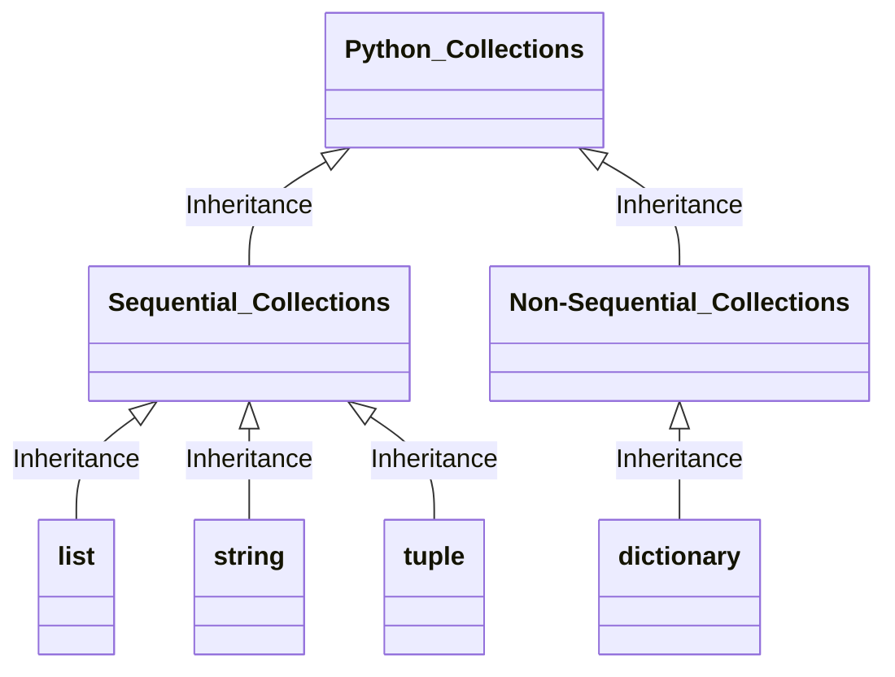

# Week3 OOP, Time Complexity

Updated 1447 GMT+8 Mar 4, 2025

2025 spring, Complied by Hongfei Yan


Logs:

> cs201数算 2025spring每日选做
>
> https://github.com/GMyhf/2025spring-cs201/blob/main/problem_list_2025spring.md
>
> LeetCode 热题 100，https://leetcode.cn/studyplan/top-100-liked/
>
> ​	哈希，双指针，滑动窗口，子串，普通数组，回溯，二分查找，贪心算法，动态规划，技巧，图论（前2个）
>
> 


# 0 数据结构与算法DSA

https://www.geeksforgeeks.org/learn-data-structures-and-algorithms-dsa-tutorial/?ref=outind

## What is DSA?

数据结构与算法（DSA）是两个独立却又紧密相连的领域相结合的产物。它被视为每位计算机科学学生必备的关键技能之一。实践中常常发现，那些对数据结构和算法有深刻理解的人往往比他人更具编程实力，也因此能够在众多求职者中脱颖而出，成功通过各大科技公司的面试。

> DSA is defined as a combination of two separate yet interrelated topics – Data Structure and Algorithms. DSA is one of the most important skills that every computer science student must have. It is often seen that people with good knowledge of these technologies are better programmers than others and thus, crack the interviews of almost every tech giant.


⚠️：算法是计概课程（Algo DS）的主要内容，四大类的算法贪心greedy、递归recursion/回溯backtracking、动态规划dp、搜索searching，我们在计概中覆盖到了。如果同学递归题目做的少，可以找相关题目多练习。

​	如果有题目没有思路，可以直接在这个课程群里面问。
​	1）递归是数算中必备的核心技能，建议优先掌握，可参看 https://github.com/GMyhf/2024fall-cs101/blob/main/20241029_recursion.md
​	2）队列在广度优先搜索（BFS）中有着广泛的应用。可参看 https://github.com/GMyhf/2024fall-cs101/blob/main/20241119_searching.md
​	3）其他的常用技巧，即使没学过也没关系，遇到相关题目时逐一掌握即可。如：双指针（链表里有个 快慢指针需要掌握）、单调栈、二分查找、并查集、滑动窗口、懒删除等。通过 1～2 道题即可理解基础原理，但要熟练掌握需要多加练习。
​	4） OOP 的写法属于语法范畴，可参看 https://www.runoob.com/python3/python3-class.html

> 


## What is Data Structure?

数据结构是指一种特定的存储和组织数据的方式，旨在我们的设备中高效且有效地管理和利用数据。采用数据结构的核心理念在于最小化时间和空间复杂度，即通过占用尽可能少的内存空间并以最短的时间来执行数据操作，从而实现高效的性能。

> A data structure is defined as a particular way of storing and organizing data in our devices to use the data efficiently and effectively. The main idea behind using data structures is to minimize the time and space complexities. An efficient data structure takes minimum memory space and requires minimum time to execute the data.

## What is Algorithm?

算法是指为了解决特定类型的问题或执行某种特定计算而设计的一系列明确定义的步骤。用更简单的话来说，算法就是一组按部就班的操作，通过这些操作来完成一项具体的任务。

> Algorithm is defined as a process or set of well-defined instructions that are typically used to solve a particular group of problems or perform a specific type of calculation. To explain in simpler terms, it is a set of operations performed in a step-by-step manner to execute a task.

## How to start learning DSA?

首先要做的是将整个学习过程分解为一系列需按顺序完成的小任务。从零开始系统地学习数据结构与算法（DSA）的过程可以分为以下四个阶段：

1. **理解时间和空间复杂度**：掌握评估算法效率的关键概念。
2. **学习各数据结构的基础**：熟悉不同数据结构的特点和使用场景。
3. **掌握算法的基础知识**：了解常用算法的工作原理及其应用。
4. **练习DSA相关的题目**：通过实践巩固所学知识，提高解决问题的能力。

> The first and foremost thing is dividing the total procedure into little pieces which need to be done sequentially. The complete process to learn DSA from scratch can be broken into 4 parts:
>
> 1. Learn about Time and Space complexities
> 2. Learn the basics of individual Data Structures
> 3. Learn the basics of Algorithms
> 4. Practice Problems on DSA


## 逻辑视图、物理视图和数据结构

计算机科学并不仅是研究计算机本身。尽管计算机在这一学科中是非常重要的工具，但也仅仅只是工具而已。计算机科学的研究对象是问题、解决问题的过程，以及通过该过程得到的解决方案。给定一个问题，计算机科学家的目标是开发一个能够逐步解决该问题的**算法**。算法是具有有限步骤的过程，依照这个过程便能解决问题。因此，算法就是解决方案。

可以认为计算机科学就是研究算法的学科。但是必须注意，某些问题并没有解决方案。可以将计算机科学更完善地定义为：研究问题及其解决方案，以及研究目前无解的问题的学科。

在研究问题解决过程的同时，计算机科学也研究**抽象**。抽象思维使得我们能分别从逻辑视角和物理视角来看待问题及其解决方案。举一个常见的例子。

试想你每天开车去上学或上班。作为车的使用者，你在驾驶时会与它有一系列的交互：坐进车里，插入钥匙，启动发动机，换挡，刹车，加速以及操作方向盘。从抽象的角度来看，这是从逻辑视角来看待这辆车，你在使用由汽车设计者提供的功能来将自己从某个地方运送到另一个地方。这些功能有时候也被称作**接口**。

另一方面，修车工看待车辆的角度与司机截然不同。他不仅需要知道如何驾驶，而且更需要知道实现汽车功能的所有细节：发动机如何工作，变速器如何换挡，如何控制温度，等等。这就是所谓的物理视角，即看到表面之下的实现细节。

使用计算机也是如此。大多数人用计算机来写文档、收发邮件、浏览网页、听音乐、存储图像以及打游戏，但他们并不需要了解这些功能的实现细节。大家都是从逻辑视角或者使用者的角度来看待计算机。计算机科学家、程序员、技术支持人员以及系统管理员则从另一个角度来看待计算机。他们必须知道操作系统的原理、网络协议的配置，以及如何编写各种脚本来控制计算机。他们必须能够控制用户不需要了解的底层细节。

上面两个例子的共同点在于，用户只需要知道接口是如何工作的，而并不需要知道实现细节。这些接口是用户用于与底层复杂的实现进行交互的方式。

### 1 为何学习数据结构及抽象数据类型

为了控制问题及其求解过程的复杂度，计算机科学家利用抽象来帮助自己专注于全局，从而避免迷失在众多细节中。通过对问题进行建模，可以更高效地解决问题。模型可以帮助计算机科学家更一致地描述算法要用到的数据。

如前所述，过程抽象将功能的实现细节隐藏起来，从而使用户能从更高的视角来看待功能。**数据抽象**的基本思想与此类似。**抽象数据类型**（简称为ADT）从逻辑上描述了如何看待数据及其对应运算而无须考虑具体实现。这意味着我们仅需要关心数据代表了什么，而可以忽略它们的构建方式。通过这样的抽象，我们对数据进行了一层封装，其基本思想是封装具体的实现细节，使它们对用户不可见，这被称为信息隐藏。

图1-1展示了抽象数据类型及其原理。用户通过抽象数据类型提供的操作来与接口交互。抽象数据类型是与用户交互的外壳。真正的实现则隐藏在内部。用户并不需要关心各种实现细节。


<center>图1-1 抽象数据类型</center>

抽象数据类型的实现，通常被称为**数据结构**。它是**物理视图**和**逻辑视图**之间的桥梁，因为数据结构既定义了数据的逻辑特性（如栈或队列的操作），也决定了这些特性的具体实现方式（如使用数组或链表）。逻辑视图和物理视图的分离使我们能够在不透露模型实际构建细节的情况下定义复杂的数据模型来解决相应的问题。这提供了与实现无关的逻辑视图。由于通常会有多种不同的方法来实现一个抽象数据类型，这种实现独立性允许程序员在不改变用户与数据交互方式的前提下切换实现的具体细节。因此，用户可以专注于问题解决的过程。The implementation of an abstract data type, often referred to as a **data structure**, will require that we provide a physical view of the data using some collection of programming constructs and primitive data types. As we discussed earlier, the separation of these two perspectives will allow us to define the complex data models for our problems without giving any indication as to the details of how the model will actually be built. This provides an **implementation-independent** view of the data. Since there will usually be many different ways to implement an abstract data type, this implementation independence allows the programmer to switch the details of the implementation without changing the way the user of the data interacts with it. The user can remain focused on the problem-solving process.

> 在计算机科学和软件工程中，“物理视图”、“数据视图”和“数据结构”是三个相关但含义不同的术语。
>
> **物理视图 (Physical View)**：
>
> - 物理视图指的是数据如何在计算机内存或存储设备上实际组织和表示的细节。它涉及到具体的数据布局、存储格式、访问方法等。例如，在实现一个数组时，物理视图会包括数组元素在内存中的连续存储方式，或者在一个链表中节点是如何通过指针相互链接的。
>
> **逻辑视图（也称为数据视图, Logical or Data View）**：
>
> - 逻辑视图（或数据视图）是指从用户或应用程序的角度看到的数据组织形式。它是抽象数据类型（ADT）的一部分，描述了数据应该具有的行为和操作，而不涉及这些操作是如何具体实现的。换句话说，逻辑视图定义了数据模型的功能特性，而不是其实现细节。例如，栈（stack）的逻辑视图只关心压入（push）和弹出（pop）操作，而不需要知道内部是用数组还是链表来实现。
>
> **数据结构 (Data Structure)**：
>
> - 数据结构是用来组织、管理和存储数据的方式，以便能够高效地访问和修改数据。它可以看作是物理视图和逻辑视图之间的桥梁，因为数据结构既定义了数据的逻辑特性（如栈或队列的操作），也决定了这些特性的具体实现方式（如使用数组或链表）。因此，数据结构的选择直接影响到程序的性能和复杂度。
>
> 原文中的 "physical view of the data" 更贴近于“数据的物理视图”，即关注的是数据在底层硬件上的表示和存储方式；而“implementation-independent view of the data” 则更倾向于描述“逻辑视图”或“数据视图”，强调的是与具体实现无关的数据抽象。
>


```
数据结构
├── 逻辑结构
│   ├── 集合结构
│   ├── 线性结构：线性表、栈、队列、串
│   ├── 非线性结构：数组、树、堆、图
│   └── 树形结构
└── 物理结构
    ├── 顺序存储
    ├── 链式存储
    ├── 索引存储 (Indexing)：B树、B+树等，适合有序数据和范围查询
    └── 散列存储 (Hashing)：在单一键值查找上表现优异
```


### 编程题目

#### 06640: 倒排索引

data structures, http://cs101.openjudge.cn/practice/06640/


#### 04093: 倒排索引查询

data structures, http://cs101.openjudge.cn/practice/04093/


> 在信息检索Infomation Retrieval领域，搜索引擎的工作原理是抓取网页，每个网页是一个doc，处理成token的序列。为了检索时候快速响应用户输入的查询token，所以要建token -> doc的倒排索引。
>
> document -> token，是正排。token -> doc_i, doc_j, ... 是倒排。名字就是这样来的。


**字典不设置上限，会耗尽内存**

https://github.com/GMyhf/2025spring-cs201/blob/main/code/2048/6_auto_2048_optimized.py

```python
#!/usr/bin/env python3
import random
import os
import sys
import time

BOARD_SIZE = 4
TARGET = 2048
SEARCH_DEPTH = 3  # 搜索深度

# 缓存 expectimax 计算结果
cache = {}

def board_to_key(board):
    return tuple(tuple(row) for row in board)

def init_board():
    board = [[0] * BOARD_SIZE for _ in range(BOARD_SIZE)]
    add_random_tile(board)
    add_random_tile(board)
    return board

def add_random_tile(board):
    empty = [(i, j) for i in range(BOARD_SIZE) for j in range(BOARD_SIZE) if board[i][j] == 0]
    if not empty:
        return
    i, j = random.choice(empty)
    board[i][j] = 4 if random.random() < 0.1 else 2
...
```


### 2 为何学习算法

计算机科学家通过经验来学习：<mark>观察他人如何解决问题，然后亲自解决问题</mark>。<mark>接触各种问题解决技巧并学习不同算法的设计方法，有助于解决新的问题</mark>。通过学习一系列不同的算法，可以举一反三，从而在遇到类似的问题时，能够快速加以解决。

各种算法之间往往差异巨大。例如求平方根的例子，完全可能有多种方法来实现计算平方根的函数。算法一可能使用了较少的资源，算法二返回结果所需的时间可能是算法一的10倍。我们需要某种方式来比较这两种算法。尽管这两种算法都能得到结果，但是其中一种可能比另一种“更好”——更高效、更快，或者使用的内存更少。随着对算法的进一步学习，你会掌握比较不同算法的分析技巧。这些技巧只依赖于算法本身的特性，而不依赖于程序或者实现算法的计算机的特性。

最坏的情况是遇到难以解决的问题，即没有算法能够在合理的时间内解决该问题。因此，至关重要的一点是，要能区分有解的问题、无解的问题，以及虽然有解但是需要过多的资源和时间来求解的问题。

在选择算法时，经常会有所权衡。除了有解决问题的能力之外，计算机科学家也需要知晓<mark>如何评估一个解决方案</mark>。总之，问题通常有很多解决方案，如何找到一个解决方案并且确定其为优秀的方案，是需要反复练习、熟能生巧的。


# 1 OOP及Python基础

本节为之前提到的思想提供更详细的例子。目标是复习Python并且强化一些会在后续各章中变得非常重要的概念。
Python是一门现代、易学、面向对象的编程语言。它拥有强大的內建数据类型以及简单易用的控制语句。由于Python是一门解释型语言，因此只需要查看和描述交互式会话就能进行学习。解释器会显示提示符>>>，然后计算你提供的Python语句。例如，以下代码显示了提示符、print函数、结果，以及下一个提示符。

```
>>> print("Algorithms and Data Structures")
>>> Algorithms and Data Structures
>>>
```




## 1.1 数据

Python支持面向对象编程范式。这意味着Python认为数据是问题解决过程中的关键点。在Python以及其他所有面向对象编程语言中，类都是对数据的构成（状态）以及数据能做什么（行为）的描述。由于类的使用者只能看到数据项的状态和行为，因此<mark>类与抽象数据类型</mark>是相似的。在面向对象编程范式中，数据项被称作对象。一个对象就是类的一个实例。

### 1 内建原子数据类型

我们首先看原子数据类型。Python有两大內建数据类实现了整数类型和浮点数类型，相应的Python类就是int和float。标准的数学运算符，即+、-、＊、/以及＊＊（幂），可以和能够改变运算优先级的括号一起使用。其他非常有用的运算符包括取模运算符%，以及整除运算符//。注意，当两个整数相除时，其结果是一个浮点数，而整除运算符截去小数部分，只返回商的整数部分。

Python通过bool类实现对表达真值非常有用的布尔数据类型。布尔对象可能的状态值是True或者False，布尔运算符有and、or以及not。

布尔对象也被用作相等（==）、大于（>）等比较运算符的计算结果。此外，结合使用关系运算符与逻辑运算符可以表达复杂的逻辑问题。表2-1展示了关系运算符和逻辑运算符。

表2-1 关系运算符和逻辑运算符

| **Operation Name**    | **Operator** | **Explanation**                                              |
| :-------------------- | :----------- | :----------------------------------------------------------- |
| less than             | <            | Less than operator                                           |
| greater than          | >            | Greater than operator                                        |
| less than or equal    | <=           | Less than or equal to operator                               |
| greater than or equal | >=           | Greater than or equal to operator                            |
| equal                 | ==           | Equality operator                                            |
| not equal             | !=           | Not equal operator                                           |
| logical and           | $and$        | Both operands True for result to be True                     |
| logical or            | $or$         | One or the other operand is True for the result to be True   |
| logical not           | $not$        | Negates the truth value, False becomes True, True becomes False |


标识符在编程语言中被用作名字。Python中的标识符以字母或者下划线（_）开头，区分大小写，可以是任意长度。采用能表达含义的名字是良好的编程习惯，这使程序代码更易阅读和理解。

当一个名字第一次出现在赋值语句的左边部分时，会创建对应的Python变量。赋值语句将名字与值关联起来。变量存的是指向数据的引用，而不是数据本身。

赋值语句改变了变量的引用，这体现了Python的动态特性。同样的变量可以指向许多不同类型的数据。

> 教学目标：深化对经典数据结构的理解与应用，提升算法设计与分析能力，培养工程化编程思维和代码质量意识。
>
> 教学方式：采用“案例教学+实践训练”的教学模式，通过101余道综合性编程题目进行实践训练，强化算法应用能力。
>
> 考核重点：算法效率（时间复杂度、空间复杂度），程序设计规范性，问题建模与解决能力。
>
> 代码要求：遵循PEP 8代码规范，鼓励采用面向对象编程（OOP）范式，强调代码的可测试性和可扩展性。


### 2 内建集合数据类型

除了数值类和布尔类，Python还有众多强大的內建集合类。列表、字符串以及元组是概念上非常相似的有序集合，但是只有理解它们的差别，才能正确运用。集合和字典是<mark>无序</mark>集合。

**列表**是零个或多个指向Python数据对象的引用的有序集合，通过在方括号内以逗号分隔的一系列值来表达。空列表就是[ ]。列表是异构的，这意味着其指向的数据对象不需要都是同一个类，并且这一集合可以被赋值给一个变量。

由于列表是有序的，因此它支持一系列可应用于任意Python序列的运算，如表2-2所示。

表2-2 可应用于任意Python序列的运算

| **Operation Name** | **Operator** | **Explanation**                         |
| :----------------- | :----------- | :-------------------------------------- |
| indexing           | [ ]          | Access an element of a sequence         |
| concatenation      | +            | Combine sequences together              |
| repetition         | *            | Concatenate a repeated number of times  |
| membership         | in           | Ask whether an item is in a sequence    |
| length             | len          | Ask the number of items in the sequence |
| slicing            | [ : ]        | Extract a part of a sequence            |


需要注意的是，列表和序列的下标从0开始。myList[1:3]会返回一个包含下标从1到2的元素列表（并没有包含下标为3的元素）。
如果需要快速初始化列表，可以通过重复运算来实现，如下所示。

```
>>> myList = [0] ＊ 6
>>> myList 
[0, 0, 0, 0, 0, 0]
```

非常重要的一点是，重复运算返回的结果是序列中指向数据对象的<mark>引用</mark>的重复。下面的例子可以很好地说明这一点。

```
>>> myList = [1,2,3,4]
>>> A = [myList]＊3
>>> A
[[1, 2, 3, 4], [1, 2, 3, 4], [1, 2, 3, 4]]
>>> myList[2] = 45
>>> A 
[[1, 2, 45, 4], [1, 2, 45, 4], [1, 2, 45, 4]]
```

变量A包含3个指向myList的引用。myList中的一个元素发生改变，A中的3处都随即改变。
列表支持一些用于构建数据结构的方法，如表2-3所示。后面的例子展示了用法。


表2-3 Python列表提供的方法

| **Method Name** | **Use**                | **Explanation**                                     |
| :-------------- | :--------------------- | :-------------------------------------------------- |
| `append`        | `alist.append(item)`   | Adds a new item to the end of a list                |
| `insert`        | `alist.insert(i,item)` | Inserts an item at the ith position in a list       |
| `pop`           | `alist.pop()`          | Removes and returns the last item in a list         |
| `pop`           | `alist.pop(i)`         | Removes and returns the ith item in a list          |
| `sort`          | `alist.sort()`         | Modifies a list to be sorted                        |
| `reverse`       | `alist.reverse()`      | Modifies a list to be in reverse order              |
| `del`           | `del alist[i]`         | Deletes the item in the ith position                |
| `index`         | `alist.index(item)`    | Returns the index of the first occurrence of `item` |
| `count`         | `alist.count(item)`    | Returns the number of occurrences of `item`         |
| `remove`        | `alist.remove(item)`   | Removes the first occurrence of `item`              |

你会发现，像pop这样的方法在返回值的同时也会修改列表的内容，<mark>reverse等方法则仅修改列表而不返回任何值</mark>。pop默认返回并删除列表的最后一个元素，但是也可以用来返回并删除特定的元素。这些方法默认下标从0开始。你也会注意到那个熟悉的句点符号，它被用来调用某个对象的方法。

range是一个常见的Python函数，我们常把它与列表放在一起讨论。range会生成一个代表值序列的范围对象。使用list函数，能够以列表形式看到范围对象的值。

范围对象表示整数序列。默认情况下，它从0开始。如果提供更多的参数，它可以在特定的点开始和结束，并且跳过中间的值。在第一个例子中，range(10) 从0开始并且一直到9为止（不包含10）；在第二个例子中，range(5,10) 从5开始并且到9为止（不包含10）; range(5,10,2) 的结果类似，但是元素的间隔变成了2（10还是没有包含在其中）。

> **Matrices 矩阵**
>
> 在学习编程的过程中，经常遇到输入的数据是矩阵的形式，所以我们首先来明确矩阵的概念。
>
> **知识点：矩阵**
>
> 这段矩阵知识点的讲解，借鉴自《数学要素》的1.4和1.5节，作者：姜伟生，2023-06-01出版。
>
> 
>
> 万物皆数。
> All is Number.
> 															——毕达哥拉斯(Pythagoras)｜古希腊哲学家、数学家｜570 B.C.—495 B.C.        
>
> ```mermaid
> flowchart TD
> 	linkStyle default interpolate basis
> 
> 
> AllIsNumber-->complex("复数")
> 	complex-->imaginary("虚数");complex-->real("实数");
> 	real-->irrational("无理数");real-->rational("有理数");
> 	rational-->non-integer("非整数");rational-->integers("整数");
> 	integers-->positive("正整数");integers-->zero("零");integers-->negative("负整数");
> AllIsNumber-->add-sub("加减")
> 	add-sub-->add("加");add-sub-->cumulative("累加");add-sub-->sub("减");
> AllIsNumber-->vector("向量")
> 	vector-->rowvec("行向量");vector-->colvec("列向量");vector-->transpose("向量转置");
> 
> AllIsNumber(万物皆数)--> matrix("矩阵");
> 
> 
> subgraph matrices
> 		matrix-->Numberofrows-columns("行数和列数"); 
> 		matrix-->element("元素");
> 		matrix-->chunk("分块");
> 			chunk-->YZLXL("一组列向量");chunk-->YZHXL("一组行向量");
> 		matrix-->transpose-diagonal("矩阵转置和主对角线");
> 		matrix-->TSJZXZ("特殊矩阵形状");
> 
> 		matrix-->JJF("加减法");
> 			JJF-->identicalshapes("形状相同");JJF-->correspondingpositions("对应位置");JJF-->Batchaddition-subtraction("批量加减");
> 
> end
> ```
>
> ​				图1 数的结构
>
> 
>
> **向量：数字排成行、列**
>
> 向量、矩阵等线性代数概念对于数据科学和机器学习至关重要。在机器学习中，数据几乎都以矩阵形式存储、运算。毫不夸张地说，没有线性代数就没有现代计算机运算。逐渐地，大家会发现算数、代数、解析几何、微积分、概率统计、优化方法并不是一个个孤岛，而线性代数正是连接它们的重要桥梁之一。
>
> **行向量、列向量**
>
> 若干数字排成一行或一列，并且用中括号括起来，得到的数组叫作向量(vector)。
> 排成一行的叫作行向量(row vector)，排成一列的叫作列向量(column vector)。
> 通俗地讲，行向量就是表格的一行数字，列向量就是表格的一列数字。以下两例分别展示了行向量和列向量，即
> $$
> \left[
> \matrix{
> 1 & 2 & 3 
> }
> \right]_{1\times 3},
> 
> \left[
> \matrix{
> 1 \\
> 2 \\
> 3 
> }
> \right]_{3\times 1}\tag{1}
> $$
>
>
> 式(1)中，下角标“1×3”代表“1行、3列”，“3×1”代表“3行、1列”。
>
> **转置**
>
> 转置符号为上标“T”。行向量转置(transpose)可得到列向量；同理，列向量转置可得到行向量。举例如下，有
> $$
> \left[
> \matrix{
> 1 & 2 & 3 
> }
> \right]^\mathrm T
> =
> \left[
> \matrix{
> 1 \\
> 2 \\
> 3 
> }
> \right],
> 
> 
> \left[
> \matrix{
> 1 \\
> 2 \\
> 3 
> }
> \right]^\mathrm T
> =
> \left[
> \matrix{
> 1 & 2 & 3
> }
> \right]
> 
> \tag{2}
> $$
>
> **矩阵：数字排列成长方形**
>
> 矩阵(matrix)将一系列数字以长方形方式排列，如
>
>
> $$
> \left[
> \matrix{
> 1 & 2 & 3 \\
> 4 & 5 & 6
> }
> \right]_{2\times 3},
> 
> \left[
> \matrix{
> 1 & 2 \\
> 3 & 4 \\
> 5 & 6 
> }
> \right]_{3\times 2},
> 
> \left[
> \matrix{
> 1 & 2 \\
> 3 & 4 
> }
> \right]_{2\times 2}
> 
> \tag{3}
> $$
>
> 通俗地讲，矩阵将数字排列成表格，有行、有列。式 (3) 给出了三个矩阵，形状分别是2行3列、3行2列和2行2列。
> 通常用大写字母代表矩阵，比如矩阵A和矩阵B。
> 图2所示为一个n×D矩阵X。n是矩阵的行数(number of rows in the matrix)，D是矩阵的列数(number of columns in the matrix)。X可以展开写成表格形式，即
> $$
> X_{n\times D}=
> \left[
> \matrix{
> x_{1,1} & x_{1,2} & ... & x_{1,D} \\
> x_{2,1} & x_{2,2} & ... & x_{2,D} \\
> \vdots & \vdots & \ddots & \vdots\\
> x_{n,1} & x_{n,2} & ... & x_{n,D} 
> }
> \right]
> 
> \tag{4}
> $$
>
>
> ​				
>
> 
>
> ​				图2　n×D矩阵X
>
> 
>
> 再次强调：先说行号，再说列号。数据矩阵一般采用大写X表达。
>
> 矩阵X中，元素(element) $x_{i,j}$ 被称作i,j元素（i j entry或i j element），也可以说$x_{i,j}$出现在i行j列(appears in row i and column j)。比如，$x_{n,1}$是矩阵X的第n行、第1列元素。
> 表1 总结了如何用英文读矩阵和矩阵元素。
>
> 表1　矩阵有关英文表达
>
> 
>
> 
>
> 
>
> **range中使用min、max**
>
> 
>
> **02659:Bomb Game**
>
> matrices, http://cs101.openjudge.cn/practice/02659/
>
> ```python
> ...
>     for (R, S, P, T) in bombs:
>         for i in range(max(0, R - (P - 1) // 2), min(A, R + (P + 1) // 2)):
>             for j in range(max(0, S - (P - 1) // 2), min(B, S + (P + 1) // 2)):
> ...
> ```
>
> **04133:垃圾炸弹**
>
> matrices, http://cs101.openjudge.cn/practice/04133/
>
> ```python
>     for i in range(max(x-d, 0), min(x+d+1, 1025)):
>         for j in range(max(y-d, 0), min(y+d+1, 1025)):
> ```
>
> 


**字符串**是零个或多个字母、数字和其他符号的有序集合。这些字母、数字和其他符号被称为字符。常量字符串值通过引号（单引号或者双引号均可）与标识符进行区分。

由于字符串是序列，因此之前提到的所有序列运算符都能用于字符串。此外，字符串还有一些特有的方法，表2-4列举了其中一些。

表2-4 Python字符串提供的方法

| **Method Name** | **Use**                | **Explanation**                                           |
| :-------------- | :--------------------- | :-------------------------------------------------------- |
| `center`        | `astring.center(w)`    | Returns a string centered in a field of size `w`          |
| `count`         | `astring.count(item)`  | Returns the number of occurrences of `item` in the string |
| `ljust`         | `astring.ljust(w)`     | Returns a string left-justified in a field of size `w`    |
| `lower`         | `astring.lower()`      | Returns a string in all lowercase                         |
| `rjust`         | `astring.rjust(w)`     | Returns a string right-justified in a field of size `w`   |
| `find`          | `astring.find(item)`   | Returns the index of the first occurrence of `item`       |
| `split`         | `astring.split(schar)` | Splits a string into substrings at `schar`                |

split在处理数据的时候非常有用。split接受一个字符串，并且返回一个由分隔字符作为分割点的字符串列表。


列表和字符串的主要区别在于，列表能够被修改，字符串则不能。列表的这一特性被称为可修改性。列表具有可修改性，字符串则不具有。

由于都是异构数据序列，因此元组与列表非常相似。它们的区别在于，元组和字符串一样是不可修改的。元组通常写成由括号包含并且以逗号分隔的一系列值。与序列一样，元组允许之前描述的任一操作。

集合（set）是由零个或多个不可修改的Python数据对象组成的无序集合。集不允许重复元素，并且写成由花括号包含、以逗号分隔的一系列值。空集由set()来表示。集是异构的。

尽管集是无序的，但它还是支持之前提到的一些运算，如表2-5所示。

表2-5 Python集合支持的运算

| **Operation Name** | **Operator**       | **Explanation**                                              |
| :----------------- | :----------------- | :----------------------------------------------------------- |
| membership         | in                 | Set membership                                               |
| length             | len                | Returns the cardinality of the set                           |
| `|`                | `aset | otherset`  | Returns a new set with all elements from both sets           |
| `&`                | `aset & otherset`  | Returns a new set with only those elements common to both sets |
| `-`                | `aset - otherset`  | Returns a new set with all items from the first set not in second |
| `<=`               | `aset <= otherset` | Asks whether all elements of the first set are in the second |

集支持一系列方法，如表2-6所示。在数学中运用过集合概念的人应该对它们非常熟悉。Note that `union`, `intersection`, `issubset`, and `difference` all have operators that can be used as well.

Note that `union`, `intersection`, `issubset`, and `difference` all have operators that can be used as well.


表2-6 Python集合提供的方法

| **Method Name** | **Use**                       | **Explanation**                                              |
| :-------------- | :---------------------------- | :----------------------------------------------------------- |
| `union`         | `aset.union(otherset)`        | Returns a new set with all elements from both sets           |
| `intersection`  | `aset.intersection(otherset)` | Returns a new set with only those elements common to both sets |
| `difference`    | `aset.difference(otherset)`   | Returns a new set with all items from first set not in second |
| `issubset`      | `aset.issubset(otherset)`     | Asks whether all elements of one set are in the other        |
| `add`           | `aset.add(item)`              | Adds item to the set                                         |
| `remove`        | `aset.remove(item)`           | Removes item from the set                                    |
| `pop`           | `aset.pop()`                  | Removes an arbitrary element from the set                    |
| `clear`         | `aset.clear()`                | Removes all elements from the set                            |


字典是无序结构，由相关的元素对构成，其中每对元素都由一个键和一个值组成。这种键-值对通常写成键：值的形式。字典由花括号包含的一系列以逗号分隔的键-值对表达，

可以通过键访问其对应的值，也可以向字典添加新的键-值对。访问字典的语法与访问序列的语法十分相似，只不过是使用键来访问，而不是下标。添加新值也类似。

需要谨记，字典并不是根据键来进行有序维护的。键的位置是由散列来决定的，后续章节会详细介绍散列。len函数对字典的功能与对其他集合的功能相同。

字典既有运算符，又有方法。表2-7和表2-8分别展示了它们。keys、values和items方法均会返回包含相应值的对象。可以使用list函数将字典转换成列表。在表2-8中可以看到，get方法有两种版本。如果键没有出现在字典中，get会返回None。然而，第二个可选参数可以返回特定值。

表2-7 Python字典支持的运算

| **Operator** | **Use**          | **Explanation**                                              |
| :----------- | :--------------- | :----------------------------------------------------------- |
| `[]`         | `myDict[k]`      | Returns the value associated with `k`, otherwise its an error |
| `in`         | `key in adict`   | Returns `True` if key is in the dictionary, `False` otherwise |
| `del`        | del `adict[key]` | Removes the entry from the dictionary                        |


表2-8 Python字典提供的方法

| **Method Name** | **Use**            | **Explanation**                                              |
| :-------------- | :----------------- | :----------------------------------------------------------- |
| `keys`          | `adict.keys()`     | Returns the keys of the dictionary in a dict_keys object     |
| `values`        | `adict.values()`   | Returns the values of the dictionary in a dict_values object |
| `items`         | `adict.items()`    | Returns the key-value pairs in a dict_items object           |
| `get`           | `adict.get(k)`     | Returns the value associated with `k`, `None` otherwise      |
| `get`           | `adict.get(k,alt)` | Returns the value associated with `k`, `alt` otherwise       |

<mark>defaultdict</mark>

> `defaultdict` 是 Python `collections` 模块中提供的一个类，它继承自内置的 `dict` 类。与普通字典相比，`defaultdict` 的主要特点是当你尝试访问一个不存在的键时，它不会抛出 `KeyError` 异常，而是会自动为这个键生成一个默认值。
>
> `defaultdict` 在初始化时需要指定一个“工厂函数”，用于在访问不存在的键时生成默认值。常用的工厂函数包括 `int`（返回0）、`list`（返回空列表）、`set`（返回空集合）等。
>
> 以下是一些使用 `defaultdict` 的示例：
>
> **创建一个 `defaultdict`**
>
> ```python
> from collections import defaultdict
> 
> # 使用 int 作为工厂函数，适用于计数
> count_dict = defaultdict(int)
> count_dict['apple'] += 1
> print(count_dict['apple'])  # 输出: 1
> print(count_dict['banana'])  # 输出: 0，注意这里'banana'之前未定义
> 
> # 使用 list 作为工厂函数，适用于存储分组信息
> group_dict = defaultdict(list)
> group_dict['fruits'].append('apple')
> group_dict['fruits'].append('banana')
> print(group_dict['fruits'])  # 输出: ['apple', 'banana']
> print(group_dict['vegetables'])  # 输出: []，空列表
> ```
>
> **应用场景**
>
> - **计数**：例如统计文档中每个单词出现的次数。
> - **分组**：例如将数据按某个属性分组。
>
> **示例：单词计数**
>
> 假设有一个包含多个字符串的列表，想要统计每个字符串出现的次数：
>
> ```python
> from collections import defaultdict
> 
> words = ["apple", "banana", "apple", "orange", "banana", "banana"]
> word_count = defaultdict(int)
> 
> for word in words:
>     word_count[word] += 1
> 
> print(dict(word_count))  # 输出: {'apple': 2, 'banana': 3, 'orange': 1}
> ```
>
> **示例：根据类别分组**
>
> 假设有如下数据结构，希望将其按类别分组：
>
> ```python
> from collections import defaultdict
> 
> items = [('水果', '苹果'), ('水果', '香蕉'), ('蔬菜', '白菜'), ('水果', '橙子'), ('蔬菜', '萝卜')]
> grouped_items = defaultdict(list)
> 
> for category, item in items:
>     grouped_items[category].append(item)
> 
> print(dict(grouped_items))
> # 输出: {'水果': ['苹果', '香蕉', '橙子'], '蔬菜': ['白菜', '萝卜']}
> ```
>
> `defaultdict` 提供了一种更加便捷的方式来处理需要默认值的情况，使得代码更加简洁易读。但是需要注意的是，在不需要默认行为的情况下，使用普通的 `dict` 可能更为合适，以避免不必要的性能开销或意外行为。


## 1.2基本语法

### 1 输入与输出

程序经常需要与用户进行交互，以获得数据或者提供某种结果。目前的大多数程序使用对话框作为要求用户提供某种输入的方式。尽管Python确实有方法来创建这样的对话框，但是可以利用更简单的函数。Python提供了一个函数，它使得我们可以要求用户输入数据并且返回一个字符串的引用。这个函数就是input。

input函数接受一个字符串作为参数。由于该字符串包含有用的文本来提示用户输入，因此它经常被称为提示字符串。

不论用户在提示字符串后面输入什么内容，都会被存储在aName变量中。使用input函数，可以非常简便地写出程序，让用户输入数据，然后再对这些数据进行进一步处理。

需要注意的是，input函数返回的值是一个字符串，它包含用户在提示字符串后面输入的所有字符。如果需要将这个字符串转换成其他类型，必须明确地提供类型转换。


> **04093: 倒排索引查询**
>
> data structures, http://cs101.openjudge.cn/practice/04093/
>
> ...
>
> 样例输入
>
> ```
> 3
> 3 1 2 3
> 1 2
> 1 3
> 3
> 1 1 1
> 1 -1 0
> 1 -1 -1
> ```
>
> ...
>
> ```python
> import sys
> input = sys.stdin.read
> data = input().split()
> 
> index = 0
> N = int(data[index])
> index += 1
> 
> word_documents = []
> 
> # 读取每个词的倒排索引
> for _ in range(N):
>     ci = int(data[index])
>     index += 1
>     documents = sorted(map(int, data[index:index + ci]))
>     index += ci
>     word_documents.append(documents)
> ....
> ```
>
> 
>
> **09201: Freda的越野跑**
>
> http://cs101.openjudge.cn/practice/09201/
>
> ...
>
> 样例输入
>
> ```
> 5
> 1 3 10 8 5
> ```
>
> ...
>
> ```python
> import sys
> ...
> n = int(sys.stdin.readline())
> a = list(map(int, sys.stdin.readline().split()))
> ```
>
> 


格式化字符串
print函数为输出Python程序的值提供了一种非常简便的方法。它接受零个或者多个参数，并且将单个空格作为默认分隔符来显示结果。通过设置sep这一实际参数可以改变分隔符。此外，每一次打印都默认以换行符结尾。这一行为可以通过设置实际参数end来更改。

更多地控制程序的输出格式经常十分有用。幸运的是，Python提供了另一种叫作格式化字符串的方式。格式化字符串是一个模板，其中包含保持不变的单词或空格，以及之后插入的变量的占位符。


> **04140: 方程求解**
>
> 牛顿迭代法，http://cs101.openjudge.cn/practice/04140/
>
> ```python
> ....
> print(f"{root2:.9f}")
> ```
>


### 2 控制结构

算法需要两个重要的控制结构：迭代和分支。Python通过多种方式支持这两种控制结构。程序员可以根据需要选择最有效的结构。

对于迭代，Python提供了标准的while语句以及非常强大的for语句。while语句会在给定条件为真时重复执行一段代码。


分支语句允许程序员进行询问，然后根据结果，采取不同的行动。绝大多数的编程语言都提供两种有用的分支结构：if else和if。

和其他所有控制结构一样，分支结构支持嵌套，一个问题的结果能帮助决定是否需要继续问下一个问题。

另一种表达嵌套分支的语法是使用elif关键字。将else和下一个if结合起来，可以减少额外的嵌套层次。注意，最后的else仍然是必需的，它用来在所有分支条件都不满足的情况下提供默认分支。


列表可以不通过迭代结构和分支结构来创建，这种方式被称为<mark>列表解析式</mark>。通过列表解析式，可以根据一些处理和分支标准轻松创建列表。

> Returning to lists, there is an alternative method for creating a list that uses iteration and selection constructs known as a **list comprehension**. A list comprehension allows you to easily create a list based on some processing or selection criteria. 
>
> 
>
> 只想包括偶数的平方，可以加上条件：
>
> ```python
> even_squares = [x*x for x in range(1, 11) if x % 2 == 0]
> ```
>
> 这种方式不仅使得代码更加简洁，而且在很多情况下也更易于阅读和理解。


### 3 异常处理

在编写程序时通常会遇到两种错误。第一种是语法错误，也就是说，程序员在编写语句或者表达式时出错。

第二种是逻辑错误，即程序能执行完成但返回了错误的结果。这可能是由于算法本身有错，或者程序员没有正确地实现算法。有时，逻辑错误会导致诸如除以0、越界访问列表等非常严重的情况。这些逻辑错误会导致运行时错误，进而导致程序终止运行。通常，这些运行时错误被称为异常。

许多初级程序员简单地把异常等同于引起程序终止的严重运行时错误。然而，大多数编程语言都提供了让程序员能够处理这些错误的方法。此外，程序员也可以在检测到程序执行有问题的情况下自己创建异常。
当异常发生时，我们称程序“抛出”异常。可以用try语句来“处理”被抛出的异常。


> **04015: 邮箱验证**
>
> strings, http://cs101.openjudge.cn/practice/04015
>
> 这题目输入没有明确结束，需要套在try ...  except里面。测试时候，需要模拟输入结束，看你是window还是mac。If the user hits EOF (*nix: Ctrl-D, Windows: Ctrl-Z+Return), raise EOFError.
>
> ```python
> while True:
>     try:
>         s = input()
>     except EOFError:
>         break
>     
> 		...
>     print('NO' if q==-1 else 'YES')
> ```
>
> 


### 4 定义函数

通常来说，可以通过定义函数来隐藏任何计算的细节。函数的定义需要一个函数名、一系列参数以及一个函数体。函数也可以显式地返回一个值。


## 1.3 面向对象编程

Python是一门面向对象的编程语言。到目前为止，我们已经使用了一些內建的类来展示数据和控制结构的例子。面向对象编程语言最强大的一项特性是允许程序员（问题求解者）创建全新的类来对求解问题所需的数据进行建模。

我们之前使用了抽象数据类型来对数据对象的状态及行为进行逻辑描述。通过构建能实现抽象数据类型的类，可以利用抽象过程，同时为真正在程序中运用抽象提供必要的细节。每当需要实现抽象数据类型时，就可以创建新类。

### 1 Fraction类

要展示如何实现用户定义的类，一个常用的例子是构建实现抽象数据类型Fraction的类。我们已经看到，Python提供了很多数值类。但是在有些时候，需要创建“看上去很像”分数的数据对象。

像 $\frac {3}{5}$​ 这样的分数由两部分组成。上面的值称作分子，可以是任意整数。下面的值称作分母，可以是任意大于0的整数（负的分数带有负的分子）。尽管可以用浮点数来近似表示分数，但我们在此希望能精确表示分数的值。

Fraction对象的表现应与其他数值类型一样。我们可以针对分数进行加、减、乘、除等运算，也能够使用标准的斜线形式来显示分数，比如3/5。此外，所有的分数方法都应该返回结果的最简形式。这样一来，不论进行何种运算，最后的结果都是最简分数。

在Python中<mark>定义新类的做法</mark>是，提供一个类名以及一整套与函数定义语法类似的方法定义。以下是一个方法定义框架。

> 在 Python 中，新创建的类默认继承自 `object` 类。`object` 是所有类的基类，也称为顶级基类或根类。这意味着在 Python 中，如果没有显式指定一个类的基类，它将自动成为 `object` 类的子类。
>
> 在类中定义的方法（包括 `__str__` 方法）的第一个参数应该是 <mark>self，它表示对当前对象的引用</mark>。这样，Python <mark>在调用方法时会自动将该对象作为第一个参数传递给方法</mark>。
>
> 当我们在多个类中定义了 `__str__` 方法时，通过 self 参数，Python 可以确定应该执行哪个类的 `__str__` 方法。

```python
class Fraction

		#the methods go here
```

所有类都应该首先提供构造方法。构造方法定义了数据对象的创建方式。要创建一个Fraction对象，需要提供分子和分母两部分数据。在Python中，构造方法总是命名为`__init__`（即在init的前后分别有两个下划线）。

代码 Fraction类及其构造方法

```python
def __init__(self, top, bottom):
    
    self.num = top
    self.den = bottom
```


注意，形式参数列表包含 3 项。<mark>self是一个总是指向对象本身的特殊参数，它必须是第一个形式参数</mark>。然而，在调用方法时，从来不需要提供相应的实际参数。如前所述，分数需要分子与分母两部分状态数据。构造方法中的`self.num`定义了`Fraction`对象有一个叫作`num`的内部数据对象作为其状态的一部分。同理，`self.den`定义了分母。这两个实际参数的值在初始时赋给了状态，使得新创建的`Fraction`对象能够知道其初始值。

要创建Fraction类的实例，必须调用构造方法。使用类名并且传入状态的实际值就能完成调用（注意，不要直接调用`__init__`）。


```python
myfraction = Fraction(3,5)
```

以上代码创建了一个对象，名为`myfraction`，值为`3/5`。图2-1展示了这个对象。


<center>图2-1 Fraction类的一个实例</center>

接下来实现这一抽象数据类型所需要的行为。考虑一下，如果试图打印Fraction对象，会发生什么呢？

```python
>>> myf = Fraction(3,5)
>>> print(myf)
<__main__.Fraction instance at 0x409b1acc>
```


`Fraction`对象`myf`并不知道如何响应打印请求。print函数要求对象将自己转换成一个可以被写到输出端的字符串。`myf`唯一能做的就是显示存储在变量中的实际引用（地址本身）。这不是我们想要的结果。

有两种办法可以解决这个问题。一种是定义一个show方法，使得Fraction对象能够将自己作为字符串来打印。代码show方法展示了该方法的实现细节。如果像之前那样创建一个Fraction对象，可以要求它显示自己（或者说，用合适的格式将自己打印出来）。不幸的是，这种方法并不通用。为了能正确打印，我们需要告诉Fraction类如何将自己转换成字符串。要完成任务，这是`print`函数所必需的。

代码 show方法

```python
def show(self):
     print(self.num,"/",self.den)
    
>>> myf = Fraction(3,5)
>>> myf.show()
3 / 5
>>> print(myf)
<__main__.Fraction instance at 0x40bce9ac>
>>>
```


Python的所有类都提供了一套标准方法，但是可能没有正常工作。其中之一就是将对象转换成字符串的方法`__str__`。这个方法的默认实现是像我们之前所见的那样返回实例的地址字符串。我们需要做的是为这个方法提供一个“更好”的实现，即重写默认实现，或者说重新定义该方法的行为。

为了达到这一目标，仅需定义一个名为`__str__`的方法，并且提供新的实现。除了特殊参数self之外，该方法定义不需要其他信息。新的方法通过将两部分内部状态数据转换成字符串并在它们之间插入字符/来将分数对象转换成字符串。一旦要求Fraction对象转换成字符串，就会返回结果。注意该方法的各种用法。

代码 `__str__`方法

```python
def __str__(self):
    return str(self.num)+"/"+str(self.den)
>>> myf = Fraction(3,5)
>>> print(myf)
3/5
>>> print("I ate", myf, "of the pizza")
I ate 3/5 of the pizza
>>> myf.__str__()
'3/5'
>>> str(myf)
'3/5'
>>>
```


可以重写Fraction类中的很多其他方法，其中最重要的一些是基本的数学运算。我们想创建两个Fraction对象，然后将它们相加。目前，如果试图将两个分数相加，会得到下面的结果。

```python
>>> f1 = Fraction(1,4)
>>> f2 = Fraction(1,2)
f1+f2

Traceback (most recent call last):
  File "<pyshell#173>", line 1, in -toplevel-
    f1+f2
TypeError: unsupported operand type(s) for +:
          'instance' and 'instance'
>>>
```


如果仔细研究这个错误，会发现加号`+`无法处理Fraction的操作数。
可以通过重写Fraction类的`__add__`方法来修正这个错误。该方法需要两个参数。第一个仍然是self，第二个代表了表达式中的另一个操作数。

```python
f1.__add__(f2)
```

以上代码会要求Fraction对象f1将Fraction对象f2加到自己的值上。可以将其写成标准表达式：f1 + f2。
两个分数需要有相同的分母才能相加。确保分母相同最简单的方法是使用两个分母的乘积作为分母。


$\frac {a}{b} + \frac {c}{d} = \frac {ad}{bd} + \frac {cb}{bd} = \frac{ad+cb}{bd}$


代码`__add__`方法返回一个包含分子和分母的新Fraction对象。可以利用这一方法来编写标准的分数数学表达式，将加法结果赋给变量，并且打印结果。值得注意的是，第3行中的\称作续行符。当一条Python语句被分成多行时，需要用到续行符。

代码 `__add__`方法

```python
def __add__(self,otherfraction):

     newnum = self.num*otherfraction.den + \
    						self.den*otherfraction.num
     newden = self.den * otherfraction.den

     return Fraction(newnum,newden)
>>> f1=Fraction(1,4)
>>> f2=Fraction(1,2)
>>> f3=f1+f2
>>> print(f3)
6/8
>>>
```

虽然这一方法能够与我们预想的一样执行加法运算，但是还有一处可以改进。1/4+1/2的确等于6/8，但它并不是最简分数。最好的表达应该是3/4。为了保证结果总是最简分数，需要一个知道如何化简分数的辅助方法。该方法需要寻找分子和分母的最大公因数（greatest common divisor, GCD），然后将分子和分母分别除以最大公因数，最后的结果就是最简分数。

要寻找最大公因数，最著名的方法就是欧几里得算法，第8章将详细讨论。欧几里得算法指出，对于整数m和n，如果m能被n整除，那么它们的最大公因数就是n。然而，如果m不能被n整除，那么结果是n与m除以n的余数的最大公因数。代码gcd函数提供了一个迭代实现。注意，这种实现只有在分母为正的时候才有效。对于Fraction类，这是可以接受的，因为之前已经定义过，负的分数带有负的分子，其分母为正。

代码 gcd函数

```python
def gcd(m,n):
    while m%n != 0:
        oldm = m
        oldn = n

        m = oldn
        n = oldm%oldn
    return n

print(gcd(20,10))
```

> import math
>
> print(math.gcd(16,12))

现在可以利用这个函数来化简分数。为了将一个分数转化成最简形式，需要将分子和分母都除以它们的最大公因数。对于分数6/8，最大公因数是2。因此，将分子和分母都除以2，便得到3/4。

代码 改良版`__add__`方法

```python
def __add__(self,otherfraction):
    newnum = self.num*otherfraction.den + self.den*otherfraction.num
    newden = self.den * otherfraction.den
    common = gcd(newnum,newden)
    return Fraction(newnum//common,newden//common)
  
>>> f1=Fraction(1,4)
>>> f2=Fraction(1,2)
>>> f3=f1+f2
>>> print(f3)
3/4
>>>
```

Fraction对象现在有两个非常有用的方法，如图2-2所示。为了允许两个分数互相比较，还需要添加一些方法。假设有两个Fraction对象，f1和f2。只有在它们是同一个对象的引用时，f1 == f2才为True。这被称为浅相等，如图2-3所示。在当前实现中，分子和分母相同的两个不同的对象是不相等的。


<center>图2-2 包含两个方法的Fraction实例</center>


<center>图2-3 浅相等与深相等</center>

通过重写`__eq__`方法，可以建立深相等——根据值来判断相等，而不是根据引用。`__eq__`是又一个在任意类中都有的标准方法。它比较两个对象，并且在它们的值相等时返回True，否则返回False。
在Fraction类中，可以通过统一两个分数的分母并比较分子来实现`__eq__`方法，如代码清单1所示。需要注意的是，其他的关系运算符也可以被重写。例如，`__le__`方法提供判断小于等于的功能。

代码 `__eq__`方法

```python
def __eq__(self, other):
    firstnum = self.num * other.den
    secondnum = other.num * self.den

    return firstnum == secondnum
```

到目前为止我们完成了Fraction类的完整实现。剩余的算术方法及关系方法留作练习。

代码 Fraction类的完整实现

```python
def gcd(m,n):
    while m%n != 0:
        oldm = m
        oldn = n

        m = oldn
        n = oldm%oldn
    return n

class Fraction:
     def __init__(self,top,bottom):
         self.num = top
         self.den = bottom

     def __str__(self):
         return str(self.num)+"/"+str(self.den)

     def show(self):
         print(self.num,"/",self.den)

     def __add__(self,otherfraction):
         newnum = self.num*otherfraction.den + \
                      self.den*otherfraction.num
         newden = self.den * otherfraction.den
         common = gcd(newnum,newden)
         return Fraction(newnum//common,newden//common)

     def __eq__(self, other):
         firstnum = self.num * other.den
         secondnum = other.num * self.den

         return firstnum == secondnum

x = Fraction(1,2)
y = Fraction(2,3)
print(x+y)
print(x == y)
```


## 27300: 模型整理

http://cs101.openjudge.cn/practice/27300/


```python
from collections import defaultdict

class llm:

    def __init__(self,fullname:str) -> None:
        self.name,self.m=fullname.split('-')
        self.unit=self.m[-1]
        self.num=eval(self.m[:-1])

    def __lt__(self,other):
        if self.unit!=other.unit:
            return self.unit=='M'
        else:
            return self.num<other.num

d = defaultdict(list)
n = int(input())
for i in range(n):
    l = llm(input())
    d[l.name].append(l)
names = sorted(d.keys())
for i in names:
    llms = sorted(d[i])
    print(f'{i}: {", ".join([j.m for j in llms])}')
```


【戴嘉震, 24EECS】定义一个 `ParamSize` 类，继承 `str`，专门用于定义模型大小的排序。

```python
from collections import defaultdict

class ParamSize(str):
    def __lt__(self, other):
        metri_self = self[-1]
        metri_other = other[-1]
        if metri_other == metri_self:
            num_self = float(self[:-1])
            num_other = float(other[:-1])
            return num_self < num_other
        if metri_self == 'M':
            return True
        else:
            return False


models = defaultdict(list)
n = int(input())
for _ in range(n):
    s = input().split('-')
    models[s[0]].append(ParamSize(s[1]))
for key in sorted(models.keys()):
    print(f"{key}: {', '.join(sorted(models[key]))}")
```


### 2 继承Inheritance

最后一节介绍面向对象编程的另一个重要方面。继承使一个类与另一个类相关联，就像人们相互联系一样。孩子从父母那里继承了特征。与之类似，Python中的子类可以从父类继承特征数据和行为。父类也称为超类。

图2-4展示了內建的Python集合类以及它们的相互关系。我们将这样的关系结构称为继承层次结构。举例来说，列表是有序集合的子。因此，我们将列表称为子，有序集合称为父（或者分别称为子类列表和超类序列）。这种关系通常被称为IS-A关系（IS-A意即列表是一个有序集合）。这意味着，列表从有序集合继承了重要的特征，也就是内部数据的顺序以及诸如拼接、重复和索引等方法。




<center>图2-4 Python容器的继承层次结构</center>


列表、字符串和元组都是有序集合。它们都继承了共同的数据组织和操作。不过，根据数据是否同类以及集合是否可修改，它们彼此又有区别。子类从父类继承共同的特征，但是通过额外的特征彼此区分。

通过将类组织成继承层次结构，面向对象编程语言使以前编写的代码得以扩展到新的应用场景中。此外，这种结构有助于更好地理解各种关系，从而更高效地构建抽象表示。

> `namedtuple` 是 Python 的 `collections` 模块中提供的一种数据结构，它扩展了标准元组（tuple）的功能。与普通元组不同的是，`namedtuple` 允许你通过名称访问元素，而不仅仅是通过索引，这使得代码更具可读性和自解释性。
>
> ```python
> from collections import namedtuple
> 
> # 定义一个名为 'Car' 的 namedtuple 类型，它有两个字段：'make' 和 'model'
> Car = namedtuple('Car', ['make', 'model'])
> 
> # 创建一个 Car 实例
> my_car = Car(make='Toyota', model='Corolla')
> 
> # 访问元素
> print(my_car.make)  # 输出: Toyota
> print(my_car.model)  # 输出: Corolla
> 
> # 也可以像普通 tuple 那样用索引访问
> print(my_car[0])  # 输出: Toyota
> print(my_car[1])  # 输出: Corolla
> 
> # 尝试修改元素会引发错误，因为 namedtuple 是不可变的
> # my_car.make = 'Honda'  # 这行代码将导致 AttributeError
> ```
>
> `namedtuple` 特别适合用来创建轻量级的、不可变的数据对象，当你有一组相关的数据项，并且希望以一种更加面向对象的方式访问这些数据时，`namedtuple` 是一个非常方便的选择。


**示例继承 class IrisNet(nn.Module)**

https://github.com/GMyhf/2025spring-cs201/blob/main/LLM/iris_neural_network.md

```python
import torch
import torch.nn as nn
import torch.optim as optim
from torch.utils.data import TensorDataset, DataLoader
from sklearn.datasets import load_iris
from sklearn.model_selection import train_test_split
from sklearn.preprocessing import StandardScaler

# 1. 加载数据
iris = load_iris()
X = iris.data
y = iris.target

# 2. 划分训练集和测试集（注意这里先划分再标准化）
X_train, X_test, y_train, y_test = train_test_split(
    X, y, test_size=0.2, random_state=42, stratify=y
)
"""
random_state=42
设定随机数种子，从而确保每次运行代码时数据划分的结果都是相同的。这样做可以使实验具有可重复性，
有利于调试和结果对比。

stratify=y
这个参数表示按照 y 中的标签进行分层抽样，也就是说，训练集和测试集中各类别的
比例会与原始数据中的类别比例保持一致。这对于类别不平衡的数据集尤为重要，可以
避免某一类别在划分时被严重低估或过采样。
"""

# 3. 数据标准化：只在训练集上计算均值和标准差，再将相同的变换应用到测试集上
scaler = StandardScaler()
X_train = scaler.fit_transform(X_train)
X_test = scaler.transform(X_test)

# 转换为 PyTorch 的 tensor
X_train = torch.tensor(X_train, dtype=torch.float32)
X_test = torch.tensor(X_test, dtype=torch.float32)
y_train = torch.tensor(y_train, dtype=torch.long)
y_test = torch.tensor(y_test, dtype=torch.long)

# 构造数据集和 DataLoader
train_dataset = TensorDataset(X_train, y_train)
train_loader = DataLoader(train_dataset, batch_size=16, shuffle=True)


# 4. 定义模型
class IrisNet(nn.Module):
    def __init__(self, input_size=4, hidden_size=10, num_classes=3):
        super(IrisNet, self).__init__()
        self.fc1 = nn.Linear(input_size, hidden_size)
        self.relu = nn.ReLU()
        self.fc2 = nn.Linear(hidden_size, num_classes)

    def forward(self, x):
        x = self.fc1(x)
        x = self.relu(x)
        x = self.fc2(x)
        return x


model = IrisNet()

# 5. 定义损失函数和优化器
criterion = nn.CrossEntropyLoss()
optimizer = optim.Adam(model.parameters(), lr=0.01)

# 6. 训练模型
num_epochs = 100
for epoch in range(num_epochs):
    model.train()  # 切换到训练模式
    running_loss = 0.0
    for batch_X, batch_y in train_loader:
        optimizer.zero_grad()         # 清空梯度
        outputs = model(batch_X)       # 前向传播
        loss = criterion(outputs, batch_y)  # 计算损失

        loss.backward()                # 反向传播
        optimizer.step()               # 更新权重

        running_loss += loss.item() * batch_X.size(0)

    epoch_loss = running_loss / len(train_loader.dataset)
    if (epoch + 1) % 10 == 0:
        print(f"Epoch [{epoch + 1}/{num_epochs}], Loss: {epoch_loss:.4f}")

# 7. 在测试集上评估
model.eval()  # 切换到评估模式
with torch.no_grad():  # 禁用梯度计算，加快测试速度，减少内存消耗
    outputs = model(X_test)
    _, predicted = torch.max(outputs, 1)
    accuracy = (predicted == y_test).sum().item() / len(y_test)
    print(f"Test Accuracy: {accuracy * 100:.2f}%")

# 最终预测示例
sample = X_test[0].unsqueeze(0)  # 取第一个测试样本
prediction = torch.argmax(model(sample), dim=1)
print(f"\nSample prediction: True class {y_test[0].item()}, "
      f"Predicted class {prediction.item()}")
```


# 2 Time Complexities Big-O

使用数据结构与算法（DSA）的主要目的是为了有效地和高效地解决问题。你如何决定自己编写的程序是否高效呢？这通过复杂度来衡量。复杂度分为两种类型：

1. 时间复杂度：时间复杂度用于衡量执行代码所需的时间。
2. 空间复杂度：空间复杂度指的是成功执行代码功能所需的存储空间量。 在数据结构与算法中，你还会经常遇到**辅助空间**这个术语，它指的是程序中除了输入数据结构外使用的额外空间。

> Here comes one of the interesting and important topics. The primary motive to use DSA is to solve a problem effectively and efficiently. How can you decide if a program written by you is efficient or not? This is measured by complexities. Complexity is of two types:
>
> 1. Time Complexity: Time complexity is used to measure the amount of time required to execute the code.
> 2. Space Complexity: Space complexity means the amount of space required to execute successfully the functionalities of the code. 
>    You will also come across the term **Auxiliary Space** very commonly in DSA, which refers to the extra space used in the program other than the input data structure.
>

上述两种复杂度都是相对于输入参数来衡量的。但这里出现了一个问题。执行一段代码所需的时间取决于多个因素，例如：

- 程序中执行的操作数量，设备的速度，以及如果是在在线平台上执行的话，数据传输的速度。

那么我们如何确定哪一个更高效呢？答案是使用渐近符号。**渐近符号**是一种数学工具，它根据输入大小计算所需时间，并不需要实际执行代码。

> Both of the above complexities are measured with respect to the input parameters. But here arises a problem. The time required for executing a code depends on several factors, such as: 
>
> - The number of operations performed in the program, 
> - The speed of the device, and also 
> - The speed of data transfer if being executed on an online platform. 
>
> So how can we determine which one is efficient? The answer is the use of asymptotic notation. **Asymptotic notation** is a mathematical tool that calculates the required time in terms of input size and does not require the execution of the code. 
>

它忽略了依赖于系统的常数，并且只与整个程序中执行的模块化操作的数量有关。以下三种渐近符号最常用以表示算法的时间复杂度：

- **大O符号 (Ο)** – 大O符号特别描述了最坏情况下的情形。
- **欧米伽符号 (Ω)** – 欧米伽(Ω)符号特别描述了最好情况下的情形。
- **西塔符号 (θ)** – 这个符号代表了算法的平均复杂度。

> It neglects the system-dependent constants and is related to only the number of modular operations being performed in the whole program. The following 3 asymptotic notations are mostly used to represent the time complexity of algorithms:
>
> - **Big-O Notation (Ο)** – Big-O notation specifically describes the worst-case scenario.
> - **Omega Notation (Ω)** – Omega(Ω) notation specifically describes the best-case scenario.
> - **Theta Notation (θ)** – This notation represents the average complexity of an algorithm.
>


算法的增长率

在代码分析中最常用的符号是**大O符号**，它给出了代码运行时间的上界（或者说是输入规模大小对应的内存使用量）。大O符号帮助我们理解当输入数据量增加时，算法的执行时间或空间需求将以怎样的速度增长。

> Rate of Growth of Algorithms
>
> The most used notation in the analysis of a code is the **Big O Notation** which gives an upper bound of the running time of the code (or the amount of memory used in terms of input size).


## 2.1 Analyzing algorithms

分析算法意味着预测该算法所需的资源。虽然有时我们主要关心像内存、通信带宽或计算机硬件这类资源，但是通常想要度量的是计算时间。一般来说，通过分析某个问题的几种候选算法，可以识别出最高效的那一个。这样的分析可能会指出不止一个可行的候选算法，但在这一过程中，通常可以淘汰几个较差的算法。

> **Analyzing** an algorithm has come to mean predicting the resources that the algorithm requires. Occasionally, resources such as memory, communication bandwidth, or computer hardware are of primary concern, but most often it is computational time that we want to measure. Generally, by analyzing several candidate algorithms for a problem, we can identify a most efficient one. Such analysis may indicate more than one viable candidate, but we can often discard several inferior algorithms in the process.

在分析一个算法之前，必须有一个要使用的实现技术的模型，包括该技术的资源模型及其成本。我们将假设一种通用的单处理器计算模型——随机存取机（random-access machine, RAM）来作为实现技术，算法可以用计算机程序来实现。在RAM模型中，指令是顺序执行的，没有并发操作。

> Before we can analyze an algorithm, we must have a model of the implementation technology that we will use, including a model for the resources of that technology and their costs. For most of this book, we shall assume a generic oneprocessor, **random-access machine (RAM)** model of computation as our implementation technology and understand that our algorithms will be implemented as computer programs. In the RAM model, instructions are executed one after another, with no concurrent operations.

严格来说，应该精确地定义RAM模型的指令及其成本。然而这样做会很繁琐，并且不会对算法设计和分析提供太多的洞察力。但必须小心不要滥用RAM模型。例如，如果RAM有一个排序指令，那么就可以只用一条指令完成排序。这样的RAM将是不现实的，因为实际的计算机没有这样的指令。因此，指导原则是实际计算机的设计方式。RAM模型包含了在实际计算机中常见的指令：算术运算（如加法、减法、乘法、除法、求余数、取底、取顶），数据移动（加载、存储、复制），以及控制（条件分支和无条件分支、子程序调用和返回）。每条这样的指令都需要固定的时间量。

> Strictly speaking, we should precisely define the instructions of the RAM model and their costs. To do so, however, would be tedious and would yield little insight into algorithm design and analysis. Yet we must be careful not to abuse the RAM model. For example, what if a RAM had an instruction that sorts? Then we couldsort in just one instruction. Such a RAM would be unrealistic, since real computers do not have such instructions. Our guide, therefore, is how real computers are designed. The RAM model contains instructions commonly found in real computers: arithmetic (such as add, subtract, multiply, divide, remainder, floor, ceiling), data movement (load, store, copy), and control (conditional and unconditional branch, subroutine call and return). Each such instruction takes a constant amount of time.

RAM模型中的数据类型有整型和浮点实数型。虽然在此处通常不关心精度问题，但在某些应用中精度是至关重要的。也假设每个数据字的大小有限制。例如，在处理大小为n的输入时，我们通常假设对某个常数c≥1， 整数由`c lgn`位表示。我们要求c≥1是为了确保每个字能够容纳n的值，从而使我们能够索引各个输入元素，并且我们将c限制为常数以防止字长无限增长。（如果字长可以无限增长，我们就可以在一个字中存储大量数据并在恒定时间内对其进行操作——这显然是一种不切实际的情况。）

> The data types in the RAM model are integer and floating point (for storing real numbers). Although we typically do not concern ourselves with precision in this book, in some applications precision is crucial. We also assume a limit on the size of each word of data. For example, when working with inputs of size n, we typically assume that integers are represented by c lg n bits for some constant $c \ge 1$. We require $c \ge 1$​ so that each word can hold the value of n, enabling us to index the individual input elements, and we restrict c to be a constant so that the word size does not grow arbitrarily. (If the word size could grow arbitrarily, we could store huge amounts of data in one word and operate on it all in constant time—clearly an unrealistic scenario.)

> 计算机字长（Computer Word Length）是指计算机中用于存储和处理数据的基本单位的位数。它表示计算机能够一次性处理的二进制数据的位数。
>
> 字长的大小对计算机的性能和数据处理能力有重要影响。较大的字长通常意味着计算机能够处理更大范围的数据或执行更复杂的操作。常见的字长包括 8 位、16 位、32 位和 64 位。
>
> 较小的字长可以节省存储空间和资源，适用于简单的计算任务和资源有限的设备。较大的字长通常用于处理更大量级的数据、进行复杂的计算和支持高性能计算需求。
>
> 需要注意的是，字长并不是唯一衡量计算机性能的指标，还有其他因素如处理器速度、缓存大小、操作系统等也会影响计算机的整体性能。


#### **Q3. Distill,32B,<mark>Q4</mark>这些参数是什么意思?**

DeepSeek-R1-Distill-Qwen-32B-GGUF/DeepSeek-R1-Distill-Qwen-32B-Q4_K_M.gguf 

> A: 问题涉及 **GGUF 格式的量化模型文件**，特别是 `DeepSeek-R1-Distill-Qwen-32B-GGUF/DeepSeek-R1-Distill-Qwen-32B-Q4_K_M.gguf` 这类文件名的参数含义。以下是详细解析：
>
> 
>
> **文件名结构解析**
>
> `DeepSeek-R1-Distill-Qwen-32B-Q4_K_M.gguf`
>
> **1. `DeepSeek-R1-Distill`**
>
>    - **DeepSeek-R1-Distill**：指的是 DeepSeek 实验室训练的第一代（R1）蒸馏版（Distill）模型。  
>    - **蒸馏（Distill）** 通常意味着这个模型是从一个更大的模型（如 DeepSeek 原始模型）压缩或优化而来的，以提高推理速度并减少计算需求。
>
> **2. `Qwen-32B`**
>
>    - **Qwen**：表示这个模型基于 Qwen（通义千问）架构，由阿里巴巴 DAMO 研发。
>    - **32B**：表示该模型有 **320 亿（32 Billion）参数**，是一个较大的模型。
>
> **3. `GGUF`**
>
>    - **GGUF（GPT-Generated Unified Format）** 是一种 **高效的 LLM 量化格式**，专为 GGML/GGUF 兼容的推理引擎（如 llama.cpp）设计。
>    - 这种格式可以优化大语言模型在 CPU 和 GPU 上的推理速度。
>
> **4. `Q4_K_M`**
>
>    - **Q4**：指的是 **量化精度为 4-bit**（表示每个权重只占 4 比特）。
>    - **K**：代表 **K-quants 量化方案**，用于更好的推理精度和平衡计算效率。
>    - **M**：通常表示 **Mixed**（混合量化），意味着模型可能使用了混合精度量化（例如部分权重 4-bit，部分 8-bit）。
>
> ---
>
> **Q4_K_M 代表的量化方案**
>
> - `Q4` 指 4-bit 量化，意味着模型的参数被压缩为 4-bit，而不是原始的 16-bit 或 32-bit 浮点数。
>
>   > 在模型压缩中，量化通常是指从浮点数到整数的映射过程，目前比较常用的是8比特整数量化，即INT8量化。针对神经网络模型，通常有两种类型的数据需要进行量化，分别是权重（也称为模型参数）和激活，它们都以浮点数形式进行表示和存储。量化过程可以看作一个函数变换，目标是将连续的输入数值映射为离散的输出集合。
>
> - `K`（K-quant）是一种增强的量化技术，可以提高量化模型的精度，减少推理误差。
>
> - `M`（Mixed）表示 **混合量化**，通常意味着：
>
>   - 可能对不同层使用不同的量化精度。
>   - 可能混合不同的块（blockwise quantization）。
>
> ---
>
> **GGUF 量化格式的选择**
>
> 你可能会看到类似的 GGUF 文件，例如：
>
> - `Q4_K_S`（4-bit K-quants, Small）
> - `Q5_K_M`（5-bit K-quants, Mixed）
> - `Q8_K`（8-bit K-quants）
>
> 通常：
>
> - **Q4_K_M**：平衡性能和速度，适合中等计算资源（如 CPU + 高端 GPU）。
> - **Q5_K_M**：更好的精度，但计算开销更大。
> - **Q8_K**：最高精度，但需要更多显存（VRAM）。


实际计算机包含未在上述列表中的指令，这些指令在RAM模型中代表了一个灰色地带。例如，幂运算是否是常数时间指令？在一般情况下，并不是；当x和y是实数时，计算 $x^y$ 需要多条指令。然而，在某些受限的情况下，幂运算是一个常数时间操作。许多计算机有一个“左移”指令，它可以在常数时间内将一个整数的位向左移动 k 个位置。在大多数计算机中，将一个整数的位向左移动一个位置等价于乘以 2，因此将位向左移动 k 个位置就等价于乘以 $2^k$。因此，只要 k 不超过计算机字的位数，这样的计算机可以通过将整数1左移k个位置来在一个常数时间内计算出$2^k$。我们将努力避免在RAM模型中出现这样的灰色地带，但在 k 是一个足够小的正整数时，我们会把 $2^k$ 的计算视为一个常数时间操作。

> Real computers contain instructions not listed above, and such instructions represent a gray area in the RAM model. For example, is exponentiation a constanttime instruction? In the general case, no; it takes several instructions to compute $x^y$ when x and y are real numbers. In restricted situations, however, exponentiation is a constant-time operation. Many computers have a “shift left” instruction, which in constant time shifts the bits of an integer by k positions to the left. In most computers, shifting the bits of an integer by one position to the left is equivalent to multiplication by 2, so that shifting the bits by k positions to the left is equivalent to multiplication by $2^k$. Therefore, such computers can compute $2^k$ in one constant-time instruction by shifting the integer 1 by k positions to the left, as long as k is no more than the number of bits in a computer word. We will endeavor to avoid such gray areas in the RAM model, but we will treat computation of $2^k$ as a constant-time operation when k is a small enough positive integer.

在RAM模型中，并不试图模拟现代计算机中常见的内存层次结构。也就是说，不模拟缓存或虚拟内存。一些计算模型尝试考虑<mark>内存层次结构</mark>效应，这在实际程序运行在真实机器上时有时是非常显著的。但总体而言，分析不会考虑它们。包括内存层次结构的模型比RAM模型复杂得多，所以可能难于使用。此外，基于RAM模型的分析通常是实际机器性能的良好预测指标。

> In the RAM model, we do not attempt to model the memory hierarchy that is common in contemporary computers. That is, we do not model caches or virtual memory. Several computational models attempt to account for memory-hierarchy effects, which are sometimes significant in real programs on real machines. A handful of problems in this book examine memory-hierarchy effects, but for the most part, the analyses in this book will not consider them. Models that include the memory hierarchy are quite a bit more complex than the RAM model, and so they can be difficult to work with. Moreover, RAM-model analyses are usually excellent predictors of performance on actual machines.

即使是在RAM模型中分析一个简单的算法也可能是一项挑战。所需的数学工具可能包括组合数学、概率论、代数技巧以及识别公式中最重要项的能力。由于一个算法的行为可能对每个可能的输入都是不同的，需要一种方式来用简单且易于理解的公式概括这种行为。

> Analyzing even a simple algorithm in the RAM model can be a challenge. The mathematical tools required may include combinatorics, probability theory, algebraic dexterity, and the ability to identify the most significant terms in a formula. Because the behavior of an algorithm may be different for each possible input, we need a means for summarizing that behavior in simple, easily understood formulas.

尽管通常只选择一种机器模型来分析给定的算法，但在决定如何表达分析时，仍然面临许多选择。希望有一种方法可以简单地书写和操作，能够展示算法资源需求的重要特征，并抑制繁琐的细节。

> Even though we typically select only one machine model to analyze a given algorithm, we still face many choices in deciding how to express our analysis. We would like a way that is simple to write and manipulate, shows the important characteristics of an algorithm’s resource requirements, and suppresses tedious details.

### 1 Analysis of insertion sort

在算法分析中有两个关键概念：输入规模（input size）和运行时间（running time），并以插入排序（INSERTION-SORT）为例来说明这些概念。

> The time taken by the INSERTION-SORT procedure depends on the input: sorting a thousand numbers takes longer than sorting three numbers. Moreover, INSERTIONSORT can take different amounts of time to sort two input sequences of the same size depending on how nearly sorted they already are. In general, the time taken by an algorithm grows with the size of the input, so it is traditional to describe the running time of a program as a function of the size of its input. To do so, we need to define the terms “running time” and “size of input” more carefully.


**输入规模**是衡量一个算法输入大小的标准，它取决于具体的问题。对于一些问题，比如排序或计算离散傅里叶变换，最自然的度量方式是输入中项目的数量——例如，排序时的数组长度n。对于其他问题，如整数乘法，输入规模的最佳度量可能是表示输入所需的总位数。<mark>有时，用两个数字描述输入规模比用一个更合适，例如，如果算法的输入是一个图，则可以用顶点和边的数量来描述输入规模</mark>。

> The best notion for **input size** depends on the problem being studied. For many problems, such as sorting or computing discrete Fourier transforms, the most natural measure is the number of items in the input—for example, the array size n for sorting. For many other problems, such as multiplying two integers, the best measure of input size is the total number of bits needed to represent the input in ordinary binary notation. Sometimes, it is more appropriate to describe the size of the input with two numbers rather than one. For instance, if the input to an algorithm is a graph, the input size can be described by the numbers of vertices and edges in the graph. We shall indicate which input size measure is being used with each problem we study.


**运行时间**是指特定输入上算法执行的基本操作或“步骤”的数量。为了使这个概念尽可能与机器无关，通常假设伪代码中的每一行需要常量时间来执行。也就是说，每一行可能需要不同的时间，但每执行第i行所需的时间为ci，其中ci是一个常数。这种观点符合随机访问机（RAM）模型，并且反映了大多数实际计算机上如何实现伪代码。

> The **running time** of an algorithm on a particular input is the number of primitive operations or “steps” executed. It is convenient to define the notion of step so that it is as machine-independent as possible. For the moment, let us adopt the following view. A constant amount of time is required to execute each line of our pseudocode. One line may take a different amount of time than another line, but we shall assume that each execution of the ith line takes time ci, where ci is a constant. This viewpoint is in keeping with the **RAM** model, and it also reflects how the pseudocode would be implemented on most actual computers.
>


随着讨论的深入，对插入排序运行时间的表达将从使用所有语句成本ci的复杂公式演变为一种更简单、更简洁、更易处理的符号。这种简化后的符号也将使得比较不同算法的效率变得更加容易。

> In the following discussion, our expression for the running time of INSERTIONSORT will evolve from a messy formula that uses all the statement costs ci to a much simpler notation that is more concise and more easily manipulated. This simpler notation will also make it easy to determine whether one algorithm is more efficient than another.


接下来，使用插入排序过程来展示每个语句的时间“成本”以及每个语句被执行的次数。对于每一个`j = 2, 3, ..., n`（其中`n = A.length`），令$t_j$表示当j取该值时，第7行的while循环测试被执行的次数。当for或while循环以常规方式退出（即由于循环头中的测试）时，测试被执行的次数比循环体多一次。另外，这里假定注释不是可执行语句，因此它们不需要任何时间。

> We start by presenting the INSERTION-SORT procedure with the time “cost” of each statement and the number of times each statement is executed. For each `j = 2, 3, ... , n`, where `n = A.length`, we let $t_j$ denote the number of times the **while** loop test in line 7 is executed for that value of j . When a **for** or **while** loop exits in the usual way (i.e., due to the test in the loop header), the test is executed one time more than the loop body. We assume that comments are not executable statements, and so they take no time.

Implementation of Insertion Sort Algorithm

`\sum_{j=2}^{n} t_j`  是 $\sum_{j=2}^{n} t_j$ 的LaTex表示，

`\sum_{j=2}^{n} t_{j}-1` 是 $\sum_{j=2}^{n} t_{j}-1$​ 的LaTex表示。

```python
def insertion_sort(arr):														# cost	times
    for i in range(1, len(arr)):										# c1		n
        j = i																				# c2 		n - 1
        
        # Insert arr[j] into the
        # sorted sequence arry[0..j-1]							#	0			n - 1
        while arr[j - 1] > arr[j] and j > 0:				# c4		\sum_{j=2}^{n} t_j
            arr[j - 1], arr[j] = arr[j], arr[j - 1] # c5		\sum_{j=2}^{n} t_j - 1
            j -= 1																	# c6		\sum_{j=2}^{n} t_j - 1


arr = [2, 6, 5, 1, 3, 4]
insertion_sort(arr)
print(arr)

# [1, 2, 3, 4, 5, 6]
```


> https://www.geeksforgeeks.org/insertion-sort/
>
> **插入排序**是一种简单的排序算法，其工作原理类似于你在手中整理扑克牌的方式。数组被虚拟地分成已排序和未排序两部分。从未排序部分选取值，并将其放置到已排序部分的正确位置上。
>
> **Insertion sort** is a simple sorting algorithm that works similarly to the way you sort playing cards in your hands. The array is virtually split into a sorted and an unsorted part. Values from the unsorted part are picked and placed in the correct position in the sorted part.
>
> 
>
> 要以升序对大小为N的数组进行排序，需要遍历数组并将当前元素（称为“关键字”）与它的前一个元素进行比较；如果关键字比它的前一个元素小，则将它与前面的元素进行比较。将较大的元素移动一个位置以腾出空间给被交换的元素。
>
> To sort an array of size N in ascending order iterate over the array and compare the current element (key) to its predecessor, if the key element is smaller than its predecessor, compare it to the elements before. Move the greater elements one position up to make space for the swapped element.
>
> 


> **Q:** Suppose you have the following list of numbers to sort: [15, 5, 4, 18, 12, 19, 14, 10, 8, 20] which list represents the partially sorted list after three complete passes of insertion sort? (C)
>
> A. [4, 5, 12, 15, 14, 10, 8, 18, 19, 20]
> B. [15, 5, 4, 10, 12, 8, 14, 18, 19, 20]
> **C. [4, 5, 15, 18, 12, 19, 14, 10, 8, 20]**
> D. [15, 5, 4, 18, 12, 19, 14, 8, 10, 20]


算法的运行时间是每个被执行语句的运行时间之和；一个执行一次需要$c_i$步骤并且总共执行n次的语句将对总运行时间贡献$c_i \times n$。为了计算T(n)，即在n个值的输入上INSERTION-SORT的运行时间，我们将成本列和次数列的乘积相加，得到

$ T(n) = \sum (c_i \times t_i) $

这里，每个$c_i$代表伪代码中第i行执行一次所需的时间（常量），而$t_i$则表示该行被执行的次数。对于插入排序，我们需要考虑每一行代码被执行的具体情况，特别是内层循环的执行次数会依赖于数组中元素的初始排列。通过这种方式，我们可以得出一个关于n（输入大小）的函数表达式，用来描述插入排序的运行时间。

> The running time of the algorithm is the sum of running times for each statement executed; a statement that takes $c_i$ steps to execute and executes n times will contribute $c_in$​ to the total running time. To compute T(n), the running time of INSERTION-SORT on an input of n values, we sum the products of the cost and times columns, obtaining
>


$T(n) = c_1n + c_2(n-1) + c_4\sum_{j=2}^{n} t_j + c_5\sum_{j=2}^{n} t_j-1 + c_6\sum_{j=2}^{n} t_j-1$


即使对于给定大小的输入，<mark>算法的运行时间也可能取决于给出的是哪个具体输入</mark>。例如，在插入排序（INSERTION-SORT）中，最佳情况发生在数组已经是有序的时候。对于每个i = 1, 2, 3, ..., n-1，当$j$在其初始值$i$时，我们在第7行发现$arr[j-1] \le arr[j]$。因此，对于i = 1, 2, 3, ..., n-1，有$t_j = 1$，这时最佳情况下的运行时间是

> Even for inputs of a given size, an algorithm’s running time may depend on which input of that size is given. For example, in INSERTION-SORT, the best case occurs if the array is already sorted. For each i = 1, 2, 3, ... , n-1, we then find that $arr[j-1] \le arr[j]$ in line 7 when $j$ has its initial value of $i$. Thus $t_j = 1$ for i = 1, 2, 3, ... , n-1, and the best-case running time is
>


$T_{\text{best}}(n) = c_1n + c_2(n-1) + c_4(n-1)$​

$\quad = (c_1 + c_2 + c_4)n - (c_2 + c_4)$


我们可以将这个运行时间表示为`an + b`，其中常量a和b取决于语句成本$c_i$；因此，它是n的**线性函数**。

如果数组是以逆序排序的——也就是说，以递减顺序排列——那么就会出现最坏情况。我们必须将每个元素A[j]与整个已排序子数组`A[0..j-1]`中的每个元素进行比较，因此 $t_j = j$ 对于`j = 1, 2, ..., n-1`。注意到这一点，

> We can express this running time as `an + b` for constants a and b that depend on the statement costs $c_i$; it is thus a **linear function** of n.
>
> If the array is in reverse sorted order—that is, in decreasing order—the worst case results. We must compare each element A[j]  with each element in the entire sorted subarray `A[0..j-1]`, and so $t_j = j$ for `j = 1, 2, ..., n-1`. Noting that
>

$\sum_{j=2}^{n} j = \frac{n(n+1)}{2} - 1$​ 

$\sum_{j=2}^{n} j-1 = \frac{n(n-1)}{2}$ 

we find that in the worst case, the running time of INSERTION-SORT is


$T_{\text{worst}}(n) = c_1n + c_2(n-1) + c_4(\frac{n(n+1)}{2} -1) + c_5(\frac{n(n-1)}{2}) + + c_6(\frac{n(n-1)}{2})$

$\quad = (\frac{c_4}2 + \frac{c_5}2 + \frac{c_6}2)n^2 + (c_1 + c_2 + \frac{c_4}2 - \frac{c_5}2 - \frac{c_6}2)n - (c_2 + c_4)$


可以将这种最坏情况下的运行时间表示为$an^2 + bn + c$，其中常量a、b和c再次取决于语句成本$c_i$；因此，它是n的**二次函数**。

通常情况下，就像在插入排序中一样，对于给定的输入，算法的运行时间是固定的，尽管一些有趣的“随机化”算法，即使对于固定的输入，它们的行为也可能有所不同。

> We can express this worst-case running time as $an^2 + bn + c$ for constants a, b, and c that again depend on the statement costs ci; it is thus a **quadratic function** of n.
>
> Typically, as in insertion sort, the running time of an algorithm is fixed for a given input, although in later chapters we shall see some interesting “randomized” algorithms whose behavior can vary even for a fixed input.
>


### 2 Worst-case and average-case analysis

在我们对插入排序的分析中，我们既考虑了最佳情况，即输入数组已经排序的情况，也考虑了最坏情况，即输入数组是逆序排列的情况。然而，<mark>通常专注于寻找只有最坏情况下的运行时间</mark>，也就是对于任何大小为n的输入最长的运行时间。我们给出关注最坏情况的三个理由：

> In our analysis of insertion sort, we looked at both the best case, in which the input array was already sorted, and the worst case, in which the input array was reverse sorted. For the remainder of this book, though, we shall usually concentrate on finding only the **worst-case running time**, that is, the longest running time for any input of size n. We give three reasons for this orientation.


- 一个算法的最坏情况下的运行时间为任何输入提供了一个运行时间的上限。了解它提供了算法永远不会超过这个时间的保证。
- 对于某些算法，最坏情况出现得相当频繁。例如，在数据库中搜索特定信息时，<mark>当信息不在数据库中时，搜索算法的最坏情况经常发生</mark>。在某些应用中，可能经常会进行不存在的信息搜索。
- “平均情况”通常几乎和最坏情况一样糟糕。假设我们随机选择n个数字并应用插入排序。确定元素A[j]应该插入到子数组`A[0 .. j-1]`中的哪个位置需要多长时间？平均来说，`A[0 .. j-1]`中的一半元素小于`A[j]`，另一半大于`A[j]`。因此，平均而言，我们需要检查子数组`A[0 .. j-1]`的一半，所以$t_j$大约是$j/2$。结果得到的平均情况下的运行时间最终是输入规模的二次函数，就像最坏情况下的运行时间一样。

> The worst-case running time of an algorithm gives us an upper bound on the running time for any input. Knowing it provides a guarantee that the algorithm will never take any longer. We need not make some educated guess about the running time and hope that it never gets much worse.
>
> For some algorithms, the worst case occurs fairly often. For example, in searching a database for a particular piece of information, the searching algorithm’s worst case will often occur when the information is not present in the database. In some applications, searches for absent information may be frequent.
>
> The “average case” is often roughly as bad as the worst case. Suppose that we randomly choose n numbers and apply insertion sort. How long does it take to determine where in subarray `A[0 ..  j-1]` to insert element A[j] ? On average, half the elements in `A[0 .. j-1]` are less than `A[j]` , and half the elements are greater. On average, therefore, we check half of the subarray `A[0 ..  j-1]`, and so $t_j$ is about $j/2$. The resulting average-case running time turns out to be a quadratic function of the input size, just like the worst-case running time.


> 在某些特殊情况下，我们将对算法的**平均情况**运行时间感兴趣；我们将看到**概率分析**技术应用于各种算法。平均情况分析的范围是有限的，因为可能不清楚什么构成特定问题的“平均”输入。经常假设所有给定大小的输入都是等可能的。实际上，这一假设可能会被违反，但有时可以使用一种**随机化算法**，它会做出随机选择，从而使概率分析成为可能，并得出一个**期望**的运行时间。
>
> In some particular cases, we shall be interested in the **average-case** running time of an algorithm; we shall see the technique of **probabilistic analysis** applied to various algorithms throughout this book. The scope of average-case analysis is limited, because it may not be apparent what constitutes an “average” input for a particular problem. Often, we shall assume that all inputs of a given size are equally likely. In practice, this assumption may be violated, but we can sometimes use a **randomized algorithm**, which makes random choices, to allow a probabilistic analysis and yield an **expected** running time. 

### 3 Order of growth

我们使用了一些简化的抽象来简化对INSERTIONSORT过程的分析。首先，忽略了每个语句的实际成本，用常数$c_i$来表示这些成本。然后，注意到即使这些常数也给出了比实际需要更多的细节：将最坏情况下的运行时间表达为$an^2 + bn + c$，其中a、b和c是依赖于语句成本$c_i$的常数。因此，我们不仅忽略了实际的语句成本，还忽略了抽象成本$c_i$。

> We used some simplifying abstractions to ease our analysis of the INSERTIONSORT procedure. First, we ignored the actual cost of each statement, using the constants ci to represent these costs. Then, we observed that even these constants give us more detail than we really need: we expressed the worst-case running time as $an^2 + bn + c$ for some constants a, b, and c that depend on the statement costs $c_i$. We thus ignored not only the actual statement costs, but also the abstract costs $c_i$.


现在我们将引入另一个简化的抽象：<mark>真正引起我们兴趣的是运行时间的增长率，或称为增长阶</mark>。因此，只考虑公式的主要项（例如，$an^2$），因为对于n的较大值来说，低阶项相对来说不那么重要。忽略主要项的常数系数，因为在确定大输入的计算效率时，常数因子不如增长率重要。对于插入排序，当忽略低阶项和主要项的常数系数后，剩下的是来自主要项的$n^2$因子。说插入排序具有$\Theta(n^2)$（发音为“theta of n-squared”）的最坏情况运行时间。

> We shall now make one more simplifying abstraction: it is the **rate of growth**, or **order of growth**, of the running time that really interests us. We therefore consider only the leading term of a formula (e.g., $an^2$), since the lower-order terms are relatively insignificant for large values of n. We also ignore the leading term’s constant coefficient, since constant factors are less significant than the rate of growth in determining computational efficiency for large inputs. For insertion sort, when we ignore the lower-order terms and the leading term’s constant coefficient, we are left with the factor of $n^2$ from the leading term. We write that insertion sort has a worst-case running time of $\Theta(n^2)$ (pronounced “theta of n-squared”). 


通常我们认为一个算法如果其最坏情况运行时间的增长阶较低，则它比另一个算法更高效。<mark>由于常数因子和低阶项的影响，一个运行时间增长阶较高的算法在小输入的情况下可能会比一个增长阶较低的算法花费的时间更少</mark>。但对于足够大的输入，例如，在最坏情况下，一个$\Theta(n^2)$的算法将比一个$\Theta(n^3)$的算法运行得更快。

> We usually consider one algorithm to be more efficient than another if its worstcase running time has a lower order of growth. Due to constant factors and lowerorder terms, an algorithm whose running time has a higher order of growth might take less time for small inputs than an algorithm whose running time has a lower order of growth. But for large enough inputs, a $\Theta(n^2)$ algorithm, for example, will run more quickly in the worst case than a $\Theta(n^3)$​ algorithm.
>
> 这里提到的$\Theta$ 符号是用来描述算法运行时间的增长阶的紧确界，意味着算法的运行时间在渐近情况下既不会快于也不会慢于$n^2$的某个常数倍。这是关于算法复杂度分析中的渐近记法的一种表述方式，用来概括地说明算法性能随输入规模变化的趋势。


### 4 O-notation

> 通用的记号应该是，O表示上界，$\Omega$表示下界，$\Theta$表示渐进阶，就是既上界又下界。

$\Theta$-记号从渐近上界和下界两个方面约束一个函数。当我们只有渐近上界时，我们使用O-记号。对于给定的函数g(n)，用O(g(n)（读作“大O of g of n”或简称“O of g of n”）来表示满足以下条件的函数集合：

> The $\Theta$-notation asymptotically bounds a function from above and below. When we have only an asymptotic upper bound, we use O-notation. For a given function g(n), we denote by O(g(n) (pronounced “big-oh of g of n” or sometimes just “oh of g of n”) the set of functions


$ O(g(n)) = \{f(n): 存在正的常数c 和 n_0，使得对所有 n ≥ n_0, 有 0 ≤ f(n) ≤ cg(n)\} $

我们使用O-记号来给出一个函数的上界，最多相差一个常数因子。

利用O-记号，通常可以通过检查算法的整体结构来简单描述算法的运行时间。例如，插入排序算法中的双重嵌套循环结构立即给出了最坏情况下运行时间为$O(n^2)$的上界。

由于O-记号描述的是上界，当用它来约束算法的最坏情况运行时间时，就得到了该算法在任何输入上的运行时间的上限。这意味着，在最坏情况下，算法不会比这个上界更慢，无论输入是什么。

> We use O-notation to give an upper bound on a function, to within a constant factor.
>
> Using O-notation, we can often describe the running time of an algorithm merely by inspecting the algorithm’s overall structure. For example, the doubly nested loop structure of the insertion sort algorithm immediately yields an $O(n^2)$ upper bound on the worst-case running time.
>
> Since O-notation describes an upper bound, when we use it to bound the worstcase running time of an algorithm, we have a bound on the running time of the algorithm on every input.
>


**举例：**$2n + 10$ is $O(n)$

$2n + 10 \le cn$

$(c - 2) n \ge 10$

$n \ge 10/(c - 2)$

Pick $c = 3 \space and \space n_0 = 10$


**举例：**the function $n^2$ is not O(n)

$n^2 \le cn$

$n \le c$, the inequality cannot be satisfied since $c$​ must be a constant 


**More Big-Oh Examples**

$7n - 2$​ is O(n)

need $c \gt 0$ and $n_0 \ge 1$ such that $7n - 2 \le cn$ for $n \ge n_0$​


$3n^3 + 20n^2 + 5$ is $O(n^3)$

need $c \gt 0$ and $n_0 \ge 1$ such that $3n^3 + 20n^2 + 5 \le cn^3$ for $n \ge n_0$

This is true for $c = 4$ and $n_0 = 21$


$3logn + 5$ is $O(logn)$

need $c \gt 0$ and $n_0 \gt 1$ such that $3logn + 5 \le clogn$ for $n \ge n_0$

this is true for $c=8$ and $n_0 = 2$


大O记号给出了函数增长率的上界。陈述`f(n) 是 O(g(n))`意味着`f(n)`的增长率不超过`g(n)`的增长率。

可以使用大O记号根据它们的增长率来对函数进行排序。

换句话说，如果一个函数`f(n)`是O(g(n))，那么对于足够大的输入n，`f(n)`的值不会超过`g(n)`的某个常数倍。这提供了一种方式来描述和比较不同算法随着输入规模增加而表现出的效率差异，通过将算法的运行时间或空间需求的增长率与一些基准函数（如线性、平方、立方、指数等）进行对比。在算法分析中，经常使用大O记号来简化表达，并专注于算法性能的关键趋势，忽略掉那些对于大规模输入影响较小的细节。

> The big-Oh notation gives an upper bound on the growth rate of a function. The statement `f(n) is O(g(n))` means that the growth rate of `f(n)` is no more than the growth rate of `g(n)`. •We can use the big-Oh notation to rank functions according to their growth rate.
>


**Big-Oh Rules**

If is `f(n)` a polynomial of degree `d`, then `f(n)` is $O(n^d)$, i.e.,

​	Drop lower-order terms 忽略低阶项

​	Drop constant factors 忽略常数因子

Use the smallest possible class of functions 使用尽可能小的函数类别

​	Say $2n$ is $O(n)$ instead of $2n$ is $O(n^2)$

Use the simplest expression of the class 使用该类别中最简单的表达方式

​	Say $3n + 5$ is $O(n)$ instead of $3n + 5$ is $O(3n)$


**Asymptotic Algorithm Analysis** **渐近算法分析**

算法的渐近分析确定了以大O记号表示的运行时间。

为了执行渐近分析，找到作为输入规模函数的最坏情况下的原始操作数量，并用大O记号来表示这个函数。

例子：

可以说算法find_max“在O(n)时间内运行”

由于最终无论如何都会忽略常数因子和低阶项，所以在计算原始操作时可以不考虑它们。

> 这意味着，在进行算法分析时，主要关注的是随着输入大小增加，算法性能如何变化的趋势。通过忽略那些对于大输入规模影响较小的细节（如低阶项和常数因子），可以简化分析，并专注于理解算法在处理大规模数据时的行为。这种分析方法允许我们比较不同算法之间的效率，而不需要深入到具体的实现细节中去。
>
> The asymptotic analysis of an algorithm determines the running time in big-Oh notation.
>
> To perform the asymptotic analysis, find the worst-case number of primitive operations executed as a function of the input size, express this function with big-Oh notation
>
> Example:
>
> say that algorithm **find_max** “runs in **O**(**n**) time”
>
> Since constant factors and lower-order terms are eventually dropped anyhow, disregard them when counting primitive operations
>


https://www.ics.uci.edu/~pattis/ICS-33/lectures/complexitypython.txt


## 2.2 Sorting Algorithm

**Sorting Algorithm** is used to rearrange a given array or list elements according to a comparison operator on the elements. The comparison operator is used to decide the new order of element in the respective data structure.

There are a lot of different types of sorting algorithms. Some widely used algorithms are:

- [Bubble Sort](http://www.geeksforgeeks.org/bubble-sort/)
- [Selection Sort](http://www.geeksforgeeks.org/selection-sort/)
- [Insertion Sort](http://www.geeksforgeeks.org/insertion-sort/)
- [Quick Sort](http://www.geeksforgeeks.org/quick-sort/)
- [Merge Sort](http://www.geeksforgeeks.org/merge-sort/)
- [ShellSort](https://www.geeksforgeeks.org/shellsort/)

There are several other sorting algorithms also and they are beneficial in different cases. You can learn about them and more in our dedicated article on [Sorting algorithms](https://www.geeksforgeeks.org/sorting-algorithms/).


> https://github.com/GMyhf/2024spring-cs201/blob/main/code/ten_sort_algorithms.md
>
> 包括：冒泡排序（Bubble Sort），插入排序（Insertion Sort），选择排序（Selection Sort），希尔排序（Shell Sort），归并排序（Merge Sort），快速排序（Quick Sort），堆排序（Heap Sort），计数排序（Counting Sort），桶排序（Bucket Sort），基数排序（Radix Sort）


### 1 Bubble Sort

Bubble Sort is the simplest sorting algorithm that works by repeatedly swapping the adjacent elements if they are in the wrong order. This algorithm is not suitable for large data sets as its average and worst-case time complexity is quite high.

Algorithm

> In Bubble Sort algorithm, 
>
> - traverse from left and compare adjacent elements and the higher one is placed at right side. 
> - In this way, the largest element is moved to the rightmost end at first. 
> - This process is then continued to find the second largest and place it and so on until the data is sorted.


```python
# Optimized Python program for implementation of Bubble Sort
def bubbleSort(arr):
    n = len(arr)

    # Traverse through all array elements
    for i in range(n):
        swapped = False

        # Last i elements are already in place
        for j in range(0, n - i - 1):

            # Traverse the array from 0 to n-i-1
            # Swap if the element found is greater
            # than the next element
            if arr[j] > arr[j + 1]:
                arr[j], arr[j + 1] = arr[j + 1], arr[j]
                swapped = True
        if (swapped == False):
            break


# Driver code to test above
if __name__ == "__main__":
    arr = [64, 34, 25, 12, 22, 11, 90]

    bubbleSort(arr)
    print(' '.join(map(str, arr)))

```


**Complexity Analysis of Bubble Sort:**

Time Complexity: $O(N^2)$
Auxiliary Space: $O(1)$

**Advantages of Bubble Sort:**

- Bubble sort is easy to understand and implement.
- It does not require any additional memory space.
- It is a stable sorting algorithm, meaning that elements with the same key value maintain their relative order in the sorted output.

**Disadvantages of Bubble Sort:**

- Bubble sort has a time complexity of $O(N^2)$ which makes it very slow for large data sets.
- Bubble sort is a comparison-based sorting algorithm, which means that it requires a comparison operator to determine the relative order of elements in the input data set. It can limit the efficiency of the algorithm in certain cases.


**Some FAQs related to Bubble Sort:**

**Q1. What is the Boundary Case for Bubble sort?**

Bubble sort takes minimum time (Order of n) when elements are already sorted. Hence it is best to check if the array is already sorted or not beforehand, to avoid $O(N^2)$ time complexity.

**Q2. Does sorting happen in place in Bubble sort?**

Yes, Bubble sort performs the swapping of adjacent pairs without the use of any major data structure. Hence Bubble sort algorithm is an <mark>in-place</mark> algorithm.

**Q3. Is the Bubble sort algorithm stable?**

Yes, the bubble sort algorithm is <mark>stable</mark>.

**Q4. Where is the Bubble sort algorithm used?**

Due to its simplicity, bubble sort is often used to introduce the concept of a sorting algorithm. 


**Q:** Suppose you have the following list of numbers to sort: [19, 1, 9, 7, 3, 10, 13, 15, 8, 12] which list represents the partially sorted list after three complete passes of bubble sort?? （ B ）

A： [1, 9, 19, 7, 3, 10, 13, 15, 8, 12]	B： **[1, 3, 7, 9, 10, 8, 12, 13, 15, 19]**	

C： [1, 7, 3, 9, 10, 13, 8, 12, 15, 19]	D：[1, 9, 19, 7, 3, 10, 13, 15, 8, 12]


### 2 Selection Sort

> **Selection sort** is a simple and efficient sorting algorithm that works by repeatedly selecting the smallest (or largest) element from the unsorted portion of the list and moving it to the sorted portion of the list. 

The algorithm repeatedly <mark>selects the smallest (or largest)</mark> element from the unsorted portion of the list and swaps it with the first element of the unsorted part. This process is repeated for the remaining unsorted portion until the entire list is sorted. 

```python
A = [64, 25, 12, 22, 11]

# Traverse through all array elements
for i in range(len(A)):

    # Find the minimum element in remaining
    # unsorted array
    min_idx = i
    for j in range(i + 1, len(A)):
        if A[min_idx] > A[j]:
            min_idx = j

        # Swap the found minimum element with
    # the first element
    A[i], A[min_idx] = A[min_idx], A[i]

# Driver code to test above
print(' '.join(map(str, A)))

# Output: 11 12 22 25 64 
```


The **selection sort** improves on the bubble sort by making only one exchange for every pass through the list. In order to do this, a selection sort looks for the largest value as it makes a pass and, after completing the pass, places it in the proper location. As with a bubble sort, after the first pass, the largest item is in the correct place. After the second pass, the next largest is in place. This process continues and requires n−1 passes to sort *n* items, since the final item must be in place after the (n−1) st pass.

Figure 3 shows the entire sorting process. On each pass, the largest remaining item is selected and then placed in its proper location. The first pass places 93, the second pass places 77, the third places 55, and so on. 


Figure 3: `selectionSort`


```python
def selectionSort(alist):
    for fillslot in range(len(alist)-1, 0, -1):
        positionOfMax = 0
        for location in range(1, fillslot+1):
            if alist[location] > alist[positionOfMax]:
                positionOfMax = location

        if positionOfMax != fillslot:
            alist[fillslot], alist[positionOfMax] = alist[positionOfMax], alist[fillslot]

alist = [54, 26, 93, 17, 77, 31, 44, 55, 20]
selectionSort(alist)
print(alist)

# [17, 20, 26, 31, 44, 54, 55, 77, 93]
```


You may see that the selection sort makes the same number of comparisons as the bubble sort and is therefore also $(O^2)$. However, due to the reduction in the number of exchanges, the selection sort typically executes faster in benchmark studies. In fact, for our list, the bubble sort makes 20 exchanges, while the selection sort makes only 8.


**Complexity Analysis of Selection Sort**

**Time Complexity:** The time complexity of Selection Sort is **O(N2)** as there are two nested loops:

- One loop to select an element of Array one by one = O(N)
- Another loop to compare that element with every other Array element = O(N)
- Therefore overall complexity = O(N) * O(N) = O(N*N) = O(N2)

**Auxiliary Space:** O(1) as the only extra memory used is for temporary variables while swapping two values in Array. The selection sort never makes more than O(N) swaps and can be useful when memory writing is costly. 


**Advantages of Selection Sort Algorithm**

- Simple and easy to understand.
- Works well with small datasets.


**Disadvantages of the Selection Sort Algorithm**

- Selection sort has a time complexity of $O(n^2)$ in the worst and average case.
- Does not work well on large datasets.
- Does not preserve the relative order of items with equal keys which means it is not stable.


**Frequently Asked Questions on Selection Sort**

**Q1. Is Selection Sort Algorithm stable?**

The default implementation of the Selection Sort Algorithm is <mark>not stable</mark>. However, it can be made stable. Please see the [stable Selection Sort](https://www.geeksforgeeks.org/stable-selection-sort/) for details.

**Q2. Is Selection Sort Algorithm in-place?**

Yes, Selection Sort Algorithm is an <mark>in-place</mark> algorithm, as it does not require extra space.


**Q:** Suppose you have the following list of numbers to sort: [11, 7, 12, 14, 19, 1, 6, 18, 8, 20] which list represents the partially sorted list after three complete passes of selection sort? (D)

A. [7, 11, 12, 1, 6, 14, 8, 18, 19, 20]
B. [7, 11, 12, 14, 19, 1, 6, 18, 8, 20]
C. [11, 7, 12, 14, 1, 6, 8, 18, 19, 20]
D. **[11, 7, 12, 14, 8, 1, 6, 18, 19, 20]**


### 3 Quick Sort

> quickSort is a sorting algorithm based on the[ Divide and Conquer algorithm](https://www.geeksforgeeks.org/divide-and-conquer-algorithm-introduction/) that picks an element as a pivot and partitions the given array around the picked pivot by placing the pivot in its correct position in the sorted array.

How does QuickSort work?

> The key process in quickSort is a partition(). The target of partitions is to place the pivot (any element can be chosen to be a pivot) at its correct position in the sorted array and put all smaller elements to the left of the pivot, and all greater elements to the right of the pivot.
>
> Partition is done recursively on each side of the pivot after the pivot is placed in its correct position and this finally sorts the array.


> https://www.geeksforgeeks.org/introduction-to-divide-and-conquer-algorithm-data-structure-and-algorithm-tutorials/
>
> **Divide And Conquer** 
> This technique can be divided into the following three parts:
>
> 1. **Divide:** This involves dividing the problem into smaller sub-problems.
> 2. **Conquer:** Solve sub-problems by calling recursively until solved.
> 3. **Combine:** Combine the sub-problems to get the final solution of the whole problem.
>
>
> The following are some standard algorithms that follow Divide and Conquer algorithm. 
>
> 1. [**Quicksort**](https://www.geeksforgeeks.org/quick-sort/) is a sorting algorithm. The algorithm picks a pivot element and rearranges the array elements so that all elements smaller than the picked pivot element move to the left side of the pivot, and all greater elements move to the right side. Finally, the algorithm recursively sorts the subarrays on the left and right of the pivot element.
>
> 2. [**Merge Sort**](https://www.geeksforgeeks.org/merge-sort/) is also a sorting algorithm. The algorithm divides the array into two halves, recursively sorts them, and finally merges the two sorted halves.
>
> 
>
> What does not qualifies as Divide and Conquer:
> Binary Search is a searching algorithm. In each step, the algorithm compares the input element x with the value of the middle element in the array. If the values match, return the index of the middle. Otherwise, if x is less than the middle element, then the algorithm recurs for the left side of the middle element, else recurs for the right side of the middle element. Contrary to popular belief, this is not an example of Divide and Conquer because there is only one sub-problem in each step (Divide and conquer requires that there must be two or more sub-problems) and hence this is a case of Decrease and Conquer.


在partition函数中两个指针 `i` 和 `j` 的方式实现。快排中的partition可以用双指针或者单指针实现，前者更容易理解，也是机考中喜欢出的题目类型。

```python
def quicksort(arr, left, right):
    if left < right:
        partition_pos = partition(arr, left, right)
        quicksort(arr, left, partition_pos - 1)
        quicksort(arr, partition_pos + 1, right)


def partition(arr, left, right):
    i = left
    j = right - 1
    pivot = arr[right]
    while i <= j:
        while i <= right and arr[i] < pivot:
            i += 1
        while j >= left and arr[j] >= pivot:
            j -= 1
        if i < j:
            arr[i], arr[j] = arr[j], arr[i]
    if arr[i] > pivot:
        arr[i], arr[right] = arr[right], arr[i]
    return i


arr = [22, 11, 88, 66, 55, 77, 33, 44]
quicksort(arr, 0, len(arr) - 1)
print(arr)

# [11, 22, 33, 44, 55, 66, 77, 88]
```


To analyze the `quickSort` function, note that for a list of length *n*, if the partition always occurs in the middle of the list, there will again be $log⁡n$ divisions. In order to find the split point, each of the *n* items needs to be checked against the pivot value. The result is $nlogn$. In addition, there is no need for additional memory as in the merge sort process.

Unfortunately, in the worst case, the split points may not be in the middle and can be very skewed to the left or the right, leaving a very uneven division. In this case, sorting a list of *n* items divides into sorting a list of 0 items and a list of n−1 items. Then sorting a list of n−1 divides into a list of size 0 and a list of size n−2, and so on. The result is an $O(n^2)$ sort with all of the overhead that recursion requires.

We mentioned earlier that <mark>there are different ways to choose the pivot value</mark>. In particular, we can attempt to alleviate some of the potential for an uneven division by using a technique called **median of three**. To choose the pivot value, we will consider the first, the middle, and the last element in the list. In our example, those are 54, 77, and 20. Now pick the median value, in our case 54, and use it for the pivot value (of course, that was the pivot value we used originally). The idea is that in the case where the first item in the list does not belong toward the middle of the list, the median of three will choose a better “middle” value. This will be particularly useful when the original list is somewhat sorted to begin with.


**Complexity Analysis of Quick Sort:**

Time Complexity:

- Best Case: $\Omega(N log (N))$
  The best-case scenario for quicksort occur when the pivot chosen at the each step divides the array into roughly equal halves.
  In this case, the algorithm will make balanced partitions, leading to efficient Sorting.
- Average Case: $\Theta ( N log (N))$
  Quicksort’s average-case performance is usually very good in practice, making it one of the fastest sorting Algorithm.
- Worst Case: $O(N^2)$
  The worst-case Scenario for Quicksort occur when the pivot at each step consistently results in highly unbalanced partitions. When the array is already sorted and the pivot is always chosen as the smallest or largest element. To mitigate the worst-case Scenario, various techniques are used such as choosing a good pivot (e.g., median of three) and using Randomized algorithm (Randomized Quicksort ) to shuffle the element before sorting.

Auxiliary Space: O(1), if we don’t consider the recursive stack space. If we consider the recursive stack space then, in the worst case quicksort could make O(N).


**Advantages of Quick Sort:**

- It is a divide-and-conquer algorithm that makes it easier to solve problems.
- It is efficient on large data sets.
- It has a low overhead, as it only requires a small amount of memory to function.

**Disadvantages of Quick Sort:**

- It has a worst-case time complexity of $O(N^2)$, which occurs when the pivot is chosen poorly.
- It is not a good choice for small data sets.
- It is <mark>not a stable</mark> sort, meaning that if two elements have the same key, their relative order will not be preserved in the sorted output in case of quick sort, because here we are swapping elements according to the pivot’s position (without considering their original positions).


**Q.** Choose the leftmost element as pivot, given the following list of numbers [14, 17, 13, 15, 19, 10, 3, 16, 9, 12] which answer shows the contents of the list after the second partitioning according to the quicksort algorithm? (D)

A. [9, 3, 10, 13, 12]
B. [9, 3, 10, 13, 12, 14]
C. [9, 3, 10, 13, 12, 14, 17, 16, 15, 19]
**D. [9, 3, 10, 13, 12, 14, 19, 16, 15, 17]**

The first partitioning works on the entire list, and <mark>the second partitioning works on the left partition not the right</mark>. It's important to remember that quicksort works on the entire list and sorts it in place.


**Q:** Given the following list of numbers [1, 20, 11, 5, 2, 9, 16, 14, 13, 19] what would be the first pivot value using the median of 3 method? (B)

A. 1
**B. 9**
C. 16
D. 19

 although 16 would be the median of 1, 16, 19 the middle is at len(list) // 2.


**Q:** Which of the following sort algorithms are guaranteed to be O(n log n) even in the worst case? (C)

A. Shell Sort
B. Quick Sort
**C. Merge Sort**
D. Insertion Sort

<mark>Merge Sort is the only guaranteed O(n log n) even in the worst case</mark>. The cost is that merge sort uses more memory.


### 4 Merge Sort

> Merge sort is defined as a sorting algorithm that works by dividing an array into smaller subarrays, sorting each subarray, and then merging the sorted subarrays back together to form the final sorted array.

In simple terms, we can say that the process of merge sort is to divide the array into two halves, sort each half, and then merge the sorted halves back together. This process is repeated until the entire array is sorted.

How does Merge Sort work?

> Merge sort is a recursive algorithm that continuously splits the array in half until it cannot be further divided i.e., the array has only one element left (an array with one element is always sorted). Then the sorted subarrays are merged into one sorted array.


```python
def mergeSort(arr):
	if len(arr) > 1:
		mid = len(arr)//2

		L = arr[:mid]	# Dividing the array elements
		R = arr[mid:] # Into 2 halves

		mergeSort(L) # Sorting the first half
		mergeSort(R) # Sorting the second half

		i = j = k = 0
		# Copy data to temp arrays L[] and R[]
		while i < len(L) and j < len(R):
			if L[i] <= R[j]:
				arr[k] = L[i]
				i += 1
			else:
				arr[k] = R[j]
				j += 1
			k += 1

		# Checking if any element was left
		while i < len(L):
			arr[k] = L[i]
			i += 1
			k += 1

		while j < len(R):
			arr[k] = R[j]
			j += 1
			k += 1


if __name__ == '__main__':
	arr = [12, 11, 13, 5, 6, 7]
	mergeSort(arr)
	print(' '.join(map(str, arr)))
# Output: 5 6 7 11 12 13
```


**Complexity Analysis of Merge Sort**

Time Complexity: O(N log(N)),  Merge Sort is a recursive algorithm and time complexity can be expressed as following recurrence relation. 

> T(n) = 2T(n/2) + θ(n)

The above recurrence can be solved either using the Recurrence Tree method or the Master method. It falls in case II of the Master Method and the solution of the recurrence is θ(Nlog(N)). The time complexity of Merge Sort isθ(Nlog(N)) in all 3 cases (worst, average, and best) as merge sort always divides the array into two halves and takes linear time to merge two halves.

Auxiliary Space: O(N), In merge sort all elements are copied into an auxiliary array. So N auxiliary space is required for merge sort.

**Applications of Merge Sort:**

- Sorting large datasets: Merge sort is particularly well-suited for sorting large datasets due to its guaranteed worst-case time complexity of O(n log n).
- External sorting: Merge sort is commonly used in external sorting, where the data to be sorted is too large to fit into memory.
- Custom sorting: Merge sort can be adapted to handle different input distributions, such as partially sorted, nearly sorted, or completely unsorted data.
- [Inversion Count Problem](https://www.geeksforgeeks.org/inversion-count-in-array-using-merge-sort/): <mark>Inversion Count</mark> for an array indicates – how far (or close) the array is from being sorted. If the array is already sorted, then the inversion count is 0, but if the array is sorted in reverse order, the inversion count is the maximum. 

**Advantages of Merge Sort:**

- Stability: <mark>Merge sort is a stable sorting</mark> algorithm, which means it maintains the relative order of equal elements in the input array.
- Guaranteed worst-case performance: Merge sort has a worst-case time complexity of O(N logN), which means it performs well even on large datasets.
- Parallelizable: Merge sort is a naturally parallelizable algorithm, which means it can be easily parallelized to take advantage of multiple processors or threads.

**Drawbacks of Merge Sort:**

- Space complexity: Merge sort requires additional memory to store the merged sub-arrays during the sorting process. 
- Not in-place: Merge sort is not an in-place sorting algorithm, which means it requires additional memory to store the sorted data. This can be a disadvantage in applications where memory usage is a concern.
- Not always optimal for small datasets: For small datasets, Merge sort has a higher time complexity than some other sorting algorithms, such as insertion sort. This can result in slower performance for very small datasets.


**Q:** 给定排序列表 [21,1,26,45,29,28,2,9,16,49,39,27,43,34,46,40]，在归并排序的第 3 次递归调用时，排序的是哪个子表? （ B ）

A： [16, 49,39,27,43,34,46,40]	B： **[21,1]**	C： [21,1,26,45]	D：[21]

Remember mergesort doesn't work on the right half of the list until the left half is completely sorted.


**Q:** 排序数据同上，归并排序中，哪两个子表是最先归并的?（ C ）

A： [21,1] and [26,45]	B：[1, 2, 9,21,26,28,29,45] and [16,27,34,39,40,43, 46,49] 	

C： **[21] and [1]**	D：[9] and [16]

The lists [21] and [1] are the first two base cases encountered by mergesort and will therefore be the first two lists merged.


### 5 Shell Sort

Shell sort is mainly a variation of **Insertion Sort**. In insertion sort, we move elements only one position ahead. When an element has to be moved far ahead, many movements are involved. The idea of ShellSort is to allow the exchange of far items. In Shell sort, we make the array h-sorted for a large value of h. We keep reducing the value of h until it becomes 1. An array is said to be h-sorted if all sublists of every h’th element are sorted.

**Algorithm:**

Step 1 − Start
Step 2 − Initialize the value of gap size. Example: h
Step 3 − Divide the list into smaller sub-part. Each must have equal intervals to h
Step 4 − Sort these sub-lists using insertion sort
Step 5 – Repeat this step 2 until the list is sorted.
Step 6 – Print a sorted list.
Step 7 – Stop.


```python
def shellSort(arr, n):
    # code here
    gap = n // 2

    while gap > 0:
        j = gap
        # Check the array in from left to right
        # Till the last possible index of j
        while j < n:
            i = j - gap  # This will keep help in maintain gap value

            while i >= 0:
                # If value on right side is already greater than left side value
                # We don't do swap else we swap
                if arr[i + gap] > arr[i]:
                    break
                else:
                    arr[i + gap], arr[i] = arr[i], arr[i + gap]

                i = i - gap  # To check left side also
            # If the element present is greater than current element
            j += 1
        gap = gap // 2


# driver to check the code
arr2 = [12, 34, 54, 2, 3]

shellSort(arr2, len(arr2))
print(' '.join(map(str, arr2)))

# Output: 2 3 12 34 54
```


**Time Complexity:** Time complexity of the above implementation of Shell sort is $O(n^2)$. In the above implementation, the gap is reduced by half in every iteration. There are many other ways to reduce gaps which leads to better time complexity. See [this ](http://en.wikipedia.org/wiki/Shellsort#Gap_sequences)for more details.

**Worst Case Complexity**
The worst-case complexity for shell sort is  $O(n^2)$


**Shell Sort Applications**

1. Replacement for insertion sort, where it takes a long time to complete a given task.
2. To call stack overhead we use shell sort.
3. when recursion exceeds a particular limit we use shell sort.
4. For medium to large-sized datasets.
5. In insertion sort to reduce the number of operations.


https://en.wikipedia.org/wiki/Shellsort

The running time of Shellsort is heavily dependent on the gap sequence it uses. For many practical variants, determining their time complexity remains an open problem.

Unlike **insertion sort**, Shellsort is not a **stable sort** since gapped insertions transport equal elements past one another and thus lose their original order. It is an **adaptive sorting algorithm** in that it executes faster when the input is partially sorted.

**Stable sort** algorithms sort equal elements in the same order that they appear in the input. 


**Q:** Given the following list of numbers: [5, 16, 20, 12, 3, 8, 9, 17, 19, 7] Which answer illustrates the contents of the list after all swapping is complete for a gap size of 3? (A)

**A. [5, 3, 8, 7, 16, 19, 9, 17, 20, 12]**
B. [3, 7, 5, 8, 9, 12, 19, 16, 20, 17]
C. [3, 5, 7, 8, 9, 12, 16, 17, 19, 20]
D. [5, 16, 20, 3, 8, 12, 9, 17, 20, 7]

Each group of numbers represented by index positions 3 apart are sorted correctly.


### 6 Comparison sorts

> 在排序算法中，稳定性是指相等元素的相对顺序是否在排序后保持不变。换句话说，如果排序算法在排序过程中保持了相等元素的相对顺序，则称该算法是稳定的，否则是不稳定的。
>
> 对于判断一个排序算法是否稳定，一种常见的方法是观察交换操作。挨着交换（相邻元素交换）是稳定的，而隔着交换（跳跃式交换）可能会导致不稳定性。

Below is a table of [comparison sorts](https://en.wikipedia.org/wiki/Comparison_sort). A comparison sort cannot perform better than *O*(*n* log *n*) on average.

|        Name         |  Best   |  Average  |   Worst   | Memory | Stable |       Method        |                         Other notes                          |
| :-----------------: | :-----: | :-------: | :-------: | :----: | :----: | :-----------------: | :----------------------------------------------------------: |
| In-place merge sort |    —    |     —     | $nlog^2n$ |   1    |  Yes   |       Merging       | Can be implemented as a stable sort based on stable in-place merging. |
|      Heapsort       | $nlogn$ |  $nlogn$  |  $nlogn$  |   1    |   No   |      Selection      |                                                              |
|     Merge sort      | $nlogn$ |  $nlogn$  |  $nlogn$  |  *n*   |  Yes   |       Merging       | Highly parallelizable (up to *O*(log *n*) using the Three Hungarian's Algorithm) |
|       Timsort       |   *n*   |  $nlogn$  |  $nlogn$  |  *n*   |  Yes   | Insertion & Merging | Makes *n-1* comparisons when the data is already sorted or reverse sorted. |
|      Quicksort      | $nlogn$ |  $nlogn$  |   $n^2$   | $logn$ |   No   |    Partitioning     | Quicksort is usually done in-place with *O*(log *n*) stack space. |
|      Shellsort      | $nlogn$ | $n^{4/3}$ | $n^{3/2}$ |   1    |   No   |      Insertion      |                       Small code size.                       |
|   Insertion sort    |   *n*   |   $n^2$   |   $n^2$   |   1    |  Yes   |      Insertion      | *O*(n + d), in the worst case over sequences that have *d* inversions. |
|     Bubble sort     |   *n*   |   $n^2$   |   $n^2$   |   1    |  Yes   |     Exchanging      |                       Tiny code size.                        |
|   Selection sort    |  $n^2$  |   $n^2$   |   $n^2$   |   1    |   No   |      Selection      | Stable with O(n) extra space, when using linked lists, or when made as a variant of Insertion Sort instead of swapping the two items. |


Highly tuned implementations use more sophisticated variants, such as [Timsort](https://en.wikipedia.org/wiki/Timsort) (merge sort, insertion sort, and additional logic), used in [Android](https://en.wikipedia.org/wiki/Android_(operating_system)), [Java](https://en.wikipedia.org/wiki/Java_(programming_language)), and [Python](https://en.wikipedia.org/wiki/Python_(programming_language)), and [introsort](https://en.wikipedia.org/wiki/Introsort) (quicksort and heapsort), used (in variant forms) in some [C++ sort](https://en.wikipedia.org/wiki/Sort_(C%2B%2B)) implementations and in [.NET](https://en.wikipedia.org/wiki/.NET).


## 编程题目

### 02299:Ultra-QuickSort

merge sort, http://cs101.openjudge.cn/practice/02299/


# 3 基本数据结构

**What Are Linear Structures?**

We will begin our study of data structures by considering four simple but very powerful concepts. Stacks, queues, deques, and lists are examples of data collections whose items are ordered depending on how they are added or removed. Once an item is added, it stays in that position relative to the other elements that came before and came after it. Collections such as these are often referred to as **linear data structures**.

Linear structures can be thought of as having two ends. Sometimes these ends are referred to as the “left” and the “right” or in some cases the “front” and the “rear.” You could also call them the “top” and the “bottom.” The names given to the ends are not significant. What distinguishes one linear structure from another is the way in which items are added and removed, in particular the location where these additions and removals occur. For example, a structure might allow new items to be added at only one end. Some structures might allow items to be removed from either end.

These variations give rise to some of the most useful data structures in computer science. They appear in many algorithms and can be used to solve a variety of important problems.


**What is a Stack?**

A **stack** (sometimes called a “push-down stack”) is an ordered collection of items where the addition of new items and the removal of existing items always takes place at the same end. This end is commonly referred to as the “top.” The end opposite the top is known as the “base.”

The base of the stack is significant since items stored in the stack that are closer to the base represent those that have been in the stack the longest. The most recently added item is the one that is in position to be removed first. This ordering principle is sometimes called **LIFO**, **last-in first-out**. It provides an ordering based on length of time in the collection. Newer items are near the top, while older items are near the base.

Many examples of stacks occur in everyday situations. Almost any cafeteria has a stack of trays or plates where you take the one at the top, uncovering a new tray or plate for the next customer in line.


**What Is a Queue?**

A queue is an ordered collection of items where the addition of new items happens at one end, called the “rear,” and the removal of existing items occurs at the other end, commonly called the “front.” As an element enters the queue it starts at the rear and makes its way toward the front, waiting until that time when it is the next element to be removed.

The most recently added item in the queue must wait at the end of the collection. The item that has been in the collection the longest is at the front. This ordering principle is sometimes called **FIFO**, **first-in first-out**. It is also known as “first-come first-served.”


**线性表**是一种逻辑结构，描述了元素按线性顺序排列的规则。常见的线性表存储方式有**数组**和**链表**，它们在不同场景下具有各自的优势和劣势。

数组是一种连续存储结构，它将线性表的元素按照一定的顺序依次存储在内存中的连续地址空间上。数组需要预先分配一定的内存空间，每个元素占用相同大小的内存空间，并可以通过索引来进行快速访问和操作元素。访问元素的时间复杂度为O(1)，因为可以直接计算元素的内存地址。然而，插入和删除元素的时间复杂度较高，平均为O(n)，因为需要移动其他元素来保持连续存储的特性。

**链表**是一种存储结构，它是线性表的链式存储方式。链表通过节点的相互链接来实现元素的存储。每个节点包含元素本身以及指向下一个节点的指针。链表的插入和删除操作非常高效，时间复杂度为O(1)，因为只需要调整节点的指针。然而，访问元素的时间复杂度较高，平均为O(n)，因为必须从头节点开始遍历链表直到找到目标元素。

选择使用数组还是链表作为存储方式取决于具体问题的需求和限制。如果需要频繁进行随机访问操作，数组是更好的选择。如果需要频繁进行插入和删除操作，链表更适合。通过了解它们的特点和性能，可以根据实际情况做出选择。


在Python中，list 更接近于数组的存储结构。


# 附录


cs201数算（计算机基础2/2）2025pre每日选做，https://github.com/GMyhf/2025spring-cs201/blob/main/pre_problem_list_2025spring.md

Python数据结构与算法分析（第3版），https://runestone.academy/ns/books/published/pythonds3/index.html


算法导论 第三版  (Thmos.H.Cormen ,Charles E. Leiserson etc.) 

https://excalidraw.com


