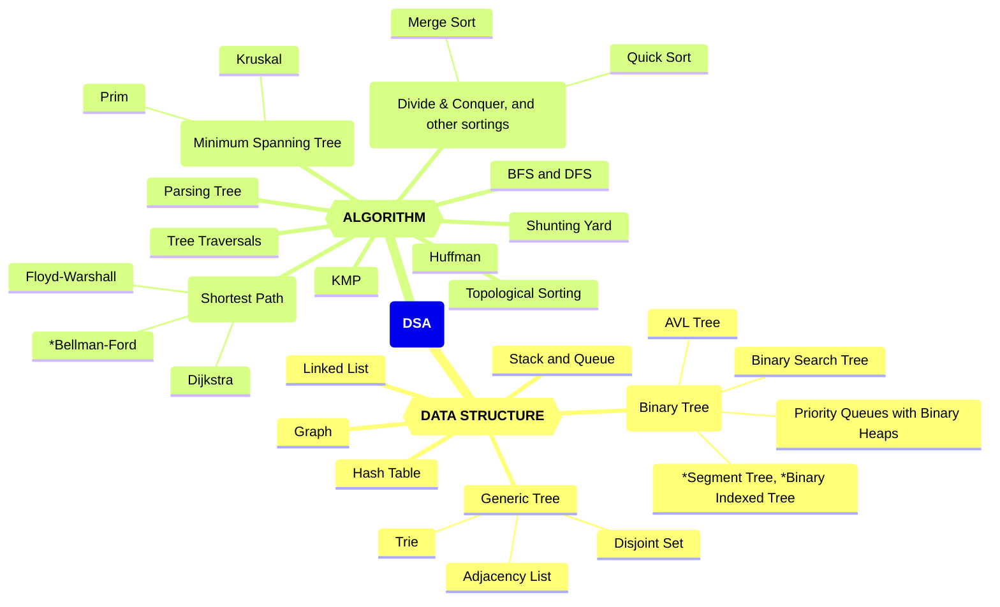
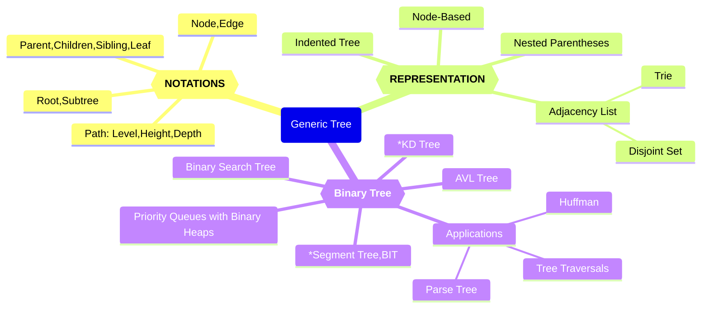
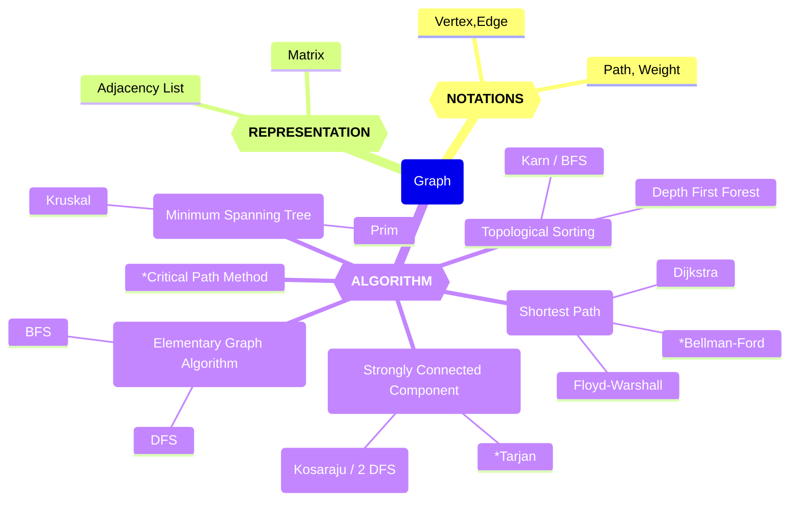

# 数据结构与算法知识体系（DSA）

Updated 2157 GMT+8 Jun 1, 2025

2025 spring, Complied by Hongfei Yan


> 我们考数算，尽量避免计概题目
>
> 建议适当降低笔试总分，同时考虑减少或取消算法填空题。鉴于机考环节已经对算法能力进行了考察，笔试中再设置此类题型略显重复，必要性不大。
>
> 机考时间：第16周周三上机，2025年6月4日 15:08-17:00, 在7、8号机房
> 笔试时间：周二，2025年6月17日 14:00-16:00
>
> 数算总评规划：期末机考1小时52分钟包含6个题目，AC5或者AC6尽量确保获得优秀评级；如果AC0，即使笔试满分，总评最高也只能达到84；如果AC4，笔试成绩较高，在不超优秀率限制的前提下，仍有机会被评定为优秀。
>
> 
>
> 机考提示信息：
>
> 数据结构与算法（B）课程考试。
> 请独立完成，不能通讯，如：不能使用微信、邮件、QQ等工具。
> 考试期间，请同学只访问OJ，不能访问其他网站，不要查看OJ考试之前自己提交的代码。
> 考试过程中允许可以带10张A4纸大小的cheat sheet，如记录语法信息作为参考。
> 题目编号前面的大写字母，相应表明是 Easy/Medium/Tough 级别。
>
> ————-
> 登录别人的账号即视为违纪甚至作弊。把自己的账号密码告诉别人，被别人登录，也视为违纪甚至作弊。如果考前别人用过你的账号，请立即修改密码。
> 请确保你的昵称格式为 24nxxxxx, 后面部分是学号。http://cs101.openjudge.cn/mine
> 有同学昵称22n, 21n, 20n, 19n开始也是可以的，学号别错，就能找到你的成绩。
>
> 

数据结构与算法（DSA，数算）的学习重点是树和图，及其涉及的各种核心算法。尽管栈和队列是基础的数据结构，且现代编程语言对其提供了直接支持，这使得我们可以方便地使用它们，但要真正掌握并高效利用这些结构，仍需深入理解其内部原理及适用场景。此外，其他一些复杂而强大的数据结构如并查集、前缀树等，同样值得我们去学习和探索。

一旦掌握了基本的数据结构（如数组、矩阵）和基础算法（包括递归、搜索、动态规划、贪心算法等），你会发现《数据结构与算法》这门课程变得更加容易理解。该课程主要探讨线性结构和非线性结构（如树和图）。其中：  

- **线性结构**可以视为数组概念的延伸，而数组本质上是一种隐式的链表。  
- **树**尤其是二叉树，通常使用递归来实现各种操作；并查集也是基于递归思想的应用，字典树（Trie）则可以通过嵌套字典（`dict{dict}`）来构建。  
- **图**作为矩阵概念的一种扩展，既可以通过二维数组表示矩阵来模拟，也可以用邻接表的形式（如`dict{list}`）来表示更复杂的图结构。

通过练习这些经典题目，可以帮助同步不同进度学生的学习步伐，还能有效提高解决实际问题的能力，并为进一步深入学习数据结构和算法提供必要的准备。  
例如，在《计算概论》阶段如果已经掌握了双指针技术，那么在《数据结构与算法》课程中遇到链表结构时，快慢指针的概念就会变得容易理解。同样地，掌握了递归思想后，并查集的实现也会更加直观。对于嵌套使用基本数据结构有了深入了解之后，构建字典树（Trie）以及图的表示方法（如邻接表dict{list}或邻接矩阵形式的二维数组）也将变得顺理成章。  
此外，搜索算法中的广度优先搜索（BFS）和深度优先搜索（DFS）是解决许多问题的基础。当你熟悉了BFS的应用场景后，将其应用于树结构中就成为了按层次遍历的有效工具。而一旦掌握了动态规划（DP），将这种思维方式扩展到树形结构上，即树形DP，也仅仅是遍历树的同时应用动态规划思想的过程。  
所以数算比计概简单，如果计概投入时间少，需要刷力扣热题100补足。https://leetcode.cn/studyplan/top-100-liked/  


<center>图1 数据结构与算法、计算概论课程内容覆盖知识点</center>


图1左侧为**数据结构**（Data Structure），右侧为**算法**（Algorithm），二者结合构成了 DSA 的核心内容。


## 一 、数据结构分类


### 1. 基础数据结构

- **栈（Stack）**：后进先出（LIFO），用于表达式求值、括号匹配等
- **队列（Queue）**：先进先出（FIFO）；包括双端队列（Deque）
- **哈希表（Hash Table / Dictionary / Map）**：常数时间插入/查询
- **链表（Linked List）**：单链表、双向链表、循环链表
- **数组（Array）**：支持随机访问
  - 前缀和 / 差分数组：用于区间求和/更新
- **字符串（String）**：特殊线性结构，支持哈希、匹配、变形等操作

---


### 2. 树结构

#### 🌳 通用树（General Tree）

- 节点、边、根、子树、父/子/兄弟节点、叶子节点
- 表示法：嵌套括号、缩进式、邻接表

#### 🌲 二叉树（Binary Tree）

- 遍历：先序、中序、后序、层序
- 常见树：
  - **解析树**（表达式计算）
  - **霍夫曼树**（最优前缀编码）
  - **优先队列**（基于堆实现）
  - **二叉搜索树（BST）**、AVL 自平衡树
  - *线段树（Segment Tree）
  - *树状数组（Fenwick Tree / Binary Indexed Tree）


---

### 3. 图结构（Graph）

- 顶点、边、路径、环、连通性、权重
- 表示方式：邻接矩阵、邻接表


---

## 二、 算法分类

### 1. 基础算法技巧

- 滑动窗口 & 双指针：子数组/子串枚举与优化
- 二分算法：查找 / 二分答案（最大化最小值 / 最小化最大值 ）
- 单调栈 & 单调队列：最近较大/较小元素、区间维护
- 辅助栈/队列：如最小栈、双栈实现队列
- 链表技巧：快慢指针


---

### 2. 经典算法思想

- 分治算法（Divide & Conquer）：快速排序、归并排序
- 动态规划（DP）：背包、树形、滚动数组优化用于压缩 DP 空间等
- 贪心算法：构造法、区间调度、反悔贪心
- 回溯与剪枝：组合、排列、子集、N 皇后、数独等
- 数学类：卡特兰数、同余等
- 表达式求值：
  - 调度场算法（Shunting Yard）
  - 逆波兰表达式（RPN）


---

### 3. 字符串算法

- KMP 算法：字符串匹配
- *Manacher 算法：最长回文子串
- 字符串哈希：双模哈希

---

### 4. 图论算法

- 图遍历：DFS / BFS（迷宫、连通块、染色等）
- 最短路径：
  - Dijkstra（贪心）
  - Bellman-Ford（可负权）
  - Floyd-Warshall（多源最短路径）
- 拓扑排序（DAG）
- 最小生成树：
  - Kruskal（并查集）、Prim（堆优化）
- 并查集（Union-Find）：路径压缩、连通性维护
- 强连通分量（SCC）：Kosaraju/ 2 DFS、*Tarjan


---

### 5. 树上算法

- LCA（最近公共祖先）：DFS + 递归（朴素法）
- 树的直径：DFS 
- 树上 DP


图2是数算内容汇总知识图谱。因为树、图的概念和相应算法较多，单独给出了树和图的知识图谱。

图3是树的知识图谱，描述了树的基本概念，到具体应用的各个方面。

图4是图的知识图谱，聚焦于图的基本概念、表示方法及其相关算法。

希望这种组织方式有助于清晰地理解各个知识点之间的关系，从而更加系统地学习数据结构与算法。




<center>图2 数算知识图谱</center>




<center>图3 树的知识图谱</center>




<center>图4 图的知识图谱</center>


我们班机考为主，`cs201数算 2025spring每日选做` 有161个题目（一半OJ题目，一半是力扣题目），https://github.com/GMyhf/2025spring-cs201/blob/main/problem_list_2025spring.md

准备分类总结；再就是结合这学期的课件；以及往年笔试题目。


## 三、课件

课件网址 https://github.com/，下面只列出考试范围内的课件，大语言模型相关课件也可以在线查阅。

20250304_week3_DSA_OOP.md	面向对象编程

20250311_week4-5_timeComplexity_linearStructure.md	时间复杂度、排序、线性结构

20250325_week6-9_tree.md	树

20250421_week10-13_graph.md	图

20250520_HashTable_KMP.md	散列表、KMP


在认真学习上面4个课件内容后，可以练习和完成每日选做题面。

<mark>problem_list_2025spring.md	每日选做题目</mark>

20250526_dsa_mindmap.md	数算知识体系（本文件）


两个主要的题解：

https://github.com/GMyhf/2024spring-cs201/blob/main/2024spring_dsa_problems.md

https://github.com/GMyhf/2024fall-cs101/blob/main/2024fall_LeetCode_problems.md


## 四、必须掌握题目

从每日选做中挑了一些重点需要掌握的题目如下。

| 问题编号与名称                   | 标签              | 难度   | 链接                                      |
| -------------------------------- | ----------------- | ------ | ----------------------------------------- |
| 04089:电话号码                   | Trie              | Medium | http://cs101.openjudge.cn/practice/04089/ |
| 20106:走山路                     | Dijkstra          | Medium | http://cs101.openjudge.cn/practice/20106/ |
| 09202: 舰队、海域出击！          | Topological Order | Medium | http://cs101.openjudge.cn/practice/09202/ |
| 05442: 兔子与星空                | MST               | Medium | http://cs101.openjudge.cn/practice/05442/ |
| 27635:判断无向图是否连通有无回路 | dfs, union-find   | Medium | http://cs101.openjudge.cn/practice/27635/ |
| 28046: 词梯                      | bfs               | Tough  | http://cs101.openjudge.cn/practice/28046/ |
| 04123: 马走日                    | backtracking      | Medium | http://cs101.openjudge.cn/practice/04123  |
| 02524: 宗教信仰                  | disjoint set      | Medium | http://cs101.openjudge.cn/practice/02524/ |
| 04078: 实现堆结构                | heap              | Medium | http://cs101.openjudge.cn/practice/04078/ |
| 22158: 根据二叉树前中序序列建树  | tree              | Medium | http://cs101.openjudge.cn/practice/22158/ |
| 24750: 根据二叉树中后序序列建树  | tree              | Medium | http://cs101.openjudge.cn/practice/24750/ |
| 24591:中序表达式转后序表达式     | stack             | Tough  | http://cs101.openjudge.cn/practice/24591/ |
| 03704: 括号匹配问题              | stack             | Easy   | http://cs101.openjudge.cn/practice/03704  |
| 02299: Ultra-QuickSort           | 归并排序          | Tough  | http://cs101.openjudge.cn/practice/02299/ |
| 08210:河中跳房子                 | Binary search     | Medium | http://cs101.openjudge.cn/practice/08210  |
| 27256: 当前队列中位数            | data structures   | Tough  | http://cs101.openjudge.cn/practice/27256/ |


## 五、每日选做题目

课件网址 https://github.com/

Q：材料`problem_list_2025spring.md`是这学期课程内容覆盖到的题目，有各个题目的名称、标签、难度和链接。需要结合题解`2024spring_dsa_problems`，`2024fall_LeetCode_problems.md`来找题面和代码。 

将`problem_list_2025spring.md`中的题目，按照 “问题编号与名称“ 在`2024spring_dsa_problems`，或者`2024fall_LeetCode_problems.md` 中可以找到题目的题面，及相应的 AC代码等信息。

对于`problem_list_2025spring.md`中每个标签，遍历的所有161个题目，然后收集题号、名称、链接，给出对应题目简短1-2句的题面要求，及解题思路。


> AI分类不出来，还得人工来

### 拓扑排序
01094: Sorting It All Out,  http://cs101.openjudge.cn/practice/01094/

- 题面：给定n个大写字母和m个"A<B"形式的关系，判断是否能确定唯一排序序列，或发现矛盾  
- 思路：增量式拓扑排序，每次添加关系后检测入度变化，若存在多个入度0节点则序列不唯一，出现环则矛盾

1857.有向图中最大颜色值，  https://leetcode.cn/problems/largest-color-value-in-a-directed-graph/

- 题面：在有向图中寻找路径使得节点颜色出现次数最大值最大  
- 思路：拓扑排序+动态规划，维护每个节点各颜色出现次数的最大值

210.课程表II， https://leetcode.cn/problems/course-schedule-ii/description/

22508:最小奖金方案， http://cs101.openjudge.cn/practice/22508/

09202: 舰队、海域出击！http://cs101.openjudge.cn/2025sp_routine/09202/

207.课程表，https://leetcode.cn/problems/course-schedule/


### 树形DP
337.打家劫舍III，https://leetcode.cn/problems/house-robber-iii/description/

- 题面：在二叉树中选择不相邻节点求最大和  
- 思路：树形DP，记录每个节点偷/不偷两种状态的最大值

24637:宝藏二叉树， http://cs101.openjudge.cn/2025sp_routine/24637/


### 动态规划DP

45.跳跃游戏II, https://leetcode.cn/problems/jump-game-ii/

01159: Palindrome， http://cs101.openjudge.cn/2025sp_routine/01159/

LCR 107.01 矩阵，https://leetcode.cn/problems/2bCMpM/

01088: 滑雪，http://cs101.openjudge.cn/2025sp_routine/01088

121.买卖股票的最佳时机，https://leetcode.cn/problems/best-time-to-buy-and-sell-stock/

5.最长回文子串

dp, two pointers, Manacher，https://leetcode.cn/problems/longest-palindromic-substring/

1299.将每个元素替换为右侧最大元素，https://leetcode.cn/problems/replace-elements-with-greatest-element-on-right-side/


### 滑动窗口

3556.最大质数子字符串之和，https://leetcode.cn/problems/sum-of-largest-prime-substrings/description/

2962.统计最大元素出现至少K次的子数组，https://leetcode.cn/problems/count-subarrays-where-max-element-appears-at-least-k-times/

2799.统计完全子数组的数目，https://leetcode.cn/problems/count-complete-subarrays-in-an-array/


### 单调栈Monotonic Stack

84.柱状图中最大的矩形，https://leetcode.cn/problems/largest-rectangle-in-histogram/


### KMP

01961: 前缀中的周期，http://cs101.openjudge.cn/2025sp_routine/01961/


### 栈Stack

3561.移除相邻字符，https://leetcode.cn/problems/resulting-string-after-adjacent-removals/

24591:中序表达式转后序表达式，http://cs101.openjudge.cn/practice/24591/

sy295: 可能的出栈序列，https://sunnywhy.com/sfbj/7/1/295

22068:合法出栈序列，http://cs101.openjudge.cn/practice/22068/

02734: 十进制到八进制，http://cs101.openjudge.cn/2025sp_routine/02734/

02694:波兰表达式，http://cs101.openjudge.cn/2025sp_routine/02694/

150.逆波兰表达式求值，https://leetcode.cn/problems/evaluate-reverse-polish-notation/

20140:今日化学论文，http://cs101.openjudge.cn/2025sp_routine/20140/

03704:扩号匹配问题，http://cs101.openjudge.cn/2025sp_routine/03704/

394.字符串解码，https://leetcode.cn/problems/decode-string/


### 辅助栈

155.最小栈，https://leetcode.cn/problems/min-stack/


### 队列queue

04067:回文数字，http://cs101.openjudge.cn/2025sp_routine/04067/


### 矩阵matrices

02659: Bomb Game, http://cs101.openjudge.cn/practice/02659/

18161:矩阵运算(先乘再加)，http://cs101.openjudge.cn/2025sp_routine/18161/

48.旋转图像，https://leetcode.cn/problems/rotate-image/

2906.构造乘积矩阵

matrices, prefix sum，https://leetcode.cn/problems/construct-product-matrix/


### 宽搜BFS

3552.网络传送门旅游，https://leetcode.cn/problems/grid-teleportation-traversal/

12029:水淹七军，http://cs101.openjudge.cn/2025sp_routine/12029/

07218:献给阿尔吉侬的花束，http://cs101.openjudge.cn/2025sp_routine/07218/

909.蛇梯棋，https://leetcode.cn/problems/snakes-and-ladders/

28046: 词梯，http://cs101.openjudge.cn/2025sp_routine/28046/

117.填充每个节点的下一个右侧节点指针II，https://leetcode.cn/problems/populating-next-right-pointers-in-each-node-ii/

103.二叉树的锯齿形层序遍历，https://leetcode.cn/problems/binary-tree-zigzag-level-order-traversal/

199.二叉树的右视图，https://leetcode.cn/problems/binary-tree-right-side-view/

01376: Robot，http://cs101.openjudge.cn/2025sp_routine/01376/

01426: Find The Multiple, http://cs101.openjudge.cn/2025sp_routine/01426/

07206:我是最快的马，http://cs101.openjudge.cn/2025sp_routine/07206/

994.腐烂的橘子，https://leetcode.cn/problems/rotting-oranges/

03151: Pots, http://cs101.openjudge.cn/2025sp_routine/03151/


### 深搜DFS

28050: 骑士周游, 

dfs, Warnsdorff, http://cs101.openjudge.cn/2025sp_routine/28050/

222.完全二叉树的节点个数，https://leetcode.cn/problems/count-complete-tree-nodes/

27928:遍历树，http://cs101.openjudge.cn/2025sp_routine/27928/

27948: FBI树，http://cs101.openjudge.cn/2025sp_routine/27948/

129.求根节点到叶节点数字之和，https://leetcode.cn/problems/sum-root-to-leaf-numbers/

124.二叉树中的最大路径和，https://leetcode.cn/problems/binary-tree-maximum-path-sum/

114.二叉树展开为链表，https://leetcode.cn/problems/flatten-binary-tree-to-linked-list/

236.二叉树的最近公共祖先，https://leetcode.cn/problems/lowest-common-ancestor-of-a-binary-tree/

437.路径总和III

dfs, prefix, https://leetcode.cn/problems/path-sum-iii/

98.验证二叉搜索树，https://leetcode.cn/problems/validate-binary-search-tree/

27637:括号嵌套二叉树

dfs+stack, http://cs101.openjudge.cn/2025sp_routine/27637

108.将有序数组转换为二叉树，https://leetcode.cn/problems/convert-sorted-array-to-binary-search-tree/

02775:文件结构“图”

dfs, stack, http://cs101.openjudge.cn/practice/24729/

230.二叉搜索树中第K小的元素，https://leetcode.cn/problems/kth-smallest-element-in-a-bst/

08581: 扩展二叉树，http://cs101.openjudge.cn/2025sp_routine/08581/

543.二叉树的直径，https://leetcode.cn/problems/diameter-of-binary-tree/

27638:求二叉树的高度和叶子数目，http://cs101.openjudge.cn/2025sp_routine/27638/

06646:二叉树的深度，http://cs101.openjudge.cn/2025sp_routine/06646/

104.二叉树的最大深度，https://leetcode.cn/problems/maximum-depth-of-binary-tree/

20052: 最大点数（同2048规则）

dfs, matirces, http://cs101.openjudge.cn/2025sp_routine/20052/

27217: 有多少种合法的出栈顺序, http://cs101.openjudge.cn/2025sp_routine/27217/

02815: 城堡问题, http://cs101.openjudge.cn/2025sp_routine/02815/

23558:有界的深度优先搜索，http://cs101.openjudge.cn/2025sp_routine/23558/


### Dijkstra

02502:Subway，http://cs101.openjudge.cn/2025sp_routine/02502/

03424: Candies，http://cs101.openjudge.cn/2025sp_routine/03424/

3341.到达最后一个房间的最少时间 I，https://leetcode.cn/problems/find-minimum-time-to-reach-last-room-i/

743.网络延迟时间，https://leetcode.cn/problems/network-delay-time/description/

05443:兔子与樱花

Dijkstra, Floyd-Warshall, http://cs101.openjudge.cn/2025sp_routine/05443/

20106:走山路，http://cs101.openjudge.cn/2025sp_routine/20106/


### Bellman Ford

01860: Currency Exchange，http://cs101.openjudge.cn/2025sp_routine/01860/

787.K站中转内最便宜的航班，https://leetcode.cn/problems/cheapest-flights-within-k-stops/


### 散列表

17975: 用二次探查法建立散列表，http://cs101.openjudge.cn/2025sp_routine/17975/


### 最小生成树（Mininum Spanning Tree）

01258: Agri-Net，http://cs101.openjudge.cn/2025sp_routine/01258/

05442: 兔子与星空，http://cs101.openjudge.cn/2025sp_routine/05442/

1584.连接所有点的最小费用，https://leetcode.cn/problems/min-cost-to-connect-all-points/


### 贪心Greedy

3362.零数组变换 III

greedy, heap, 差分数组，https://leetcode.cn/problems/zero-array-transformation-iii/

3355.零数组变换 I

Prefix sum, greedy, https://leetcode.cn/problems/zero-array-transformation-i/

781.森林中的兔子，https://leetcode.cn/problems/rabbits-in-forest/

04080:Huffman编码树，http://cs101.openjudge.cn/2025sp_routine/04080/

22161: 哈夫曼编码树，http://cs101.openjudge.cn/practice/22161/

2680.最大或值，https://leetcode.cn/problems/maximum-or/

1963.使字符串平衡的最小交换次数，https://leetcode.cn/problems/minimum-number-of-swaps-to-make-the-string-balanced/

01328:Radar Installation, http://cs101.openjudge.cn/2025sp_routine/01328/

56.合并区间，https://leetcode.cn/problems/merge-intervals/

11.盛最多水的容器

greedy, two pointers，https://leetcode.cn/problems/container-with-most-water/


### 归并排序Merge Sort

20018: 蚂蚁王国的越野跑

Merge sort, binary search, http://cs101.openjudge.cn/2025sp_routine/20018

23.合并K个升序链表，https://leetcode.cn/problems/merge-k-sorted-lists/

02299: Ultra-QuickSort, http://cs101.openjudge.cn/2025sp_routine/02299/


### 三指针

75.颜色分类，https://leetcode.cn/problems/sort-colors/


### 排序Sorting

274.H指数，https://leetcode.cn/problems/h-index/

27300:模型整理，http://cs101.openjudge.cn/2025sp_routine/27300/


### 递归Recursion

02749:分解因数，http://cs101.openjudge.cn/2025sp_routine/02749/


### 回溯Backtracking 

37.解数独，https://leetcode.cn/problems/sudoku-solver/

2597.美丽子集的数目，https://leetcode.cn/problems/the-number-of-beautiful-subsets/

02488:A Knight's Journey，http://cs101.openjudge.cn/2025sp_routine/02488/

78.子集，https://leetcode.cn/problems/subsets/

46.全排列，https://leetcode.cn/problems/permutations/

04123:马走日，http://cs101.openjudge.cn/2025sp_routine/04123/

01321:棋盘问题，http://cs101.openjudge.cn/2025sp_routine/01321/


### 正则表达式RE

04015: 邮箱验证，http://cs101.openjudge.cn/2025sp_routine/04015


### 数学Math

02499:Binary Tree, http://cs101.openjudge.cn/practice/02499/


### 堆Heap

3510.移除最小数对使数组有序II，https://leetcode.cn/problems/minimum-pair-removal-to-sort-array-ii/

3478.选出和最大的K个元素，https://leetcode.cn/problems/choose-k-elements-with-maximum-sum/

06648: Sequence，http://cs101.openjudge.cn/2025sp_routine/06648/

27256: 当前队列中位数，http://cs101.openjudge.cn/2025sp_routine/27256/

100576.提取至多K个元素的最大总和，https://leetcode.cn/problems/maximum-sum-with-at-most-k-elements/


### 前缀树Trie

04089:电话号码，http://cs101.openjudge.cn/2025sp_routine/04089/


### 信息检索IR

04093: 倒排索引查询，http://cs101.openjudge.cn/practice/04093/

06640: 倒排索引，http://cs101.openjudge.cn/2025sp_routine/06640/


### 自然语言处理 NLP

1078.Bigram分词，https://leetcode.cn/problems/occurrences-after-bigram/


### 二分查Binary Search

01064:网线主管，http://cs101.openjudge.cn/2025sp_routine/01064/

22528:厚道的调分方法, http://cs101.openjudge.cn/2025sp_routine/22528/

2070.每一个查询的最大美丽值, https://leetcode.cn/problems/most-beautiful-item-for-each-query/

02456: Aggressive cows，http://cs101.openjudge.cn/2025sp_routine/02456/

240.搜索二维矩阵II，https://leetcode.cn/problems/search-a-2d-matrix-ii/

08210:河中跳房子，http://cs101.openjudge.cn/2025sp_routine/08210

35.搜索插入位置，https://leetcode.cn/problems/search-insert-position/


### 并查集(Union find / Disjoint set)

3532.针对图的路径存在性查询I，https://leetcode.cn/problems/path-existence-queries-in-a-graph-i/

827.最大人工岛，https://leetcode.cn/problems/making-a-large-island/

547.省份数量，https://leetcode.cn/problems/number-of-provinces/

18250:冰阔落 I，http://cs101.openjudge.cn/2025sp_routine/18250/

02524:宗教信仰，http://cs101.openjudge.cn/2025sp_routine/02524/


### 面向对象编程OOP

208.实现Trie(前缀树),https://leetcode.cn/problems/implement-trie-prefix-tree/

19943:图的拉普拉斯矩阵, http://cs101.openjudge.cn/2025sp_routine/19943/

3384.设计电子表格

OOP, RE, https://leetcode.cn/contest/biweekly-contest-152/problems/design-spreadsheet/

2502.设计内存分配器，https://leetcode.cn/problems/design-memory-allocator/


### 牛顿迭代分

04140: 方程求解，http://cs101.openjudge.cn/2025sp_routine/04140/


### Kadane

02766: 最大子矩阵, http://cs101.openjudge.cn/2025sp_routine/02766/


### 实现implementation 

3531.统计被覆盖的建筑， https://leetcode.cn/problems/count-covered-buildings/

04078: 实现堆结构，http://cs101.openjudge.cn/2025sp_routine/04078/

3487.删除后的最大子数组元素和，https://leetcode.cn/problems/maximum-unique-subarray-sum-after-deletion/


### 哈希Hash Table

2364.统计坏数对的数目，https://leetcode.cn/problems/count-number-of-bad-pairs/

146.LRU缓存

hash table, doubly-linked list, https://leetcode.cn/problems/lru-cache/


### 树结构Tree

04082:树的镜面映射，http://cs101.openjudge.cn/practice/04082/

- 题面：将给定二叉树进行水平镜像翻转后输出层序遍历  
- 思路：层序遍历时交换左右子节点顺序

03720:文本二叉树，http://cs101.openjudge.cn/2025sp_routine/03720/

01577:Falling Leaves, http://cs101.openjudge.cn/2025sp_routine/01577/

01145:Tree Summing, http://cs101.openjudge.cn/2025sp_routine/01145/

05907:二叉树的操作，http://cs101.openjudge.cn/practice/05907/

T20576: printExp（逆波兰表达式建树），http://cs101.openjudge.cn/2025sp_routine/20576/

02788:二叉树，http://cs101.openjudge.cn/2025sp_routine/02788/

05455:二叉搜索树的层次遍历，http://cs101.openjudge.cn/2025sp_routine/05455/

105.从前序与中序遍历序列构造二叉树，https://leetcode.cn/problems/construct-binary-tree-from-preorder-and-inorder-traversal/

22158: 根据二叉树前中序序列建树，http://cs101.openjudge.cn/practice/22158/

22275: 二叉搜索树的遍历，http://cs101.openjudge.cn/2025sp_routine/22275/


### 滚动数组优化DP

01-背包，滚动数组，https://oi-wiki.org/dp/knapsack/

**23421: 小偷背包**，http://cs101.openjudge.cn/practice/23421/


```python
N, B = map(int, input().split())
values = list(map(int, input().split()))
weights = list(map(int, input().split()))

dp = [0] * (B + 1)

for i in range(N):
    prev = dp[:]  # 复制上一次的状态
    for j in range(B + 1):
        if j >= weights[i]:
            dp[j] = max(prev[j], prev[j - weights[i]] + values[i])

print(dp[B])
```


**M787.K站中转内最便宜的航班**

https://leetcode.cn/problems/cheapest-flights-within-k-stops/

在「最多经过 K 次中转」的约束下，求出从 src 到 dst 的最小费用。

```python
from typing import List

class Solution:
    def findCheapestPrice(self, 
                          n: int, 
                          flights: List[List[int]], 
                          src: int, 
                          dst: int, 
                          K: int) -> int:
        # 初始化：到各城最便宜费用
        INF = float('inf')
        dist = [INF] * n
        dist[src] = 0
        
        # 最多允许 K 次中转 -> 最多使用 K+1 条边
        for _ in range(K + 1):
            # 基于上一轮的结果创建新一轮的 dist
            prev = dist[:]  
            
            # 对每条航班边做松弛
            for u, v, w in flights:
                # 若 u 可达，则尝试用 u -> v 这条边更新 v
                if prev[u] + w < dist[v]:
                    dist[v] = prev[u] + w
            
            # 下一轮松弛时，依然要基于本轮更新后的 dist，
            # 因此不需要再额外复制
        
        return dist[dst] if dist[dst] != INF else -1
```


## 六、笔试题目

https://github.com/GMyhf/2025spring-cs201/blob/main/written_exam_DSA-B.md
